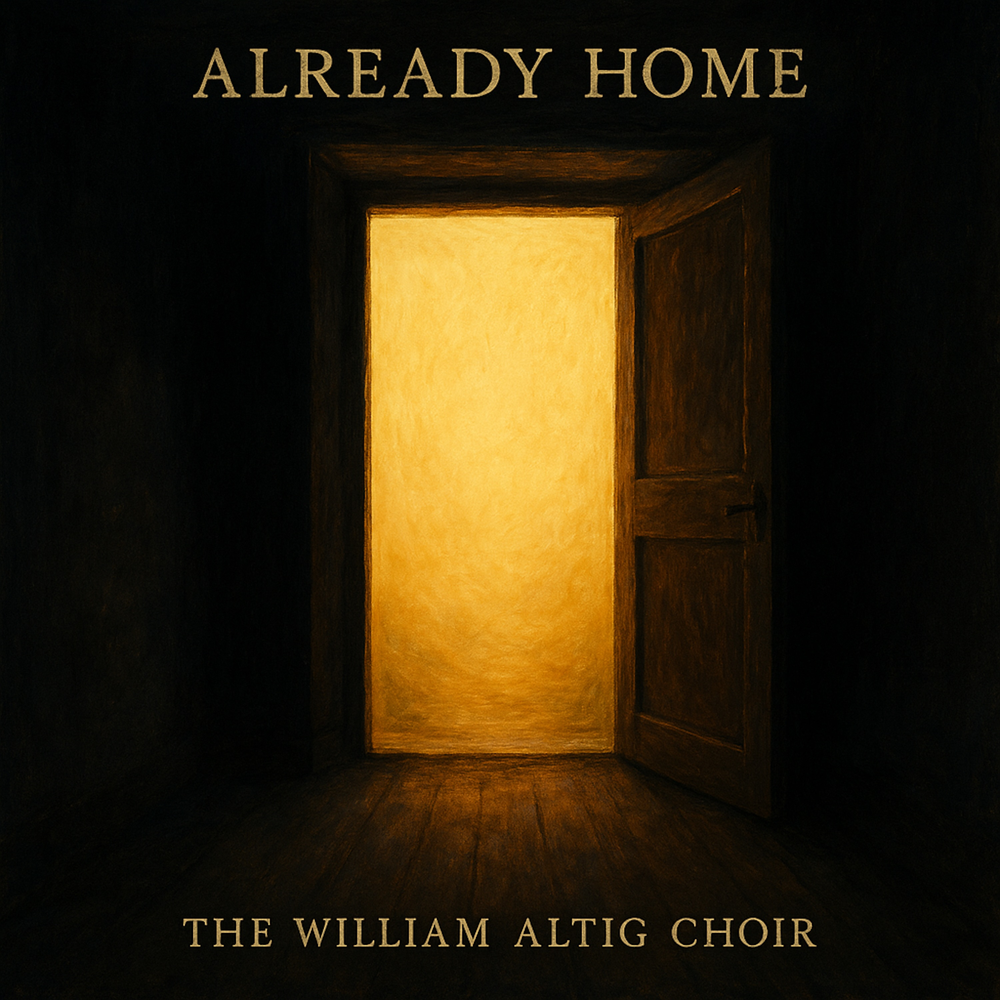

# Already Home  
  
A slow blues ballad about the moment everything changes.  
  
I spent so long trying to earn my way, step by step, brick by brick—keeping score, watching the clock run down, wondering if I'd ever be good enough. Then one single moment of grace broke through, and I realized: I don't have to keep trying anymore. I'm already home.  
  
This song is for anyone who's exhausted from striving, anyone carrying the weight of not being enough, anyone who needs to hear that the long road ends in rest. It's about the vertical leap—when sudden grace replaces endless effort, when one heartbeat of believing burns away years of struggle.  
  
Fingerpicked acoustic guitar, mournful harmonica, and honest vocals tell the story of liberation from the burden of self-salvation. Influenced by delta blues, folk storytelling, and the spiritual depth of gospel, but accessible to anyone who's ever felt the relief of finally letting go.  
  
The journey from exhaustion to freedom. From striving to rest. From the long road to home.  
  
*If this song resonates with you, please share it with someone who needs to hear it. We're all walking each other home.*  
  
**SEO Tags (Comma-Separated)**  
blues, folk blues, acoustic blues, spiritual blues, delta blues, gospel blues, americana, roots music, singer songwriter, slow blues, blues ballad, folk ballad, fingerstyle guitar, harmonica blues, acoustic storytelling, redemption song, grace, liberation, melancholic, triumphant, rest, home, freedom, letting go, spiritual folk, contemporary folk, organic production, intimate vocals, life changing moment, awakening  
  
**Lyrics: **  
Verse 1  
I walked that long road, friend, for longer than I know,  
Tried to earn my way to heaven, step by step so slow.  
I did everything they told me, kept my promises each day,  
Gave away everything I had, just trying to find the way.  
  
Verse 2  
They said you gotta build it up, brick by heavy brick,  
Count every single good deed, make the list real thick.  
I watched the clock run down, tried to beat the setting sun,  
Wondered if I'd ever make it, wondered if I'd ever be done.  
  
Chorus  
But that long road can't compare to the leap I made that day,  
When the truth hit my heart and washed my fear away.  
I heard it like thunder, and I believed it right then,  
One single moment changed everything—I was home again.  
That one thought burned away all the years I'd tried.  
  
Verse 3  
They told me He was gone, that He left us here alone,  
That the story ended long ago, turned to dust and stone.  
But a voice came out of nowhere, singing truth so clear and bright,  
Said "That story was the doorway—now you're standing in the light.  
I've been here all along, child, you don't have to chase,  
You don't have to earn tomorrow when you're standing face to face."  
  
Chorus  
And that long road can't compare to the leap I made that day,  
When the truth hit my heart and washed my fear away.  
I heard it like thunder, and I believed it right then,  
One single moment changed everything—I was home again.  
That one thought burned away all the years I'd tried.  
  
Bridge  
No more looking back now, no more keeping score,  
I don't have to wonder if I've done enough anymore.  
I jumped right over all that counting, threw the numbers far away,  
I got a promise in my soul now, and it's here to stay.  
'Cause I found the truth and held it tight here in my hand,  
My one moment of believing was worth more than all the sand.  
  
Outro  
You can build your towers high, you can work until you drop,  
But I already made it home—I already reached the top.  
'Cause I got the promise living right here in my soul—  
Oh, I took the leap, yes I took the leap,  
And now I'm finally whole...  
  
  
