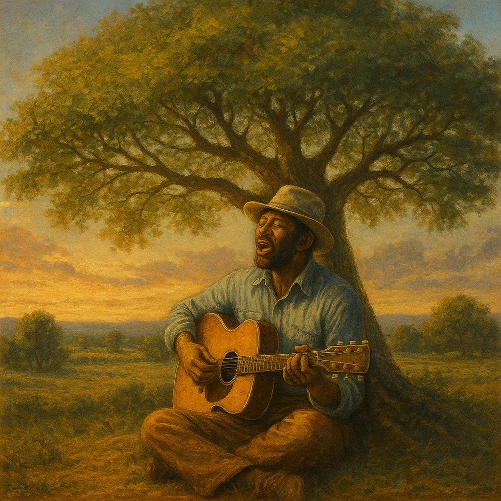

# Bodhi Tree Blues  
  
*Bodhi Tree Blues* is a slow-shuffle folk-blues hymn born from the Lotus Sūtra’s Chapter 17 promise of immediate awakening.  
  
A warm finger-picked guitar and mournful harmonica set the groove, while a gospel-style choir lifts the chorus like a sunrise.  
  
The song celebrates the truth that every breath and every step are sacred—each of us already seated under the Bodhi tree, each moment a living stūpa of awakening.  
  
It’s porch-front blues for a world of conflict, inviting everyone to sit down, breathe, and discover that enlightenment is here and now.  
  
⸻  
  
**Search Tags**  
  
Bodhi Tree Blues  ,  blues folk  ,  folk blues  ,  slow shuffle  ,  12/8 blues  ,  Lotus Sutra , chapter 17 , immediate enlightenment , Maitreya Ajita , inherent Buddhahood , Bodhi tree , Buddhist blues , spiritual folk , acoustic guitar , harmonica , gospel choir , Texas folk blues , porch session , meditative blues , awakening song , one vehicle , Ekāyana , dharmakaya , nonduality , contemplative music , singer songwriter , William Altig Choir  
  
Lyrics:   
(Slow shuffle in A minor, 12/8 feel—think Mississippi John Hurt meets early Dylan)  
  
[Verse 1]  
In a world of dust and trouble,  
where the night feels long and cold,  
the Buddha’s voice keeps rollin’—  
sayin’ your heart’s already whole.  
No need to chase a far-off dawn,  
the timeless sun’s inside.  
Right where you stand is holy ground,  
you can’t run and you can’t hide.  
  
[Chorus]  
Sit down under your Bodhi tree,  
it’s been waitin’ all along.  
Every breath’s a living stūpa,  
every heartbeat sings the song.  
No kalpas of weary wanderin’,  
no future life to buy—  
the Dharma blooms this very day,  
beneath your Texas sky.  
  
[Verse 2]  
They said merit needs a thousand lives,  
a million gifts to sow.  
But one clear chant, one faithful heart,  
is all you need to know.  
The cause and fruit are one bright spark,  
like lightning through the rain;  
read, recite, embrace the truth—  
you’re free of birth and chain.  
  
[Chorus]  
Sit down under your Bodhi tree,  
it’s been waitin’ all along.  
Every breath’s a living stūpa,  
every heartbeat sings the song.  
No kalpas of weary wanderin’,  
no future life to buy—  
the Dharma blooms this very day,  
beneath your Texas sky.  
  
[Bridge]  
Persecution’s gonna holler,  
like a black dog at your door.  
But the harder that wind is blowin’,  
the more your roots will soar.  
Ajita stands beside you,  
future Buddha by your side;  
this world of conflict’s temple ground—  
let the fearless vow be your guide.  
  
[Final Chorus – soft then rising]  
Sit down under your Bodhi tree,  
it’s been waitin’ all along.  
Every breath’s a living stūpa,  
every heartbeat sings the song.  
No kalpas of weary wanderin’,  
no future life to buy—  
the Buddha walks this very road,  
with you beneath the sky.  
  
  
