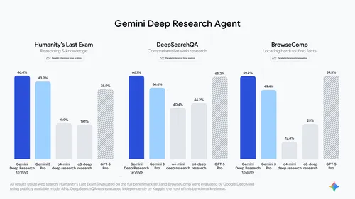

# Build with Gemini Deep Research  
Dec 11, 2025  
## ·  
4 min read  
##   
 Read AI-generated summary   
## We have reimagined Gemini Deep Research to be more powerful than ever. It is now accessible to developers via the new Interactions API, launching alongside DeepSearchQA, a benchmark for complex web search tasks.  
## L  
**Lukas Haas**  
Product Manager, Google DeepMind  
## S  
**Shrestha Basu Mallick**  
Group Product Manager, Google DeepMind  
##   
##   
##   
**Listen to article **  
**6:49 minutes**  
Today, we are releasing a significantly more powerful [Gemini Deep Research agent](https://ai.google.dev/gemini-api/docs/deep-research), available via the [Interactions API](https://blog.google/technology/developers/interactions-api). For the first time, developers can embed Google’s most advanced autonomous research capabilities directly into their own applications. We are also open-sourcing a new web research agent benchmark, DeepSearchQA, designed to test agent comprehensiveness on web research tasks.  
Gemini Deep Research is an agent optimized for long-running context gathering and synthesis tasks. The agent’s reasoning core uses [Gemini 3 Pro](https://blog.google/products/gemini/gemini-3/), our [most factual model](https://deepmind.google/blog/facts-benchmark-suite-systematically-evaluating-the-factuality-of-large-language-models/) yet, and is specifically trained to reduce hallucinations and maximize report quality during complex tasks. By scaling multi-step reinforcement learning for search, the agent autonomously navigates complex information landscapes with high accuracy.  
Deep Research iteratively plans its investigation – it formulates queries, reads results, identifies knowledge gaps, and searches again. This release features vastly improved web search, allowing it to navigate deep into sites for specific data.  
The new Gemini Deep Research agent achieves state-of-the-art results on [Humanity’s Last Exam](https://arxiv.org/abs/2501.14249) (HLE) and DeepSearchQA, and is our best on [BrowseComp](https://openai.com/index/browsecomp/). It is optimized to generate well-researched reports at much lower [cost](https://ai.google.dev/gemini-api/docs/pricing#pricing-for-agents). Deep Research is now more useful and intelligent than ever, and will soon be available in [Google Search](https://blog.google/products/search/google-search-ai-mode-update/#deep-search), [NotebookLM](https://blog.google/technology/google-labs/notebooklm-deep-research-file-types/), [Google Finance](https://blog.google/products/search/new-google-finance-ai-deep-search/) and upgraded in the [Gemini App](https://gemini.google/overview/deep-research/).  
  
Gemini Deep Research achieves state-of-the-art 46.4% on the full Humanity’s Last Exam (HLE) set, 66.1% on DeepSearchQA and a high 59.2% on BrowseComp  
## DeepSearchQA: a benchmark for deep research agents  
Existing benchmarks often fail to capture the complexity of real-world, multi-step web research. This is why we are open-sourcing [DeepSearchQA](https://www.kaggle.com/benchmarks/google/dsqa/leaderboard), a new benchmark to evaluate agents on intricate, multi-step information-seeking tasks.  
DeepSearchQA features 900 hand-crafted "causal chain" tasks across 17 fields, where each step depends on prior analysis. Unlike traditional fact-based tests, DeepSearchQA measures comprehensiveness, requiring agents to generate exhaustive answer sets. This assesses both research precision and retrieval recall.  
DeepSearchQA also serves as a diagnostic tool for the benefits of "thinking time." In our internal evaluations, we observed significant performance gains when allowing the agent to perform more searches and reasoning steps which we plan to explore in future releases.  
##   
Comparing pass@8 vs. pass@1 results demonstrates the value of letting the agent explore multiple parallel trajectories for answer verification. These results were computed on a 200-prompt subset of DeepSearchQA.  
We are releasing the benchmark assets to drive future research toward more robust and capable agents:  
* **Explore the data:** Access the [dataset](https://www.kaggle.com/datasets/deepmind/deepsearchqa/data), [leaderboard](https://www.kaggle.com/benchmarks/google/dsqa/leaderboard), and starter [Colab](https://www.kaggle.com/code/andrewmingwang/deepsearchqa-starter-code).  
* **Read the science:** Dive into the methodology in our [Technical Report](https://storage.googleapis.com/deepmind-media/DeepSearchQA/DeepSearchQA_benchmark_paper.pdf).  
## Gemini Deep Research agent in the real world  
The Gemini Deep Research agent is already demonstrating profound, immediate results in complex fields demanding high precision and context based on early feedback and testing. This includes verticals such as financial services, biotech, and market research, which have used Gemini Deep Research to tackle preliminary research tasks.  
Financial firms are using Gemini Deep Research to automate the labor-intensive initial stages of due diligence. By aggregating market signals, competitor analysis, and compliance risks from across the web and proprietary sources, the agent becomes a massive force multiplier for investment teams in their early research phases.  
Gemini Deep Research agent has been a huge accelerant to our diligence processes, shortening our research cycles from days to hours without loss of fidelity or quality. It feels like having an army of experts ready to go in support of our most ambitious analyses.  
## K  
**KJ Sidberry**Partner, GV  
In the scientific community, Deep Research is helping to solve complex safety challenges. Axiom Bio, which builds AI systems to predict drug toxicity, found that Gemini Deep Research unlocked an unprecedented level of initial research depth and granularity across biomedical literature, accelerating drug discovery pipelines.  
Gemini Deep Research surfaces granular data and evidence at and beyond what previously only a human researcher could do. We're excited to build on this as a foundation for agentic systems that reason from molecular mechanisms to experimental data and clinical outcomes, and empower scientists to develop safer medicines.  
## A  
**Alex Beatson**Co-founder, Axiom Bio  
## Build with Gemini Deep Research  
For developers building the next generation of automated research tools, Gemini Deep Research agent offers unparalleled capabilities through which to synthesize information and generate a detailed report:  
* **Unified information synthesis:** Gemini Deep Research analyzes your documents (PDFs, CSVs, docs) and public web data using File Upload and the [File Search Tool](https://blog.google/technology/developers/file-search-gemini-api/). It also handles large context gracefully, allowing you to place extensive background information directly in the prompt.  
* **Report steerability:** You control the output via prompting, defining the structure, headers, and subheaders, or specifying data table generation and formatting.  
* **Detailed citations:** Granular sourcing is provided for claims, allowing users to verify data origin.  
* **Structured outputs:** Supports JSON schema outputs for easy parsing of research results by downstream applications.  
## Get started with Deep Research in the Interactions API  
You can follow our [developer documentation](https://ai.google.dev/gemini-api/docs/deep-research) to start building with the Deep Research agent using the new [Interactions API,](https://blog.google/technology/developers/interactions-api) which is our next-generation interface designed to simplify interactions with Gemini models and agents. You can access the Interactions API with your Gemini API key from Google AI Studio.  
Future updates will also focus on richer outputs like native chart generation for visual analytical reports and expanding connectivity through Model Context Protocol (MCP) support to more easily tap into your custom data sources. We’re also working to bring Gemini Deep Research to Vertex AI for enterprises.  
