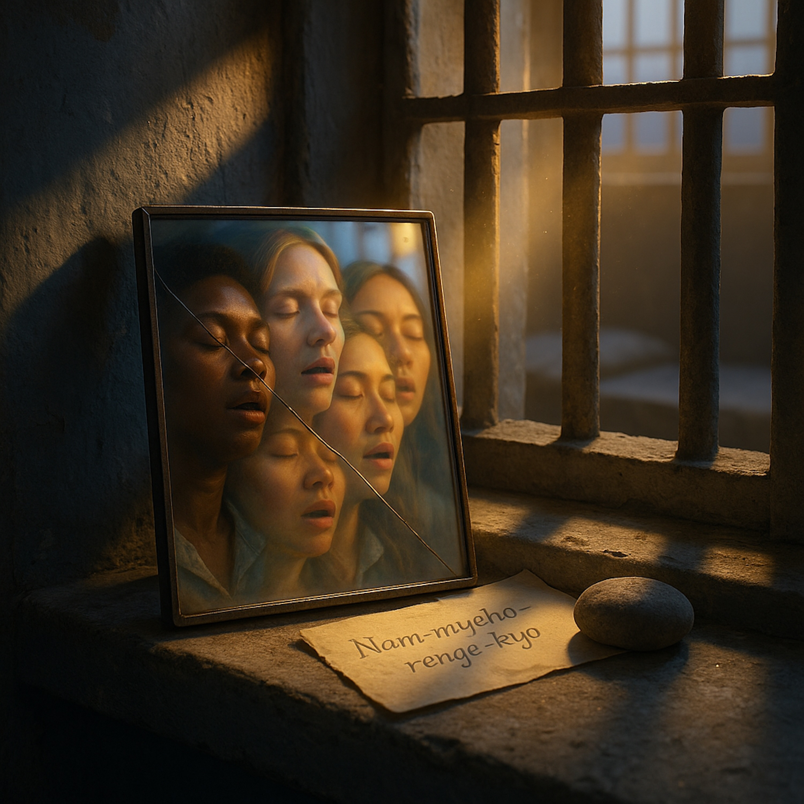

# Cell Block Chant  
  
**CELL BLOCK CHANT**  
  
**A blues anthem for anyone who's ever felt broken beyond repair.**  
  
This song tells the story of Maya Chen—a disbarred lawyer serving time for embezzlement—and Rosa, the older woman who taught her a simple Buddhist chant in their shared cell block. What starts as desperate skepticism becomes a practice of transformation: *Nam-myoho-renge-kyo*.  
  
Through gritty fingerpicked guitar, raw vocals, and layered harmonies that build from one voice to a chorus of women, "Cell Block Chant" explores what "protection" really means. Not a shield from hardship, but the strength to stand in the storm. Not magic, but the daily work of turning poison into medicine. Not receiving salvation, but discovering you had the power all along—and using it to help the next person who needs it.  
  
The song moves from the isolation of Cell Block D to a circle of voices, from shame to purpose, from one cracked mirror to an unbreakable reflection. It's about what happens when you help someone else wake up: you wake up more.  
  
**This isn't prosperity gospel. This is survival blues. This is the sound of resurrection through giving what you were given.**  
  
Musically rooted in deep blues, folk, and gospel traditions—think early Mavis Staples meeting Brandi Carlile in a prison yard—with handclaps, foot stomps, harmonica, and a Buddhist chant that sounds like it's always belonged in American roots music.  
  
For everyone who's been told they're irredeemable. For everyone who found strength in their scars. For everyone who learned that protecting others is how you protect yourself.  
  
*"It ain't magic, it ain't mercy—it's a mirror in the morning, showing you who you're gonna be."*  
  
**CONTENT NOTE:** This song deals with themes of incarceration, shame, addiction, and transformation. It's meant to honor the resilience of people navigating these realities.  
  
**ABOUT THE CHANT:** Nam-myoho-renge-kyo is a practice from Nichiren Buddhism meaning "I take refuge in the mystic law of cause and effect." It's used here with deep respect for its tradition and the real people who've found strength through it.  
  
*Featured: Acoustic guitar (DADGAD), upright bass, vintage drums, electric guitar, Hammond B3, harmonica, layered vocals, handclaps, foot stomps*  
  
**Share this song with someone who needs to hear it. That's how this works.**  
  
Lyrics:  
[Verse 1 - Slow, spoken-sung over minor fingerpicking]  
  
They put me in Cell Block D for stealing hope    
Took money from the widow, took money from the broke    
My mama died anyway, left me with the bill    
Now I'm staring at these walls, Lord, and time stands still    
  
I was hollow, I was hollow    
Like a tree struck by lightning years ago    
I was hollow, I was hollow    
Didn't know which way was up, which way to go  
  
---  
  
[Verse 2 - Beat picks up slightly]  
  
Rosa came in humming, old woman with a paper    
Said "Girl, I got something that might save you for later"    
Strange words in Japanese, said you sing 'em out loud    
I said "Lady, I don't pray," but she sang 'em anyhow    
  
Nam-myoho-renge-kyo    
Nam-myoho-renge-kyo    
Sounds like water, sounds like fire    
Sounds like something I used to know  
  
---  
  
[Chorus - Full, with stomp and clap]  
  
It ain't magic, it ain't mercy    
It ain't begging heaven to set you free    
It's a mirror in the morning    
Showing you who you're gonna be    
  
You chant for the broken, you chant for the thief    
You chant for the mother who died without relief    
And something starts turning, way down deep    
Like a river finding its way back to the sea  
  
---  
  
[Verse 3 - Back to fingerpicking]  
  
Sixth week in, I was chanting with the dawn    
Still guilty as the day they put these prison clothes on    
But the shame that used to pin me to my bed    
Started feeling less like dying, more like getting fed    
  
I'm still broken, I'm still broken    
But there's something growing in the cracks    
I'm still broken, I'm still broken    
But I ain't laying down, I'm fighting back  
  
---  
  
[Verse 4 - Building intensity]  
  
Young girl came in crying, nineteen and strung out    
Rosa said "Your turn now, show her what it's about"    
I said "I barely know the words, I barely know the way"    
She said "That's when you teach it—when you learned it yesterday"    
  
So I sang: Nam-myoho-renge-kyo    
And she sang: Nam-myoho-renge-kyo    
Two voices in the darkness    
Learning how to let the light show  
  
---  
  
[Chorus - Full band, passionate]  
  
It ain't magic, it ain't mercy    
It ain't begging heaven to set you free    
It's a mirror in the morning    
Showing you who you're gonna be    
  
You chant for the addict, you chant for the lost    
You chant for the ones who paid the highest cost    
And something starts turning, way down deep    
Like a seed that's been waiting underneath concrete  
  
---  
  
[Bridge - Stripped back, just voice and maybe harmonica]  
  
They denied my parole, thought I'd break in two    
But twelve women stood around me, singing what I taught them to    
The storm ain't out there, baby, the storm is in your chest    
And this here chant's the way you stand when you can't get no rest    
  
Rosa told me: "Protection ain't a shield from the rain    
Protection's being able to dance while you're feeling the pain"    
  
---  
  
[Verse 5 - Triumphant but still gritty]  
  
Now I'm out and I'm working for the ones who can't pay    
Teaching women in lockup every Saturday    
Got a mirror by my window and a phone that won't stop    
Women calling in the darkness, needing something I got    
  
But I don't got nothing they ain't got too    
Just a way to wake it up, just a way to see it through    
  
---  
  
[Final Chorus - Everyone singing, full power]  
  
It ain't magic, it ain't mercy    
It ain't begging heaven to set you free    
It's a mirror in the morning    
Showing you who you're gonna be    
  
You chant for your enemy, you chant for your friend    
You chant for beginning and you chant for the end    
And something starts turning, way down deep—    
You become the mountain that don't bow to the wind    
  
Nam-myoho-renge-kyo    
(The poison becomes medicine)    
Nam-myoho-renge-kyo    
(The broken learn to mend)    
Nam-myoho-renge-kyo    
(When you help another soul)    
Nam-myoho-renge-kyo    
(You find yourself made whole)  
  
---  
  
[Outro - Slowing down, back to fingerpicking and humming]  
  
They put me in Cell Block D...    
But they couldn't lock what Rosa set free...    
Now I carry that mirror everywhere I go...    
Teaching folks the only prayer they need to know...    
  
[Spoken, over final chord]  
  
"It goes like this..."  
  
[Fade out on chant]  
  
---  
  
For the ones in Cell Block D    
And every cell block after    
For Rosa    
For the mirror    
For the song that sets you free by teaching you to stand  
  
  
