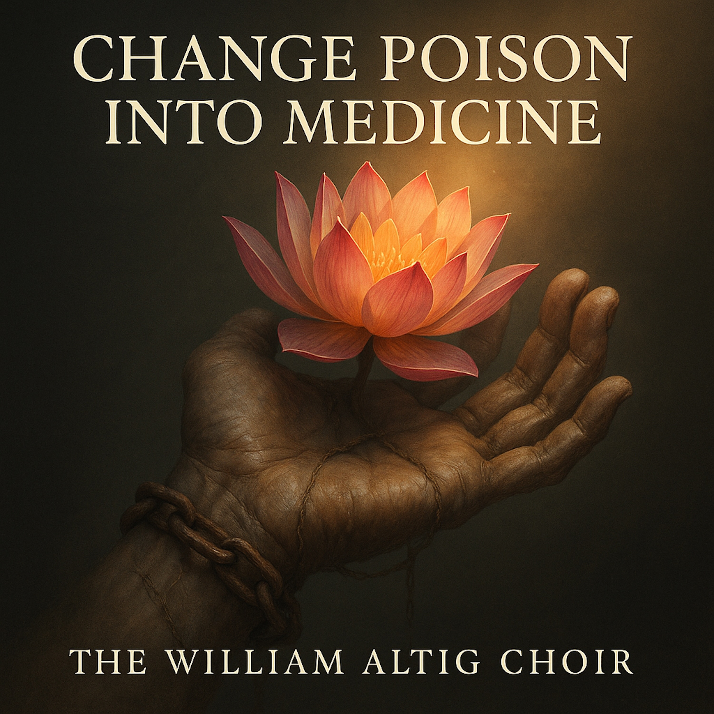

# Change Poison into Medicine  
  
A Blues-Folk Testimonial for Anyone Who Ever Got Told They Were Already Lost  
  
This isn’t a hymn for saints — it’s a rallying cry for the bruised. *Change Poison into Medicine* walks the razor’s edge between despair and awakening, hammering the old karma-chains with a raw acoustic spark and a harmonica that won’t stop crying until it can finally *soar*.  
  
The narrator questions the old fear-based religion that promised endless punishment — then flips the script. The Lotus Sūtra drops like a thunderbolt — revealing a “Mystic Law” already raging in his bones. No waiting for heaven. No cosmic warden counting sins.  
  
Just the courage to take the worst you’ve lived…
and **alchemize it into strength**.  
  
Firelight vocals. Scratched-up guitar. Stomping kick and tambourine driving the chorus like a second chance pounding at the door.  
  
A blues of rebirth.
A sermon for the skeptics.
A reminder that the medicine and the poison are often the same—
**depending on who you decide to be now.**  
  
**SEO Tags (comma-separated):**
blues folk, acoustic blues, spiritual blues, testimonial song, lotus sutra music, Nichiren inspired music, redemption song, karmic transformation, change poison into medicine, mystical folk, healing music, inspirational blues, faith and doubt, modern dharma music, blues harmonica, hopeful music, resilience anthem, roots gospel folk  
  
(Verse 1 – The Heavy Chain) Woke up this mornin', sun wouldn't shine on me Felt the **chains** of my past, far as my eye could see The old preachers told me the debt was way too deep Said I’d pay for a million years, even in my sleep. They said, "Son, gettin' clean is a long, hard road." Felt my soul gettin' heavy, carryin' that load. I was shackled by a story that I couldn't change Just a ghost in my own life, lost on a lonely range.  
  
(Chorus – The Good Medicine) But the Lotus Sūtra came like a **hammer on the stone** Gave me one true sound to call my own Said the power of the Law was right here in my soul It’s the great physician’s cure, Lord, to make a man whole. Yes, it's true, my friend, I finally understood Gotta **change the poison into medicine**, and turn the bad to good.  
  
(Verse 2 – The Vanishing Dew) My debts were piled as high as a mountain in the sky Thought I’d be carryin' that burden 'til the day I die But the Sūtra said my **faith** was a deeper root And this one true practice set my soul loose. That old, bad karma didn't need to be pulled out piece by piece It **vanished like the frost or dew** when the sun brings release. Yeah, it wiped the whole slate clean in the twinkling of an eye Gave me the nerve to face the things I was too scared to try.  
  
(Chorus – The Good Medicine) But the Lotus Sūtra came like a hammer on the stone Gave me one true sound to call my own Said the power of the Law was right here in my soul It’s the great physician’s cure, Lord, to make a man whole. Yes, it's true, my friend, I finally understood Gotta **change the poison into medicine**, and turn the bad to good.  
  
(Bridge – The Vow) I ain't no prisoner just payin' for my sin This very hardship is where my **real work** begins I **chose** to be here, to take on this pain Like the soul who made a promise, walkin' through the rain. My suffering ain't a sentence, it's a promise that I made Right here in this **muddy world**, my foundation is laid.  
  
(Outro – Right Here, Right Now) I'm gettin' my reward right here, in **this present life** No longer bound by that old, endless strife Oh, the Mystic Law, it's a burnin' light Turnin' all my darkness into something bright.  
  
Oh, that medicine... (Poison into medicine) That sweet, sweet medicine... (Poison into medicine) I'm changin' it now... Right here... Right now.  
  
  
  
