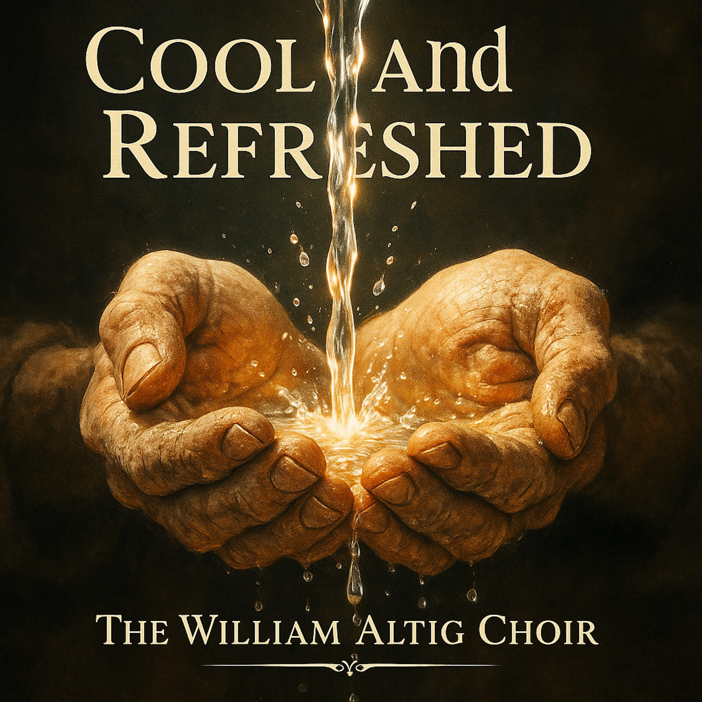

# Cool and Refreshed  
  
**"Cool and Refreshed" - A Spiritual Blues-Gospel Duet**  
  
A powerful testimony of transformation told through male and female voices. "Cool and Refreshed" weaves Buddhist wisdom into the American blues-gospel tradition, exploring the journey from spiritual burden to liberation.  
Walking heavy with the weight of the past, two souls discover that their true nature is pure—not defined by their mistakes or fears. When the Teacher looks past the stain and speaks their future name, everything changes. Like being sprinkled with nectar, the doubt washes away, and they feel cool and refreshed.  
  
This song is for anyone who's ever felt too broken for redemption, too stained for grace. It's a reminder that transformation isn't just possible—it's your birthright.  
  
**Features:** • Male/Female duet arrangement • Traditional AAB blues verses • Uplifting gospel chorus • Buddhist-Christian spiritual fusion • Authentic roots music production  
  
Written and performed with reverence for both the Delta blues and spiritual awakening traditions.  
  
## SEO Tags  
blues gospel, spiritual blues, gospel duet, male female duet, buddhist gospel, roots music, soul music, spiritual awakening, redemption song, blues ballad, Americana gospel, folk gospel, testimony song, delta blues, spiritual music, contemporary gospel, sacred music, blues soul, acoustic gospel, dharma blues, enlightenment song, transformation music, uplifting gospel, slow blues, soul ballad, spiritual testimony, buddhist music, christian buddhist fusion, meditation music, worship music, freedom song, liberation music, conscious music, healing music, revival gospel, southern gospel, traditional blues, neo soul gospel, inspirational music, faith music, grace song, prophecy song, spiritual journey, awakening music, nectar song, teacher wisdom, pure nature, karmic healing, mindful music  
  
**Lyrics: **  
(Verse 1 - AAB Blues)  
I was walkin' heavy, with the dust of ancient time (Yes)  
I was walkin' so heavy, carryin' the dust of ancient time  
My mind was full of poison, couldn't see no way to climb.  
  
(Verse 2 - AAB Blues)  
I had that deep-down fear, Lord, that I couldn't be set free (Mmm)  
Had that deep-down fear, that salvation just wasn't for me  
Thought I was too stained and broken, bound for eternity.  
  
(Chorus - Gospel Lift)  
And I feel... (oh, I feel)  
As cool and as refreshed  
As if I was sprinkled with nectar.  
He washed away the doubt,  
He put my soul to rest  
Said, "You're a Buddha, child, your future is blessed."  
And I feel... (oh, I feel)  
Cool and refreshed.  
  
(Verse 3 - AAB Blues)  
I used to look behind me, at the trouble I had made (Yeah)  
I looked at all my mistakes, Lord, and I was so afraid  
Thought my past was carved in stone, no future to be laid.  
  
(Verse 4 - AAB Blues)  
But the Teacher looked right at me, He saw beneath the stain (Yes He did)  
The Teacher looked right at me, and He spoke my future name  
He said, "Your nature is pure, son, now go and stake your claim."  
  
(Chorus - Gospel Lift)  
And I feel... (oh, I feel)  
As cool and as refreshed  
As if I was sprinkled with nectar.  
He washed away the doubt,  
He put my soul to rest  
Said, "You're a Buddha, child, your future is blessed."  
And I feel... (oh, I feel)  
Cool and refreshed.  
  
(Bridge)  
My old life was a story, written in the dust  
By ignorance and anger, by everything I lust.  
But that promise is a new day, it broke me from the past—  
It's a truth from outside the cycle, a teaching built to last.  
  
(Final Chorus - Full Soul)  
And I feel... (oh, I feel!)  
As cool and as refreshed  
As if I was sprinkled with nectar.  
He washed away the doubt,  
He put my soul to rest  
Said, "You're a Buddha, child, your future is blessed."  
And I feel... (oh, I feel)  
Cool and refreshed.  
  
(Outro - Fade Out)  
Mmm, cool and refreshed...  
Like a drop of nectar...  
Washed away the fear...  
(Fade)  
  
  
