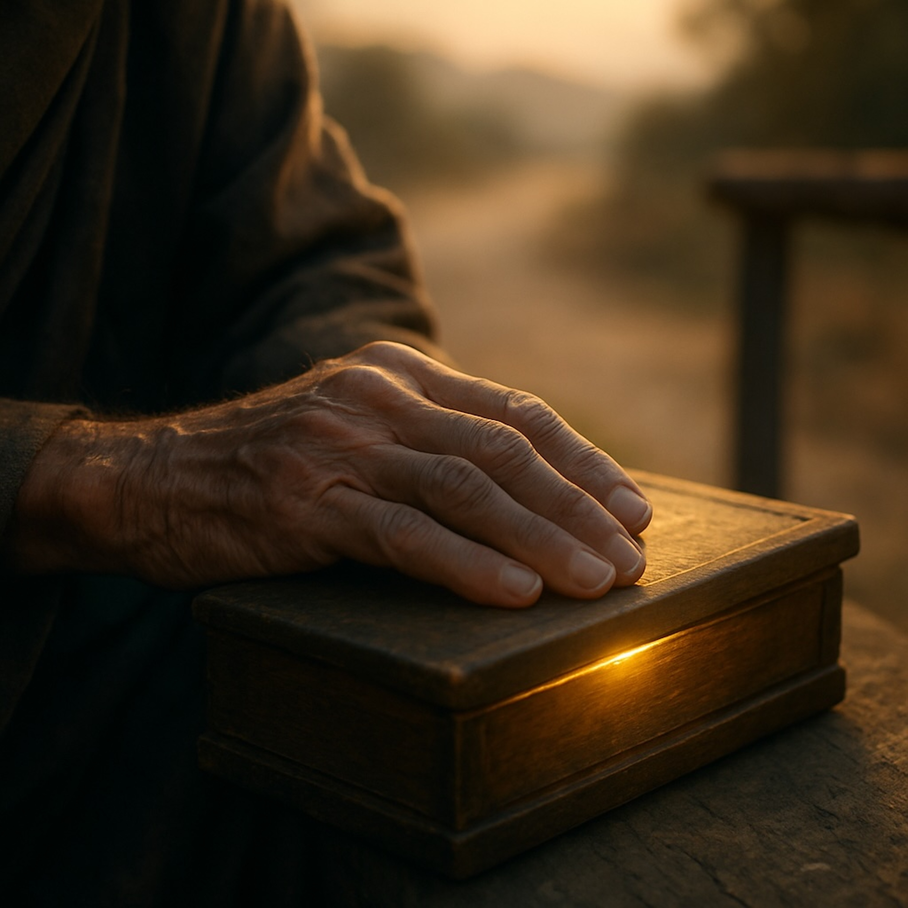

# Dharma Blues  
  
Inspired by the opening verses of Chapter 10 of the Lotus Sūtra, "Dharma Blues" is my personal take on a truth that has resonated deeply. It's a song born from the recognition that suffering and joy are not separate, and that even in a world filled with strife, the "eyes of the Buddha" can show us the way to peace. With a sound that recalls the classic folk and blues artists I've always loved, this is a song for anyone on their own path to awakening.  
  
blues, folk, spiritual, buddhism, dharma, lotus sutra, acoustic, singer-songwriter, original, meditation, enlightenment, wisdom, compassion, non-duality, blues-folk, storytelling, lotus, Padmaprabha, Houston, new-music, songwriter, guitar, harmonica  
  
Lyrics:   
  
Verse 1  
Woke up this mornin’, sun hangin’ high,  
Old trouble still driftin’, cloudin’ my eye.  
Thought this world was only hurt and fight,  
Till the Dharma whispered a deeper light:  
“Look a little closer, hear what I say—  
Equality and difference will guide your way.”  
  
Chorus  
Oh, the Buddha’s eyes see clear and true,  
Through joy and sorrow, through me and you.  
The world keeps turnin’, but my vision can,  
From a restless drifter to a peaceful man.  
I’ll keep this sutra close, steady in my hand,  
Offerings of heart for this promised land.  
  
Harmonica break  
(low, train-whistle bends—hope rising through blue haze)  
  
Verse 2  
I once saw mountains and valleys divide,  
Thought every soul had a place to hide.  
But the same wind sings through every green tree,  
The same sun’s shinin’ on you and on me.  
Each of us carries a heavy old load,  
Yet we walk one ground on the same long road.  
  
Chorus (repeat)  
  
Verse 3  
This world’s a burning house, fire in the beams,  
Desires climbing like half-woken dreams.  
But Medicine King showed the cure inside:  
A joy unbroken, a truth that abides.  
Unlock that wisdom, let illusions fall—  
No place to run, yet no need at all.  
  
Chorus (repeat)  
  
Bridge  
It ain’t gold or silver you set on the shrine,  
But time and mercy, a heart aligned.  
So I’ll honor the keepers who bear this flame,  
Bow my head softly, praise their name.  
  
Final Chorus / Outro  
Oh, the Buddha’s eyes see clear and true…  
(last line lingers)  
Offerings of heart—that’s what I bring,  
Let the truth of the Dharma make my spirit sing.  
Harmonica fades like a night train gone,  
Leaving quiet dawn to carry the song.  
  
