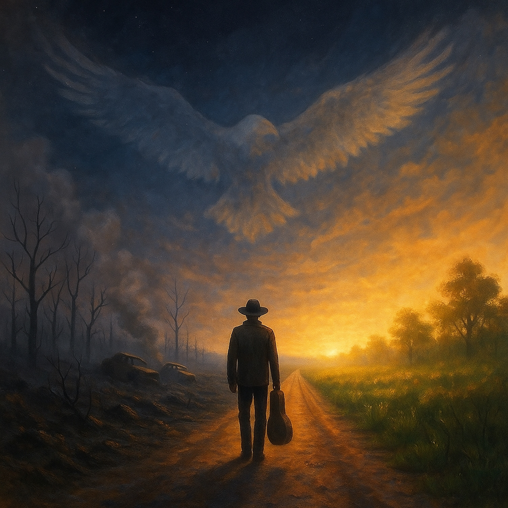

# Eagle Peak is Everywhere  
  
A folk-blues meditation on perception and awakening. The singer wanders through a world of fear, loss, and disillusionment — only to discover that the paradise he sought was never elsewhere. Inspired by the Parable of the Skillful Physician and the revelation of the Eternal Buddha’s Pure Land, the song reimagines enlightenment as an act of seeing clearly: that this burning, broken world is already sacred.  
  
Sparse finger-picked guitar, weathered vocals, and a hush of resignation carry the listener from lament to illumination.  
This isn’t escape — it’s arrival.  
  
Eagle Peak is Everywhere, William Altig Choir, blues folk song, Leonard Cohen style, Jason Isbell style, dharma blues, spiritual folk, modern parable, enlightenment song, Lotus Sutra inspired music, Pure Land blues, acoustic storytelling, American folk, awakening through song, slow acoustic blues, spiritual Americana, singer-songwriter reflection, sound of awakening, mystic folk blues  
  
***Lyrics: ***  
*(Folk-Blues / Finger-Picked Acoustic in the spirit of Leonard Cohen, Jason Isbell, or Nick Drake)*  
  
**[Verse 1]**  
The world I see is smoke and rust, a land of grief and dread,  
The evening news, a trail of dust, just whispers of the dead.  
They say this world’s consumed in fire, with fear in every stone,  
And the only peace I ever knew was a place I’d never known.  
A distant land, a tranquil shore I’d never get to see—  
Too many miles, too many wars between that world and me.  
  
**[Chorus 1]**  
But a voice rings out across the years, a truth I barely heard,  
It cuts right through a thousand fears with just a single word.  
He said, “My pure land’s not destroyed, it’s not some other sphere—  
You’re standing in the tranquil void… Eagle Peak is here.”  
  
**[Verse 2]**  
I’ve heard the tales of that bright place where jeweled trees bear fruit,  
Where heavenly drums keep time and grace and kindness takes its root.  
Where blossoms rain from silent skies in soft and fragrant streams,  
And I thought it was a bedtime prayer, a half-remembered dream.  
A paradise for saints to find when all their work is done,  
But not for my own troubled mind beneath this bitter sun.  
  
**[Chorus 2]**  
Still that voice rings out across the years, a truth I never heard,  
It cuts right through a thousand fears with just a single word.  
He said, “My pure land’s not destroyed, it’s not some other sphere—  
You’re standing in the tranquil void… Eagle Peak is here.”  
  
**[Bridge]**  
He said, “The fire’s in your eyes, the sorrow in your soul,  
The world you see is made of lies that you can’t control.  
But if your heart turns straight and true, and your intent is kind,  
You’ll see me standing here with you and leave the flames behind.  
This sahā world, this patch of ground— the light’s been shining clear.”  
  
**[Final Chorus]**  
And that voice rings out across the years, a truth I’ve finally heard,  
It cuts right through my lingering fears with just a single word.  
He said, “My pure land’s not destroyed, it’s not some other sphere—  
You’re standing in the tranquil void… Eagle Peak is here.”  
  
**[Outro]**  
*(Tempo slows; single guitar breathes between lines)*  
The fire’s just a shadow now, the fear’s become a name,  
This dusty road, this broken vow— it’s holy all the same.  
Eagle Peak is everywhere…  
  
*(One last open-string chord fades into silence.)*  
  
  
