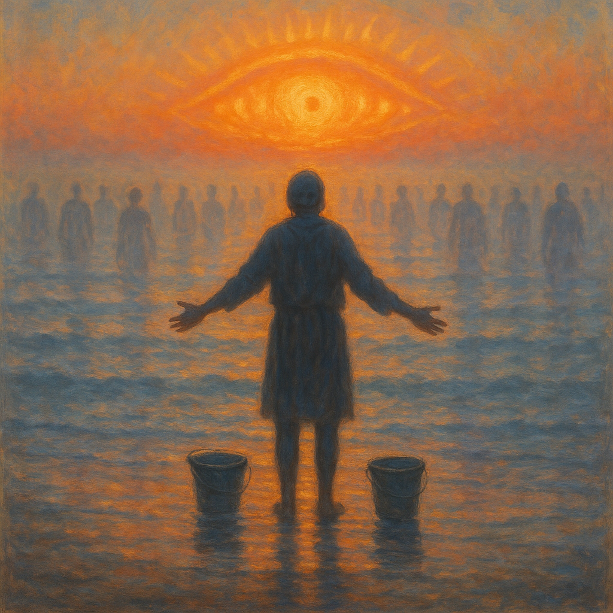

# Empty the Ocean  
  
What do you do when the world's suffering feels too vast to bear? When your two hands seem powerless against an ocean of problems?  
  
This song was born from an ancient Buddhist teaching about Avalokitesvara—the Bodhisattva who listens to the cries of the world—and a very modern question: How do we stay engaged with compassion when we feel overwhelmed and alone?  
  
"Empty the Ocean" tells the story of someone trying to clean a polluted harbor one bucket at a time, and the wisdom teaching that transforms exhaustion into sustainable action. It's a song about the shift from power to wisdom, from isolation to interconnection, from burnout to collective change.  
  
Musically, it blends fingerpicked acoustic blues with spiritual folk and gospel testimony—think delta blues meets dharma teaching, with harmonica crying over ocean waves. The production includes singing bowls, harmonium, and the sound of water itself, creating a sonic meditation on compassion, accountability, and hope.  
This isn't a song about giving up or transcending the world's problems. It's about understanding that we're not separate from those problems—or from each other. We are the ocean, waking up to itself, learning to clean and heal and change the flow.  
  
For activists burning out. For helpers feeling helpless. For anyone who's ever stood at the edge of the world's pain and wondered what their small acts could possibly matter.  
  
*"We can't empty the ocean with our small human hands / But we ARE the ocean, waking to itself today"*  
Listen with headphones. Breathe with the rhythm. Let it remind you: you're not working alone.  
  
**SEO Tags (30+):**  
dharma blues, folk blues, spiritual folk music, Buddhist music, contemporary dharma, activist music, compassion fatigue, bodhisattva vow, Avalokitesvara, Guanyin music, protest spirituality, engaged Buddhism, environmental activism songs, ocean metaphor, interconnectedness, collective action, burnout recovery, hopeful activism, fingerpicked blues, gospel folk, meditation music, acoustic spiritual, wisdom tradition, social justice music, climate anxiety, sustainable activism, Buddhist folk, dharma folk, spiritual blues, conscious music, contemplative folk, mindfulness music, compassion songs, systemic change, speaking truth to power, oceanic vow, deep listening, skillful means, non-dual wisdom, community organizing, liberation music  
  
Lyrics:   
  
[Verse 1--Dukkha (suffering), the problem of individual power]  
Woke up this morning with a bucket in each hand  
Gonna clean this whole ocean, gonna save this drowning land  
But the water keeps on rolling, Lord, it never seems to end  
I'm just one tired soul trying to make this whole world mend  
  
[Chorus--Introduction of wisdom path (listening vs. doing)]  
You can't empty the ocean, baby, with your two small hands  
You can't empty the ocean trying to move all that sand  
But you can listen to the water, hear what it's trying to say  
You can be the ocean cleaning itself today  
  
[Verse 2--The teacher appears (Avalokitesvara as the old woman)]  
Old woman told me, "Child, you're asking the wrong thing  
You ain't got the power of God, you ain't got angel wings  
But you got wisdom if you use it, you got eyes that still can see  
There's one piece of trash right there, and that child who's asking 'Why?'"  
  
[Chorus]  
You can't empty the ocean, baby, with your two small hands  
You can't empty the ocean trying to move all that sand  
But you can listen to the water, hear what it's trying to say  
You can be the ocean cleaning itself today  
  
[Bridge - slower, more meditative. Core teaching of non-self, interconnectedness, dependent origination]  
She said, "You think you're just a drop, separate and small  
But drops don't live in oceans—there's no separation at all  
You're the water in the water, you're the wave upon the sea  
*When you act with truth and courage, you're changing history*  
  
[Verse 3--Skillful means (upāya) in action]  
Now I still come to the harbor when the morning light is new  
But I ain't trying to empty nothing, I just do what I can do  
Help a stranger with their burden, teach a child about the tide  
Every little thing's connected on this oceanic ride  
  
[Chorus - with variation]  
No, you can't empty the ocean, baby, with your two small hands  
You can't empty the ocean trying to move all that sand  
But you can be the ocean, flowing where it needs to go  
You're a thousand arms of kindness in the undertow  
  
[Verse 4 - testimony style. Acknowledgment that doubt returns (realistic practice)]  
Sometimes I get weary, feel like giving up the fight   
But some folks say "just clean your shore" while factories dump at night  
Being water in the water means you gotta change the flow  
Sometimes love means speaking truth to power's undertow  
  
[Final Chorus - building. Transformation, the vow lived, becoming the Bodhisattva]  
We can't empty the ocean, no, with our small human hands  
Can't empty the ocean trying to move all that sand  
But we ARE the ocean, waking to itself today  
We're the deep listening, we're the compassionate way  
  
[Outro - spoken word over instrumental. Transmission complete, the teaching continues]  
"Deep as forever... never full, never empty...  
Each drop reflecting the whole...  
Just listen... just respond...  
You're not working alone."  
  
[End on sustained harmonica and reverb]  
  
  
