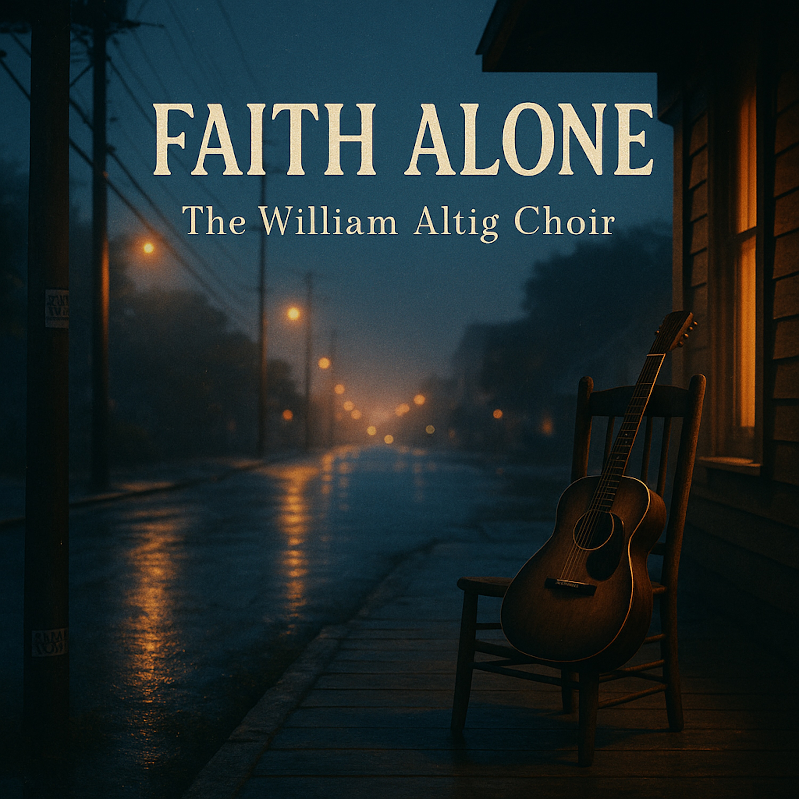

# Faith Alone   
  
A raw, heartfelt fusion of folk-blues soul and modern trap rhythm. *Faith Alone* tells the story of a weary seeker who learns that belief itself — simple, steady, and human — is enough to carry us home.  

Fingerpicked acoustic guitar and slide licks meet 808s, brushed snares, and gospel harmonies. The result is a prayer set to a pulse: intimate, grounded, and luminous.  

This is porchlight music for a digital age — where the rhythm of faith finds its beat in everyday life.  
  
🔍** SEO Tags (comma-separated)**  
faith alone, the william altig choir, folk trap gospel, blues trap fusion, acoustic trap, folk blues gospel, spiritual blues, modern gospel blues, porchlight soul, americana trap, acoustic guitar 808s, faith music, mindful music, blues storytelling, acoustic gospel, roots and rhythm, spiritual fusion, dharma blues, soulful folk, slide guitar blues, hopeful songs, folk hip hop blend, modern folk blues, buddhist blues, awakening songs  
  
  
*(Slow, steady blues — acoustic and warm.)*  
  
**Verse 1
**Woke up this mornin’, heavy heart, tired bones,
Been lookin’ for the truth in every book and stone.
Tried to walk that narrow way, but I just fell behind,
Till I learned that faith’s the road, not somethin’ you gotta find.
Ain’t about the clever talk or how deep you pray,
It’s just trustin’ the heart to show the way.  
  
**Chorus
**Oh, the Sutra says the door is open wide,
You don’t need no gold, just step inside.
Faith alone, brother, that’s the simple key,
Just one spark of trust can set your spirit free.
That single heart of conviction, it carries me along,
To the Land of Tranquil Light, where we all belong.  
  
**Verse 2
**Old Shariputra, wise as the sun,
Said, “All my knowing never got it done.”
It took faith, not learning, to clear his eyes,
Ain’t no ladder to heaven, just a moment that flies.
And me, I ain’t learned, but I got one light,
That flickers, but it still burns bright.  
  
**Chorus
**Oh, the Sutra says the door is open wide,
You don’t need no gold, just step inside.
Faith alone, sister, that’s the easy road,
Just let the river take your load.
That single heart of conviction, it carries me along,
To the Land of Tranquil Light, where we all belong.  
  
**Bridge
**It’s a small fire in the cold, and I feed it slow,
Chantin’ through the storms that come and go.
They say it’s simple, but it sure ain’t cheap,
You gotta keep singin’ when you can’t sleep.
That Name’s my medicine, that chant’s my song,
Every time I say it, I know where I belong.  
  
**Outro
**So I lay down my pride and my need to know,
I got Faith Alone, that’s the way I go.
Just chantin’, chantin’, soft and low—
*Nam-myoho-renge-kyo...*
Faith alone... yeah, that’s the way home.  
  
  
