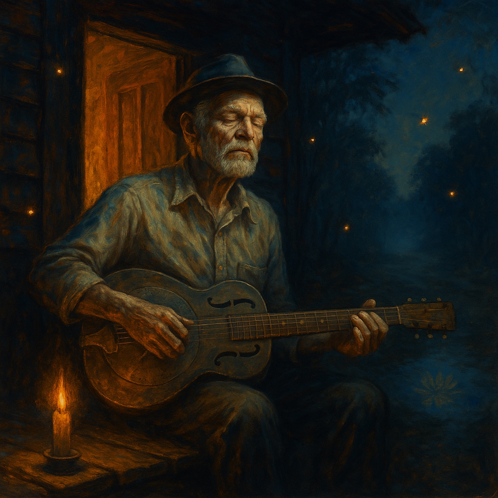

# Faith Call, Insight Answers  
  
https://soundcloud.com/d-william-altig/faith-calls-insight-answers?si=4e5a023aaf4c491eb563e07eb1dac75b&utm_source=clipboard&utm_medium=text&utm_campaign=social_sharing  
  
**“Faith Calls, Insight Answers”** is a Delta Dharma Blues song about the inner dialogue between faith and understanding — a call-and-response between the heart that believes and the mind that sees.  
  
Carried by slide guitar, handclaps, and a voice worn smooth by the road, this track brings the Eightfold Path down to earth. It’s not about heaven or hell — it’s about the moment you stop talking long enough to hear what silence tells.  
  
Each verse walks barefoot through wisdom’s mud, where kindness and courage light the way. Faith calls out, insight answers, and together they build a road of merit straight through the mystery of life.  
  
For anyone on a spiritual path — seekers, wanderers, or weary truth-tellers — this is porchlight blues for awakening souls.  
  
Delta blues, Dharma blues, spiritual blues, folk blues, acoustic roots, Americana, meditation music, Buddhist music, blues storytelling, soulful slide guitar, awakening songs, Eightfold Path, right understanding, wisdom music, faith and insight, call and response blues, mindful music, porch blues, spiritual awakening, William Altig Choir, the William Altig Choir, Songs of Awakening, modern dharma music, roots folk, Delta sound, enlightenment blues  
  
**Lyrics:**  
  
[Intro – Slide guitar riff, foot stomp rhythm]  
(Spoken)  
Ain’t about heaven, ain’t about hell—  
It’s about learnin’ to see what the silence tells.  
  
⸻  
  
[Verse 1]  
Faith calls— you hear it in the bones,  
Insight answers— when the wind starts moanin’ low.  
You don’t need no scripture fancy,  
Just a mind that wants to know.  
  
[Chorus – Call and Response]  
[Call]  Merit builds the road you’re walkin’.  
[Response]  Step by step, clear eyes see.  
[Call]  Every act of kindness lightin’  
(Response)  A lantern on that mystery.  
  
⸻  
  
[Verse 2]  
Old preacher said, “Boy, stop talkin’.  
Start listenin’ to what’s true.”  
Said, “Faith and reason ain’t rivals, son—  
They just dance like me and you.”  
  
[Chorus – Call and Response]  
[Call]  Merit builds the road you’re walkin’.  
[Response]  Step by step, clear eyes see.  
[Call]  Even one line of truth believed in—  
[Response]  Can set your spirit free.  
  
⸻  
  
[Bridge – Spoken over slow slide riff]  
Don’t talk about reachin’ heaven,  
That road don’t run that far.  
It’s right here, right now—  
Every heart a shinin’ star.  
  
⸻  
  
[Verse 3]  
I been down that Eightfold highway,  
Dust on my boots, peace in my chest.  
Right view ridin’ shotgun,  
Right speech layin’ the rest.  
Each mile a lesson in seein’,  
Each breath a gate to the sky,  
Faith calls and Insight answers—  
That’s how the blind learn to fly.  
  
⸻  
  
[Final Chorus – Full band enters, handclaps and harmony]  
(Call)  Merit builds the road you’re walkin’.  
(Response)  Step by step, clear eyes see.  
(Call)  Faith calls and Insight answers—  
(Response)  That’s the truth inside of me.  
(Call)  You don’t need gold or temple treasure—  
(Response)  Just a heart that’s brave and kind.  
(Together)  When you walk with right understanding,  
Ain’t no darkness left behind.  
  
  
