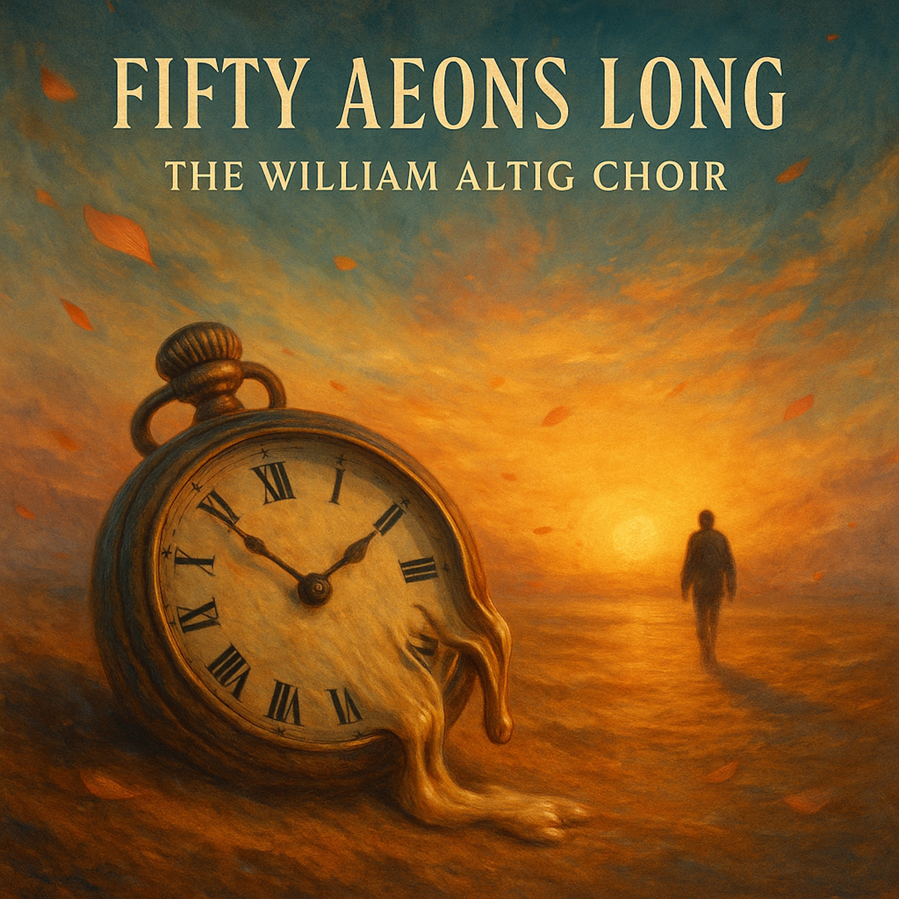

# Fifty Aeons Long  
  
*“Fifty Aeons Long”* by **The William Altig Choir** is a hauntingly beautiful folk-blues meditation on time, freedom, and perception. The song explores how our suffering often comes from clinging to minutes, regrets, and imagined futures—when the truth is timeless and already here. With finger-picked acoustic guitar, slide accents, upright bass, and a baritone voice that feels both ancient and intimate, the track unfolds like a prayer at sunrise. It’s blues for the soul awakening, a sound that dissolves the weight of the clock and lets eternity breathe through every note.  
  
**SEO Tags:**  
Fifty Aeons Long, The William Altig Choir, William Altig, folk blues, americana, acoustic blues, delta blues, meditation blues, timeless song, enlightenment, time, perception, awakening, mindfulness, spiritual folk, slow blues, reflective song, acoustic guitar, slide guitar, baritone vocals, roots music, song about time, dharma blues, americana folk, Texas blues, introspective song, philosophical blues, cosmic folk, William Altig music, Songs of Awakening  
  
[Verse 1 – The Clock and the Soul: Solo guitar + voice—dry, intimate]  
I woke before the whistle, sun still hid its face,  
Coffee burned my tongue, dreams vanished without a trace.  
Been fightin’ every minute like a war I can’t outlast,  
But time just grins and slips away, laughin’ at my past.  
  
[Chorus – Half-Day Blues: Add bass + light slide]  
I’ve been countin’ fifty aeons, thinkin’ they were just half a day,  
Got my mind all tangled in hours that fade away.  
If I could see like the Buddha sees, I’d know the moment’s never gone—  
I’d drop my watch and hum this tune, fifty aeons long.  
  
[Verse 2 – The Ground Opens Up: Full rhythm section enters softly]  
The dirt beneath my worry cracked and let some light shine through,  
A thousand golden faces rose from everything I knew.  
They whispered, “Child, your prison’s built of minutes and desire—  
Step outside the ticking hand, and walk right through the fire.”  
  
[Chorus – Half-Day Blues:]  
I’ve been countin’ fifty aeons, thinkin’ they were just half a day,  
Got my mind all tangled in hours that fade away.  
If I could see like the Buddha sees, I’d know the moment’s never gone—  
I’d drop my watch and hum this tune, fifty aeons long.  
  
[Bridge – The Shift: Organ pad swells, drums drop to heartbeat pulse]  
All my fears are echoes in a jar of borrowed time,  
I finally saw that silence ain’t a void—it’s the rhyme.  
Now I breathe in every second, let the whole world sing along—  
The blues of now forever, fifty aeons long.  
  
[Final Chorus + Tag: Choir + harmonica lift to E major for transcendence.]  
I’ve been countin’ fifty aeons, thinkin’ they were just half a day,  
Now I’m laughin’ with the sunrise, all my debts of time repaid.  
When I see the world on Buddha’s scale, my heart beats calm and strong—  
  
[Last line sung a cappella → single guitar harmonic fading out]  
One breath, one song, fifty aeons long.  
  
