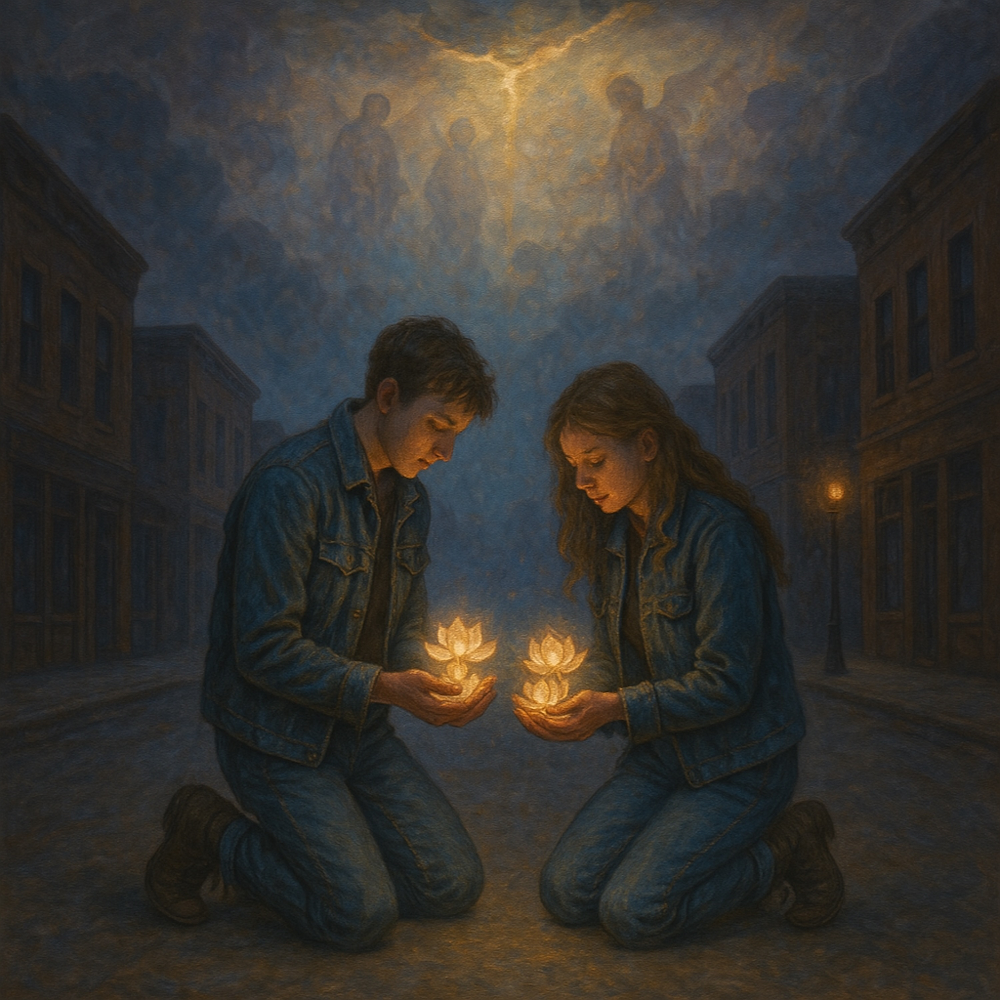

# *Flowers for the Truth*
  
*Flowers for the Truth* is a hauntingly beautiful duet where two voices meet on an empty city street, offering radiant, glowing flowers to something greater than themselves. This folk-blues ballad weaves the sacred and the ordinary into a single moment of grace. With a painterly sound and mystical undertones, it evokes the hush of twilight, the ache of seeking, and the quiet reverence of truth revealed. A song for those walking the edge between earth and heaven, love and awakening.  
  
**Tags (comma-separated):**
flowers for the truth, spiritual duet, folk blues, ambient folk, ethereal, mystical, sacred, soulful, heartfelt, glowing flowers, divine offering, urban mystic, emotional, stardust, painterly sound, truth seekers, Lotus Sutra, male female vocals, contemporary spiritual, soundscape, twilight city, divine harmony, reverent, awakening song  
  
**Style:** Blues Folk-Pop
**Duet Format:** Male/Female vocals (or any two distinct voices)
**Tempo:** Slow groove, 80–90 bpm
**Mood:** Reflective, soulful, reverent  
  
**[Verse 1 – Voice 1]**
Five hundred million skies away,
They came to hear just one true phrase.
Already kings in heaven's light,
Still they felt the pull that burns through night.  
**[Voice 2]**
They brought their flowers, humble and true,
‘Cause even paradise longs for what’s new.
They bowed low, they sang with grace—
To see the truth face to face.  
  
**[Chorus – Both, alternating lines]**
If we hear the truth, some will wake and rise,
(Yeah, rise up shining in wide-open skies.)
Others find peace, in a softer rebirth,
(Like springtime rain falling back to the earth.)
And the ones who do good start to grow—
That’s the way the Dharma flows.  
  
**[Verse 2 – Voice 1]**
It ain’t just words, it’s how you show,
Do you kneel down slow, do you let it glow?
Not for pride or some holy crown,
But to lift the heavy and lay burdens down.  
**[Voice 2]**
The Buddha sat still, but he saw it all—
The longing, the reverence, the ancient call.
And he knew some would change that day—
Just by hearing what he’d say.  
  
**[Chorus – Both, in harmony]**
If we hear the truth, some will wake and rise,
Others find peace, in more forgiving skies.
And the shadows start to lose their hold,
As the good-hearted start turning bold.
Yeah, the ones who do good start to grow—
That’s the way the Dharma flows.  
  
**[Bridge – Spoken Interlude, alternating]**
**Voice 1:** They came from beyond what we call space…
**Voice 2:** …just to hear a teaching full of grace.
**Voice 1:** Not for power, not for pride…
**Voice 2:** …but to help the suffering turn the tide.
**Both (sung):**
And that’s what truth can do—
Not just for one, but for me and you.  
  
**[Final Chorus – Both, rich harmony]**
If we hear the truth, some will wake and rise,
Others find peace where the spirit flies.
And the pain of the world begins to fade,
As we walk the path the sages laid.
Yeah, the ones who do good start to grow—
That’s the way the Dharma flows.  
  
**[Outro – Voice 2, softly]**
So bring your flowers, lay them down,
**[Voice 1, gently]**
In every heart, in every town…
**[Both]**
The truth still calls through time and space—
To meet it now, with humble grace.  
  
  
