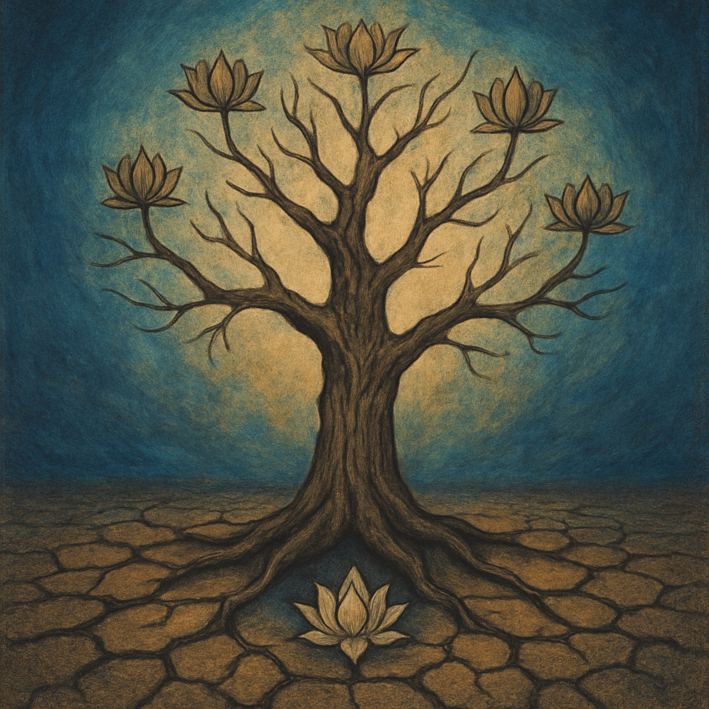

# From the Deep and Fertile Ground  
  
Inspired by the profound teachings of the Lotus Sutra and the enduring vow of the Bodhisattvas of the Earth, "**From the Deep and Fertile Ground**" is a grounded, bluesy folk song that moves from spiritual insight to personal transformation. The song is a deconstruction of what "supernatural power" means, revealing it not as an arbitrary magical feat, but as a joyful, celebratory response from the Buddha to the solemn determination of his eternal disciples.  
  
The lyrics delve into the central Buddhist principle of "changing poison into medicine," exploring how the "three poisons" of greed, anger, and foolishness can be transformed. The song posits that anger can become energy for compassionate action, isolation can be transformed into the wisdom of interconnectedness, and attachment can lead to true liberation.  
  
The chorus evokes the cosmic spectacle described in the sutra, where the earth quakes and light emanates from every pore of the Buddha. This magnificent display is celebrated as a "timeless celebration of a shared, eternal vow," a vow that is passed on to all who commit to awakening their own innate potential for enlightenment. The song ultimately reminds us that the Buddha's ancient joy is re-created every time a person stands up to transform their own life and help others.  
  
**Search Tags:** Buddhist music, folk, blues, spiritual, Lotus Sutra, Nichiren, Padmaprabha, inspiration, spiritual folk, peaceful, enlightening, acoustic, uplifting, mindfulness, new age.  
  
Lyrics:   
(Verse 1)  
(Slow, acoustic guitar intro, a simple, bluesy picking pattern)  
Well, the Buddha sat on the Lotus Throne, way back in a time untold.  
He saw his disciples, weary and worn, with a story to be told  
He'd taught them a path to ease their pain, to let go of greed and strife  
But he knew there was more, a deeper truth, a brand new way of life.  
  
(Chorus)  
(The choir joins in, a harmony with a slow, gospel feel)  
Oh, the earth it quaked, and the heavens bent, with a light from every pore.  
He showed his power, not just for show, but to answer a solemn vow, and so much more  
It wasn't magic, no, not at all, just a joyful, loving sound  
For his followers who rose from the earth, from the deep and fertile ground  
  
(Verse 2)  
(The song becomes more personal, a single voice over the guitar)  
They say that anger's a poison well, that's what we've always been taught.  
But the Lotus shows us a different way, a lesson we can't buy or be bought  
Turn that anger into a righteous fire, a fuel for the fight  
To stand for justice and help someone rise, and fill the darkness with light.  
  
(Chorus)  
(The choir's harmony swells, more passionately)  
And the earth it quaked, and the heavens bent, with a light from every pore.  
He showed his power, not just for show, but to answer a solemn vow, and so much more  
It wasn't magic, no, not at all, just a joyful, loving sound  
For his followers who rose from the earth, from the deep and fertile ground.  
  
(Bridge)  
(The tempo slows, a single voice, almost spoken word, like a preacher)  
They tell you that you're alone and lost, an island in the sea.  
But the Buddha’s light shines on every soul, in you and in me  
That isolation can turn to grace, a bridge to all mankind.  
And that endless want, that attachment's chain, can turn to wisdom in your mind.  
  
(Outro)  
(The song fades out slowly, with the choir humming the melody and the guitar returning to the slow, gentle picking pattern)  
The Buddha's joy, it's not far away.  
It lives in our hearts when we stand up to pray  
It lives in the vow that we make for all time  
To turn this poison into a beautiful rhyme  
Oh, a beautiful rhyme... (last note hangs in the air)  
  
  
