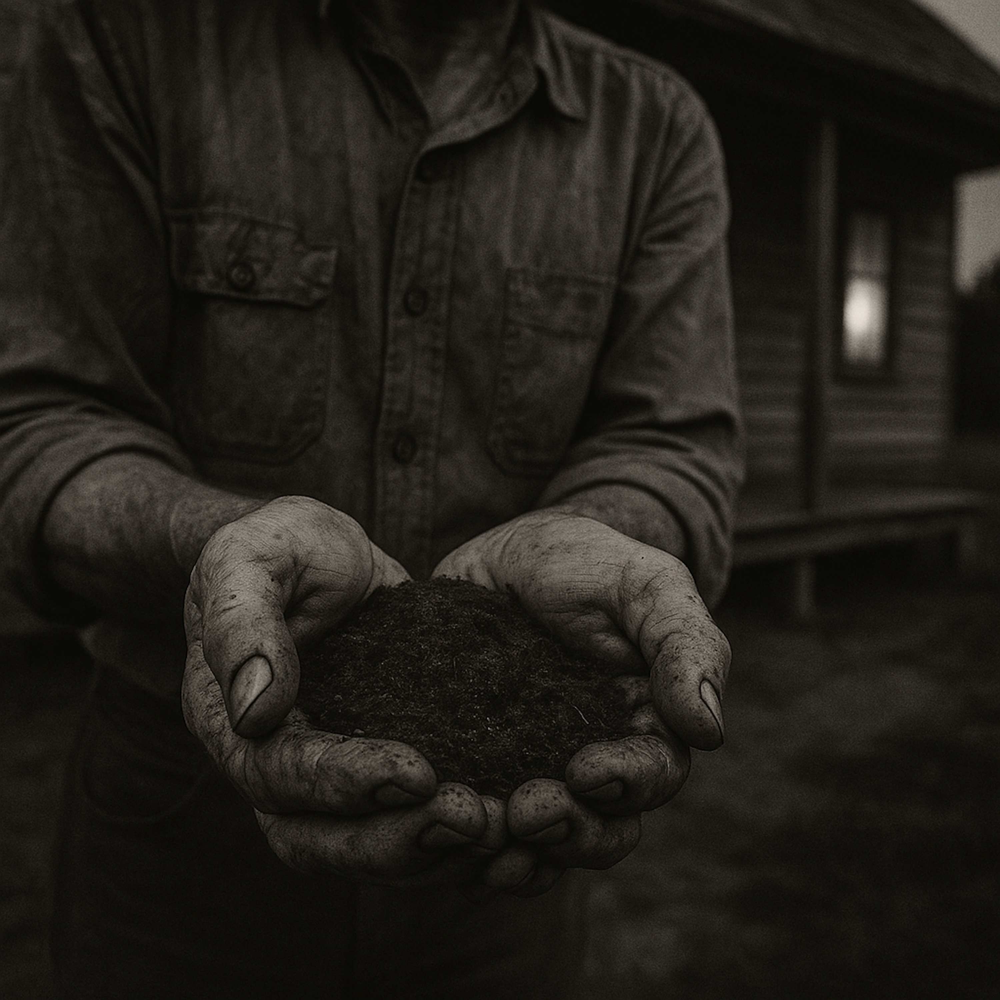

# Gonna Get My Hands Dirty  
  
This one's for anyone who's ever felt like they were reading the recipe for life but still going hungry. "Gonna Get My Hands Dirty" is a folk-blues story that digs into some old, powerful parables: one about a house on fire where the people inside are too busy playing to notice the danger , and another about a king's son who forgets his inheritance and has to work his way back to remembering his own worth.    
  
It's a song about the simple, gritty truth that wisdom isn't found on a page—it's earned in the dirt, in the work, and in the choice to act with compassion. It’s about rolling up your sleeves and realizing that the only way to make things real is to get your hands dirty.  
  
Inspired by the teachings of the *Lotus Sūtra*, this track is built on a foundation of raw acoustic guitar, weeping slide, and a wailing harmonica. For fans of story-driven folk and blues that asks the big questions.  
  
**Search Tags**  
  
Folk, Blues, Americana, Singer-Songwriter, Acoustic, Storytelling, Original Music, Folk Rock, Country Blues, Slide Guitar, Harmonica, Spiritual, Philosophy, Buddhism, Lotus Sutra, Parable, Compassion, Hope, Redemption,  
  
Lyrics:   
(Acoustic guitar intro, slow and steady like a train rhythm)  
  
(Verse 1)  
The roof is on fire, the floorboards are hot  
But the children are playin' with the toys they got  
Don't see the danger, don't see the rot  
In this burnin' house, they've already forgot.  
A man stands outside, he's callin' their name  
Says, "I got you somethin' better than this foolish game."  
He don't waste his time tryin' to explain the flame  
He just knows the gettin' out is the whole aim.     
  
(Chorus)  
'Cause you can read the recipe 'til your eyes go blind  
But the truth ain't on the page, it's what you do and find.  
Gotta get your hands dirty in this world of mine  
'Cause readin' ain't the same as cookin' when it's supper time.  
  
(Verse 2)  
I was a king's son, but I ran from my home  
For fifty long years, I was destined to roam.  
Dressed in rags and sorrow, chilled to the bone  
Forgot the great fortune that I'd always owned.  
I stumbled back home, but I didn't know the place  
Saw my own father, but couldn't see his face.  
He saw my shame, my fall from grace  
And knew the whole truth would make me flee the space.     
  
(Verse 3)  
So he hired me on for a poor man's pay  
To shovel the dirt at the close of the day.  
For twenty long years, he showed me the way  
Built me back slowly, come what may.  
He never once told me, "Son, you are my heir"  
He just let my own work chase off my despair.  
'Til I was strong enough, the real truth to bear  
That the whole damn kingdom was always my share.     
  
(Chorus)  
You can read the recipe 'til your eyes go blind  
But the truth ain't on the page, it's what you do and find.  
Gotta get your hands dirty in this world of mine  
'Cause readin' ain't the same as cookin' when it's supper time.  
  
(Bridge)  
Then the ground beneath me started to shake and to groan  
And a million helpers rose up from the stone.  
They weren't from the heavens, they were flesh and bone  
Born of this suffering world, to make it their own.     
They said, "The work ain't 'bout savin' just you from the fire"  
"It's about stayin' behind, to lift everyone higher".     
  
(Chorus)  
So I'll read the recipe, but I won't be blind  
'Cause the truth ain't on the page, it's in the daily grind.  
Gonna get my hands dirty for all of humankind  
'Cause readin' ain't the same as cookin', and it's supper time.  
  
(Outro, guitar slows)  
Yeah, it's supper time...  
Gonna help my brother...  
Gonna help my sister...  
It's supper time.  
(Final chord fades)  
  
  
