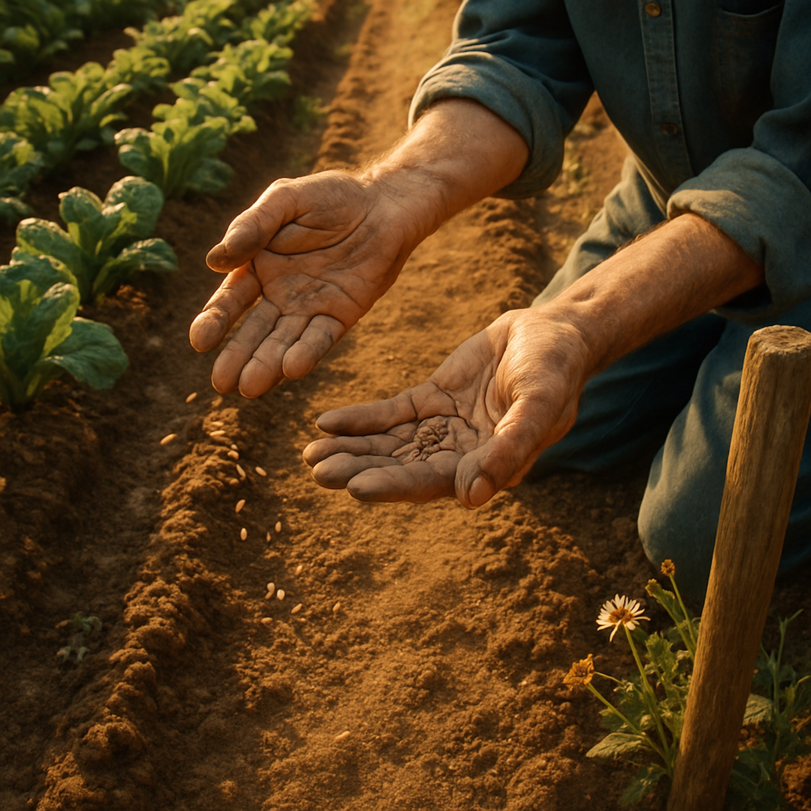

# Good Seed  
  
**Good Seed (Garden Blues) - Platform Description**  
**Description**  
"Good Seed" is a patient, grounding folk-blues meditation on the wisdom of tending life like a garden. With fingerpicked acoustic guitar, warm harmonica, and call-and-response vocals, this song explores what it means to plant good seeds, give freely without demanding results, and learn from the spaces where nothing grows.  
Drawing on timeless gardening wisdom and spiritual insight, this track reminds us that we can't force growth - we can only create the conditions and trust the process. Some seeds bloom in spring, some take years, and some teach us through their silence. The empty spaces in our garden hold wisdom just as profound as the flowers.  
Perfect for anyone who's learning to work at a different pace, to give light without attachment, to honor both the blooms and the bare soil. A companion piece to the bardic tradition of carrying wisdom through song.  
**Key themes:** Patience and trust • Learning from what doesn't grow • Giving freely like the sun • Garden wisdom • Letting go of control • Empty spaces as teachers • Scattering kindness like seeds  
  
**SEO Tags**  
folk blues, garden song, patience songs, spiritual folk music, acoustic blues, gardening metaphor, wisdom music, mindfulness songs, letting go, trust the process, bardic music, bluesy folk, fingerpicked guitar, harmonica blues, contemplative music, folk storytelling, roots music, Americana folk, organic folk sound, meditation music, growth and patience, learning from failure, planting seeds, conscious folk, nature wisdom, slow living music, folk philosophy, earth-based spirituality, working hands, soil and seeds, seasonal wisdom, authentic folk, vintage blues sound, call and response, indie folk blues, sacred folk music, teaching songs, life lessons music, acceptance songs, non-attachment, trust in nature, folk tradition, modern bard, timeless wisdom, DIY folk, heartfelt blues  
  
**Short Version (for character-limited platforms)**  
Patient folk-blues about tending life like a garden. Learning from what grows and what doesn't. Wisdom, harmonica, and trust in the process. 🌱  
**Hashtag Version**  
#FolkBlues #GardenWisdom #PatienceSongs #SpiritualFolk #AcousticBlues #MindfulnessMusic #LetItBe #TrustTheProcess #BardicMusic #RootsMusic #ContemplativeMusic #AmericanaFolk #FolkPhilosophy #ModernBard #AuthenticFolk #Indiefolk #SlowLiving #NatureWisdom #FolkStorytelling #OrganicSound  
  
  
[Verse 1]  
Got my hands in the dirt, got the sun on my face  
Been learning to work at a different kind of pace  
You can't pull on a seedling to make it grow tall  
Sometimes the waiting is the wisest work of all  
  
[Chorus]  
Just plant good seed, tend the garden well  
Give it light and water, let the seasons tell  
Some will bloom in spring, some will take their time  
And the ones that don't grow, well they teach you just fine  
Plant good seed, let it be  
  
[Verse 2]  
I used to think that I could force my way through  
Fight and push and make things do what I want them to  
But the sun don't demand, and the rain don't command  
They just give what they got, leave the rest in nature's hands  
  
[Chorus]  
Just plant good seed, tend the garden well  
Give it light and water, let the seasons tell  
Some will bloom in spring, some will take their time  
And the ones that don't grow, well they teach you just fine  
Plant good seed, let it be  
  
[Bridge]  
Every flower that don't bloom  
Is teaching something true  
Maybe wrong soil, maybe wrong time  
Maybe it's making room for something else to shine  
There's wisdom in the empty space  
Where nothing shows its face  
  
[Verse 3]  
So I listen to the silence where the seeds won't grow  
There's a message in the nothing that I need to know  
Not everything's meant for every piece of ground  
Sometimes letting go is the most fertile thing I've found  
  
[Verse 4]  
I'm just a gardener with a patch of earth and time  
Scattering kindness like seeds along the line  
Can't control the weather, can't command the spring  
Just offer up my light and see what mercy brings  
  
[Final Chorus]  
Plant good seed, tend the garden well  
Give it light and water, trust the story it will tell  
Some will bloom tomorrow, some will take some years  
And the ones that don't grow hold a wisdom just as clear  
Plant good seed  
Oh, plant good seed  
And let it be  
  
[Outro]  
(Slow and peaceful)  
Hands in the dirt, sun on my face  
Learning to work at a different kind of pace  
Plant good seed... and let it be  
  
  
