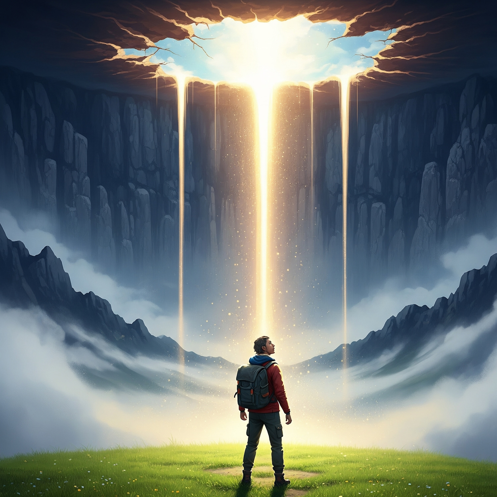

# Infinite Potential   
  
Verse 1 – Bluesy Reflection  
I chased a silver lining, thought the climb was done  
Rested on a hillside, thinking I’d won  
Had my quiet moments, a lonely peaceful view  
Never sensed the deeper river, running strong and true  
That “good-enough” whisper kept my vision small  
Till I saw the mountain rising, higher than the wall  
  
Chorus – The Discovery (Folk Anthem)  
Then the sky cracked open, and the truth began to gleam  
A boundless hidden legacy, wilder than a dream  
Not a gift from somewhere else, but a fire born within  
Always here for living—where do I begin?  
This treasure of the heart, wide as the endless night  
Infinite potential waiting, ready to ignite  
  
Verse 2 – Shifting Perspective  
I thought my private burdens were the only weight to bear  
Shadowed by my sorrows, breathing heavy air  
But the world’s own aching echoed in every cry and sound  
And I stepped outside my narrow life onto common ground  
From small-minded wisdom a larger light will rise  
Seeing through the emptiness with newly opened eyes  
  
Chorus – The Discovery (Folk Anthem)  
Then the sky cracked open, and the truth began to gleam  
A boundless hidden legacy, wilder than a dream  
Not a gift from somewhere else, but a fire born within  
Always here for living—where do I begin?  
This treasure of the heart, wide as the endless night  
Infinite potential waiting, ready to ignite  
  
[Instrumental]  
  
Bridge – One Road, Many Lives  
Some seek quiet refuge, some fight through the storm  
Different scars and battles, yet a single form  
The road keeps weaving, our lessons intertwine  
All our paths converging in a grand design  
Not escape but engagement, a journey we all share  
A human vow together, driving out despair  
  
Chorus – The Discovery (Folk Anthem)  
Then the sky cracked open, and the truth began to gleam  
A boundless hidden legacy, wilder than a dream  
Not a gift from somewhere else, but a fire born within  
Always here for living—where do I begin?  
This treasure of the heart, wide as the endless night  
Infinite potential waiting, ready to ignite  
  
Outro – Shared Mission  
No more just my freedom, but a hand stretched to give  
For every breathing spirit, as long as I live  
This unclaimed legacy shining fierce and bold  
A story for the ages, waiting to unfold  
Compassion rising natural, in every soul a spark  
Mending the broken world, and lighting up the dark.  
  
spiritual , inspirational , folk , singer-songwriter , wisdom , compassion , awakening , transformation , enlightenment , personal growth , hope , storytelling , Padmaprabha , Buddhism , Dharma  
  
  
