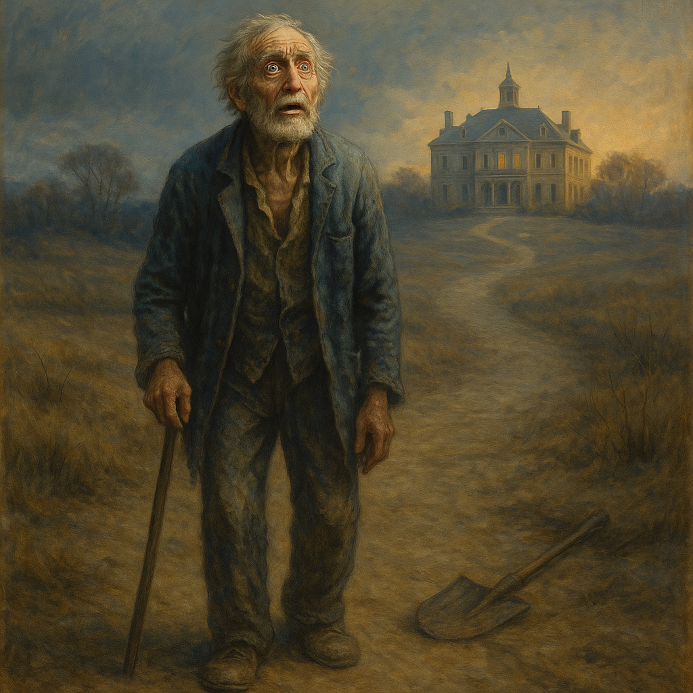

# Journey to Legacy  
*(folk ballad – steady, rootsy groove)*  
  
**Verse 1**   
A young soul left his roots and home, a legacy deep and wide,   
Wandered through the hard years, nowhere left to hide.   
Fifty winters bent his back, hunger wore him thin,   
Never guessed the treasure waiting, right where life began.   
The elder rich in wisdom watched from a silent place,   
Longing for the lost one, hoping time would give him grace.  
  
**Verse 2**   
One day the weary drifter, heavy with old fears,   
Stumbled on a grand estate that echoed through the years.   
Awe and trembling filled the heart—this can’t be for me,   
Turned and fled that shining hall, back to poverty.   
Saw himself as nothing, just a laborer on the hill,   
Blind to the greatness beating quiet and still.  
  
**Chorus**   
He ran from his own blessing, too humble to believe,   
That the wealth before his eyes he was born to receive.   
The elder, patient, knowing that a small dream can bind,   
Worked with subtle kindness to free that captive mind.  
  
**Verse 3**   
Two mentors came in plain clothes, with simple, honest ways,   
“Clear the clutter, learn the ropes,” they said, and doubled pay.   
Twenty years of steady work, roots in sacred ground,   
While the elder—masked and silent—kept the circle round.   
Each small skill a stepping stone, each day a hidden plan,   
Building trust and confidence, to wake the sleeping clan.  
  
**Verse 4**   
Promoted up to manager, steward of the land,   
Still the heart stayed servant-small, riches close at hand.   
Never claimed a single gift, thinking nothing due,   
The old story of being low kept shadowing the view.   
True identity lay waiting, just beyond that fear,   
A vast inheritance shining ever near.  
  
**Chorus**   
He ran from his own blessing, too humble to believe,   
That the wealth before his eyes he was born to receive.   
The elder, patient, knowing that a small dream can bind,   
Worked with subtle kindness to free that captive mind.  
  
**Bridge**   
At last the elder summoned all and spoke with ringing voice,   
“This is my true heir—my heart, my rightful choice.   
All that I have is theirs; it always has been so.”   
The final veil was lifted; the soul could finally know.   
It wasn’t gaining fortune, but reclaiming what was there—   
His own inherent power, beyond all worldly care.  
  
**Outro**   
No longer a vagabond, no longer lost and tossed,   
An heir to boundless treasure, whatever years had cost.   
Living proof of hidden wealth that patience can restore—   
The Heir’s Blues no longer, but a song of “evermore.”  
  
  
  
  
