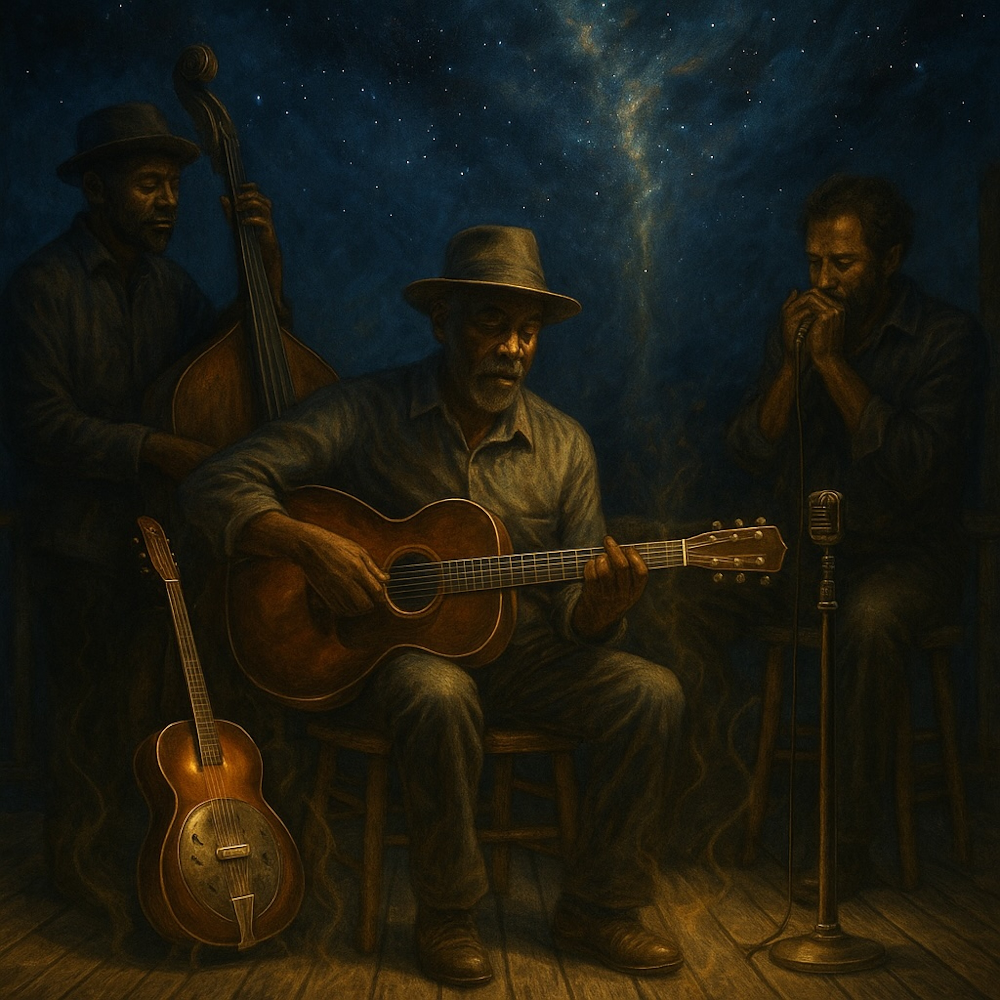

# *Joyful Display Blues*  
  
*Joyful Display Blues* is a slow-burning, midnight-porch blues-folk song that turns ancient Lotus Sūtra insight into raw, human sound. Finger-picked guitar and a low harmonica drone carry lyrics about bodhisattvas rising from the earth, the Buddha’s cosmic display of light, and the vow to transform anger, isolation, and attachment into courage, compassion, and wisdom. Lantern-warm tones and indigo sky textures give the music a mystical yet earthy feel. It’s a celebration of everyday alchemy—turning poison into medicine—and of the unstoppable joy that keeps us singing through dark nights.  
  
**Search Tags**  
blues folk, acoustic blues, spiritual blues, lotus sutra, buddhist blues, bodhisattva blues, mystical folk, porch blues, soulful harmonica, fingerpicked guitar, mindful music, spiritual awakening, transformation song, cosmic blues, deep listening, americana roots, meditative blues, vow and joy, Nichiren inspiration, slow blues groove  
  
Lyrics:   
(slow, minor-key folk blues; finger-picked guitar with a low harmonica drone)  
  
[Verse 1 – The Long View]  
I heard the earth was shakin’, Bodhisattvas risin’ from the ground,  
Not some far-off heaven, but right here where truth is found.  
They vowed to keep the story, when the Buddha’s voice was gone,  
And the sky lit up like thunder—light from every pore shone on.  
  
[Chorus – The Cosmic Call]  
Oh the Buddha stretched his tongue to heaven,  
snapped his fingers, the worlds all spun.  
But that power’s not a parlor trick,  
it’s the vow of everyone.  
The joyful display of the Buddhas,  
is the strength we carry inside—  
Turning poison into medicine,  
on this blues-folk midnight ride.  
  
[Verse 2 – Everyday Alchemy]  
Anger’s just raw energy, I can forge to fearless love,  
Isolation melts to compassion, like rain from clouds above.  
Attachment shifts to wisdom, seein’ life as it truly flows,  
Every wound a door to freedom, every thorn a hidden rose.  
  
[Chorus – The Cosmic Call]  
Oh the Buddha stretched his tongue to heaven,  
snapped his fingers, the worlds all spun.  
But that power’s not a parlor trick,  
it’s the vow of everyone.  
The joyful display of the Buddhas,  
is the strength we carry inside—  
Turning poison into medicine,  
on this blues-folk midnight ride.  
  
[Bridge – Modern Mission]  
Nichiren walked that lonesome road,  
Superior Practice in his bones.  
Told us chant the mystic name,  
make this troubled world our own.  
It ain’t some distant paradise,  
it’s the grit beneath our feet.  
We rise from earth like thunder,  
with a vow we won’t defeat.  
  
[Verse 3 – Eternal Present]  
The light that shook ten thousand worlds,  
still burns in every breath we take.  
Every time we lift another soul,  
the cosmic joy awakes.  
This ain’t old scripture fading,  
it’s a song the future sings,  
A blues that rolls forever,  
on Bodhisattva wings.  
  
[Final Chorus – The Joyful Display]  
Oh the Buddha stretched his tongue to heaven,  
snapped his fingers, the worlds all spun.  
But that power’s not a parlor trick,  
it’s the vow of everyone.  
The joyful display of the Buddhas,  
is the strength we carry inside—  
Turning poison into medicine,  
on this endless midnight ride.  
  
(Outro: slow harmonica fade, a soft guitar thumb-beat like a distant heartbeat)  
  
  
