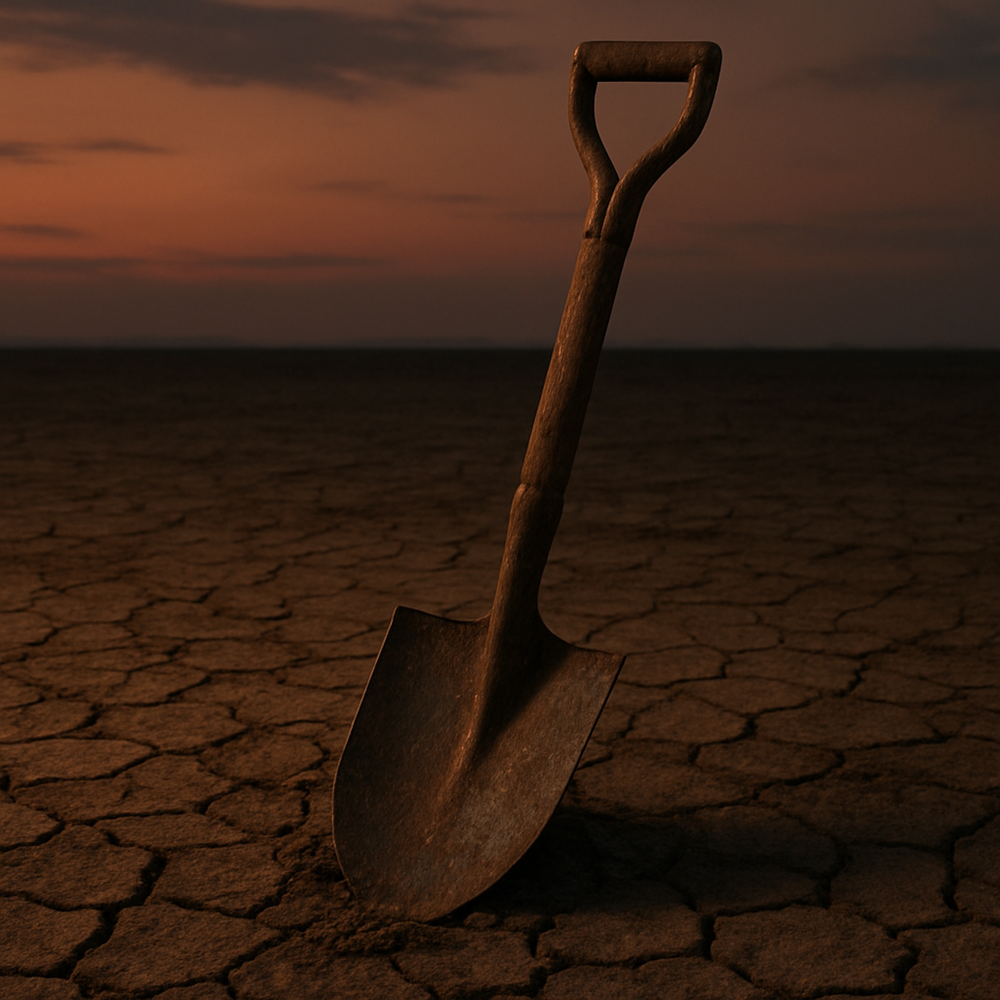

## Lay Your Shovel Down  
## A Blues-Folk Song  
  
A blues-folk meditation on the exhaustion of trying to earn your worth through endless striving. This song walks through the valley of good intentions gone sour, calloused hands and hollow prayers, until a stranger by the roadside offers an ancient truth: the light you've been climbing toward was inside you all along.  
  
Written in the tradition of confessional Americana, "Lay Your Shovel Down" explores what happens when our attempts to help others become mirrors for our own ego, and how grace arrives not as a reward for effort, but as a gift to the weary.  
  
Inspired by contemplative spiritual traditions but rooted in universal human longing, this is a song for anyone who's ever tried to light their own house with the fire they gave away.  
  
For the broken-down, the burnt-out, the ones still climbing in the dark—this one's for you.  
  
**SEO Tags**  
Blues, Folk, Americana, Spiritual Blues, Confessional Songwriting, Acoustic Folk, Contemplative Music, Gospel Blues, Dylan-esque, Roots Music, Folk Ballad, Southern Gospel, Redemption Song, Grace and Surrender, Existential Folk, Introspective Lyrics, Storytelling Song, Traditional Folk, Finger-Picked Guitar, Raw Vocals, Stripped Down Acoustic, Wisdom Tradition, Spiritual Seeking, Modern Folk Hymn, Blues Poetry, Folk Spirituality, Honest Songwriting, Lyric-Driven Folk, Philosophical Blues, Soul Searching  
  
  
*Tempo: Slow to mid-tempo (70-85 BPM), with space for breathing*
*Key: Suggested D minor or E minor for that weary, earthy tone*
*Feel: Raw, intimate, confessional—think early Bob Dylan meets Mississippi John Hurt*  
  
**[INTRO]**  
*(Sparse fingerpicked guitar or solo harmonica, setting a dusty, contemplative mood. Let it breathe for 8-12 bars. The listener should feel like they're walking into the middle of someone's private reckoning.)*  
  
**[VERSE 1 – The Labor and Dissatisfaction]**  
(Guitar builds slightly, steady rhythm. Vocals raw, almost conversational at first, building intensity toward the end)  
  
I woke up this morning,   
climbed the highest hill,   
tried to make it right.  
Dug every garden,   
gave my neighbor water,   
waited for a sign of light.  
I hauled stone and timber,   
built a fire to keep folks warm,  
But when the long shadows stretched and the day was gone,   
I was empty, soaked, and worn.  
  
(Drop intensity—deliver next lines like the embers dying.)
  
I found my kindness was just a mirror,   
cracked and gray,
Tryin’ to light my own damn house with the fire I gave away.  
  
(Swell again.)
  
Yeah, I worked all day long, but when the moon rose high—
My spirit still wasn’t satisfied.  
  
**[CHORUS – The Cry and the Lifeline]**  
(Full band enters if you have one—drums, bass. Otherwise, guitar intensifies. This is the breaking point, so the music should feel both desperate and released)  
  
My hands are calloused,   
but my prayers taste like a lie,  
I’m standin’ in the dust,   
watchin’ every good deed drift on by.
My giving was hollow,   
hidin’ what I hoped to get,
I’m drownin’ in my own well-meaning,   
and the shore ain’t found me yet.  
  
(Pull back, intimate tone.)
  
Practice ain’t enough, Lord—  
I need the truth I can’t achieve,  
I need the word that saves me from the man I thought I had to be.  
  
**[VERSE 2 – The Scene of Collapse and Grace]**  
(Pull back to sparse instrumentation. This is storytelling mode—intimate, scene-setting)  
  
I tried to pull the world up clean from the mud,  
But the weight of their sorrow mixed in with my blood.  
My high aspirations sank down in the mire,  
My water turned bitter—  
I forgot the true fire.  
  
(Long rest; let the silence ache.)
  
I fell by the roadside,   
cold dread in my chest,  
When a stranger laid a parchment right upon my weary chestc.  
  
(Echo the stranger’s voice—distant, warm, eternal.)
  
He said: “You been tryin’ to earn the daylight,   
climbin’ in the dark,  
The wellspring you been diggin’ for’s already in your heart.
Now close your weary eyes, child—  
let these words carry you home.”  
  
**[CHORUS (REPRISE)]**  
(Same as first chorus, but now it carries different weight—this time it's understood, not just cried out)  
  
My hands are calloused,   
but my prayers don’t taste like lies,
I’m standin’ in the dust,   
watchin’ grace come rollin’ by.
My giving was hollow once,   
hidin’ what I hoped to get,
But I’m drinkin’ from that same well now—  
and I ain’t drownin’ yet.  
Practice ain’t enough, Lord—  
but faith is what I see,
I found the word that saves me from the man I tried to be.  
  
**[BRIDGE – The Revelation and Assurance]**  
(Music shifts here—this should feel like dawn breaking. Maybe add strings, organ, or just a fuller guitar arrangement. This is the turning point, the theological heart delivered as poetry)  
  
Then a whisper cut through the drought,  
Said, “The gold you’re diggin’ for—  
it’s what you’re made of, child, no doubt.”  
You been pullin' on a door that never was locked,  
Bleedin’ for the light when it’s burnin’ inside.  
  
(Build to release—the redemption lands musically and lyrically.)  
  
The fire was in the wood all along,  
The song was in your skin.  
The debt was paid before your birth—  
You just gotta let the mercy in.  
  
**[OUTRO – The Final Release]**  
(Strip back to just voice and guitar, or voice and single sustained note. This is the resolution—quiet, grounded, peaceful)  
  
You don’t gotta carry nothin’,   
just lay your shovel down and sigh.  
The worth you were lookin’ for, child,   
was shinin’ in your own eye.
You don’t gotta earn the grace—  
just stand still and breathe.  
  
(Shift to “I”—testimony voice.)
  
I climbed that high hill,   
but now I sit down flat,
And the quiet that holds me deep—  
is the peace I chased at last.
I stopped the striving, let the light just stay—  
I walked out of my own shame today.  
  
(Whispered close, almost off-mic)
  
“No more... cold dread..."  
  
(Optional mantra fade: “Lay it down… lay it down…”)  
  
  
