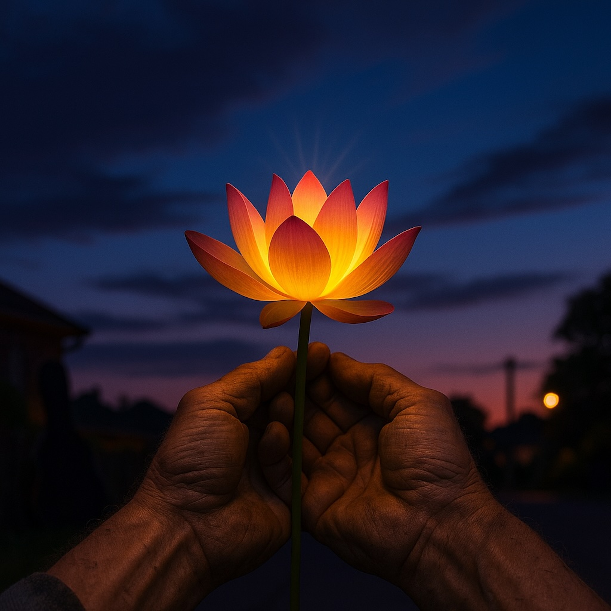

# Lotus Light’s Blues  
  
**Lotus Light’s Blues** is a slow-burning folk-blues meditation on ordinary awakening. Over a minor-key finger-picked guitar, the song follows a long road of restless searching and discovers that the Buddha-mind is not hidden in distant heavens but alive in daily kindness and work-worn hands.  
  
Each verse weaves images of dusty roads and quiet rivers of compassion with a chorus that celebrates everyday generosity—lifting a lamp for a neighbor, building shelter under Houston skies, letting a song ride the breeze. The bridge and outro honor that joy as the true lantern, shining out the Lotus Dharma in the here and now.  
  
With its glowing, street-corner spirituality and blues-folk groove, **Lotus Light’s Blues** invites listeners to find liberation not in escape, but in the simple, luminous acts of care that make us the reason others care.  
  
(Music intro: A slow, finger-picked acoustic guitar melody with a hint of a minor chord, like an old blues tune.)  
  
(Verse 1)   
Dusty road stretches on forever, sun beats down on my weary face   
Been chasing a dream I can’t catch, running a solitary race   
Thought peace was a mountain to climb, a prize only saints could hold   
But the stories I heard in my youth, they left a hunger in my soul.  
  
(Chorus)   
Now the Buddha's mind ain’t hiding, it's not way out in the distant blue   
It's right here in the hands of the workin' man, and the gentle grace of you   
When you lift a lamp for your brother, you bring harmony into the air   
You don't just find a rare stage, you become the reason people care.  
  
(Verse 2)   
Some folks say there's a dozen roads, some say just a single lane   
But the river of compassion, it flows to wash away the pain   
All the stories, all the parables, they’re just signposts for the blind   
Just fingers pointing to the moon, the same full moon we all can find.  
  
(Chorus)   
Yeah, the Buddha's mind ain’t hiding, it's not way out in the distant blue   
It's right here in the hands of the workin' man, and the gentle grace of you   
When you lift a lamp for your brother, you bring harmony into the air   
You don't just find a rare stage, you become the reason people care.  
  
(Bridge)   
Keeping the word ain't just a book, it's the kindness in your eyes   
It's building a shelter for the weary, beneath these Houston skies   
And that joy you feel when you give, that's the lantern burning bright   
Shining out the Lotus Dharma, Padmaprabha’s holy light.  
  
(Outro)   
So put a song on the wind now, let it ride that gentle breeze   
For all the souls in trouble, scattered like the autumn leaves   
Yeah, for all the souls in trouble...   
  
(Guitar melody fades out slowly, with a final, resonant chord.)  
  
  
  
