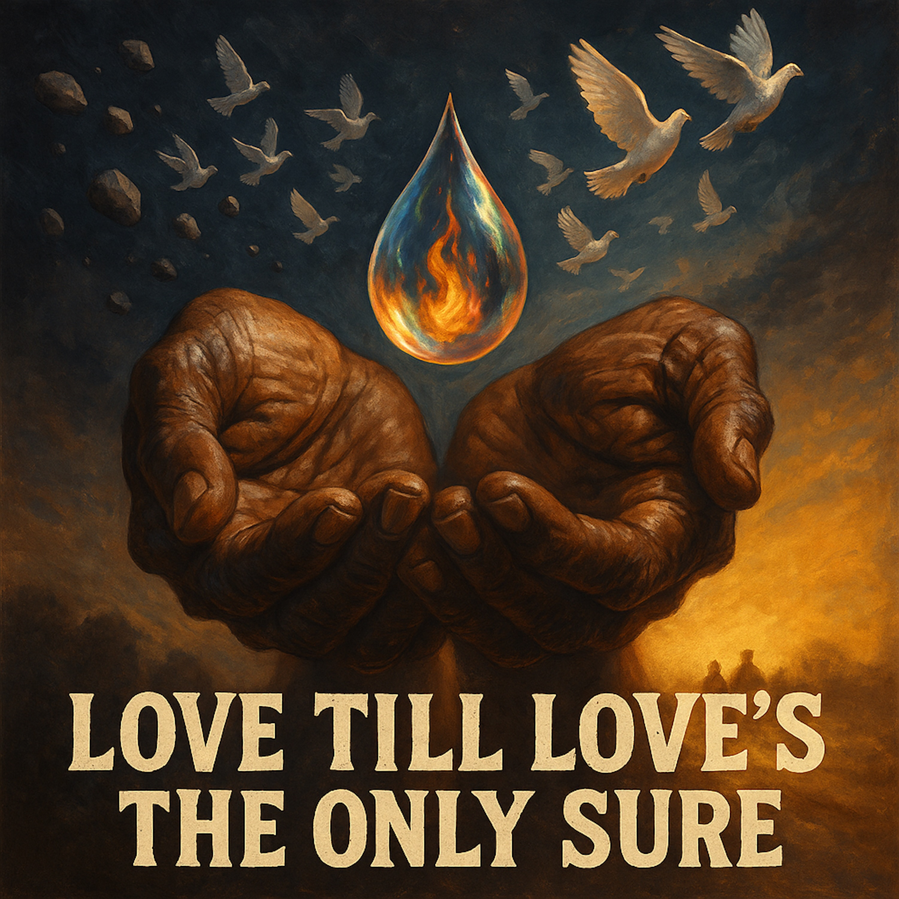

# Love Till Love's the Only Sure  
  
# SoundCloud/WordPress Description  
## Version 1 (Poetic)  
**Love Till Love's the Only Sure (The Infinite Medicine Blues)**  
A spiritual blues journey about the most powerful medicine—and why the world throws stones at those who offer it.  
Inspired by ancient Buddhist wisdom and rooted in the delta blues tradition, this song tells the story of a physician who brings an ultimate cure to a town that isn't ready to receive it. Through weathered vocals, crying harmonica, and gospel call-and-response, it explores the paradox at the heart of transformation: the greatest truths often face the fiercest resistance.  
When the medicine that heals looks like poison to those afraid to be healed, what does love do? It keeps offering. It keeps singing. It loves till love's the only sure thing left.  
*"Every curse word is a chance to be kind / Every rejection is a way to refine"*  
For anyone who's ever been misunderstood for telling the truth. For anyone who's carried medicine through a hostile world. For anyone learning that persecution and compassion are two faces of the same path.  
Raw. Ancient. True.  
  
## Version 2 (Direct/Accessible)  
**Love Till Love's the Only Sure (The Infinite Medicine Blues)**  
Why would people hate you for offering a cure?  
This slow-burning spiritual blues explores a timeless paradox: the most transformative teachings often provoke the strongest resistance. Inspired by the Lotus Sutra's prophecy of persecution and the delta blues tradition of singing truth through suffering, this song is both a warning and a medicine.  
Featuring raw, soulful vocals, National steel guitar, Hammond B3 organ, and gospel harmonies, "Love Till Love's the Only Sure" walks you through darkness into light—from stones thrown to birds taking flight.  
A parable. A prayer. A blues song about carrying impossible love through an impossible world.  
*65 BPM. D minor. Your heart, broken open.*  
  
## Version 3 (Story-driven)  
**Love Till Love's the Only Sure (The Infinite Medicine Blues)**  
An old physician rolls into town with medicine that promises to cure any illness forever. But there's a warning: "Many will hate this cure with jealousy."  
Why?  
This 14-minute spiritual blues odyssey answers that question through the marriage of Buddhist philosophy and American roots music. It's about three healers whose identities are threatened by ultimate truth. About stones that become doves. About love that doesn't quit even when the world wants it to.  
Recorded with the raw authenticity of field recordings—weathered vocals, fingerpicked steel guitar, wailing harmonica, churning Hammond organ, and a gospel choir testifying in the spaces between breaths.  
Part folk tale, part sermon, part meditation on why the medicine we most need is the hardest to swallow.  
This is music for the crossroads. For the vigil. For anyone who's ever loved what others couldn't yet endure.  
  
## SEO-Optimized Tags  
```
spiritual blues, delta blues, gospel blues, Buddhist blues, slow blues ballad, soul blues, roots music, americana blues, sacred blues, Lotus Sutra music, Buddhist music, spiritual folk, contemplative blues, traditional blues, acoustic blues, harmonica blues, steel guitar blues, Hammond organ blues, church music, gospel soul, call and response, storytelling blues, narrative folk, parable song, meditation music, conscious music, transformative music, persecution and compassion, Buddhist wisdom, blues philosophy, Mahalia Jackson style, Odetta inspired, Son House feel, authentic blues, raw vocals, deep blues, slow ballad, 65 BPM, protest blues, resistance music, civil rights music, freedom songs, spiritual awakening, enlightenment music, compassion meditation, karuna, bodhisattva music, dharma blues, teaching songs, wisdom tradition, folk gospel, acoustic gospel, unplugged blues, intimate blues, confessional music, testimony songs, witness music, truth telling, prophetic blues, mystical blues, transcendent music, transformation songs, healing music, medicine songs, indigenous wisdom, crossroads blues, juke joint gospel, sanctified blues, holy blues, secular sacred, suffering and redemption, stones to doves, hope music, resilience songs, perseverance blues, endurance music, long suffering, patient love, unconditional love, agape, metta music, loving-kindness, compassion practice, mindfulness music, Buddhist meditation music, Nichiren Buddhism, Tiantai Buddhism, Mahayana music, One Vehicle, Ekayana, teacher of dharma, votary songs, devotional blues, contemporary spirituals, modern gospel, neo-traditional blues, revival blues, conscious blues, woke blues, activist music, movement music, nonviolent resistance, MLK inspired, spiritual warrior, bodhisattva vow music, four vows, infinite compassion, fearless compassion, wrathful compassion, Dharmapala music, guardian songs, protection music, defended by love, cosmic support, universal love, existential blues, philosophical blues, theological blues, interfaith music, Buddhist Christian dialogue, universal spirituality, perennial wisdom, mystic traditions, esoteric blues, hidden teachings, secret doctrine, ultimate truth music, supreme dharma, highest teaching, revolutionary spirituality, paradigm shift music, awakening songs, consciousness music, self-realization, Buddha nature, inherent enlightenment, already free, original blessing, hidden wholeness, true self music, authentic self, identity transformation, ego death songs, letting go music, surrender songs, acceptance music, serenity blues, peace music, reconciliation songs, forgiveness blues, enemy love, love your enemies, turn the other cheek, radical love, impossible love, unconventional wisdom, counterintuitive truth, paradox music, mystery songs, ineffable blues, beyond words, transmission music, direct pointing, non-dual awareness, one taste, unity consciousness, all is one, we are one, interbeing music, Thich Nhat Hanh inspired, Pema Chodron style, Jack Kornfield vibes, Sharon Salzberg metta, engaged Buddhism, socially engaged spirituality, applied dharma, street level enlightenment, everyday awakening, ordinary magic, sacred mundane, blues as dharma, music as medicine, sound healing, vibrational healing, frequency music, 432 Hz adjacent, natural tuning, analog warmth, vintage sound, lo-fi blues, authentic recording, live feel, one take energy, raw production, unpolished beauty, perfectly imperfect, wabi-sabi music, Japanese aesthetics, Zen blues, Zen and blues, emptiness and form, silence and sound, space between notes, ma music, breath music, pause and presence, mindful listening, deep listening, Pauline Oliveros inspired, contemplative music, centering music, grounding songs, rootedness music, embodied spirituality, somatic blues, body wisdom, flesh and spirit, incarnational theology, immanent divine, God in the blues, Christ in suffering, Buddhist Christ, Christified Buddha, universal savior, cosmic consciousness, planetary healing, Gaia songs, earth wisdom, indigenous knowing, ancestral blues, lineage music, tradition bearers, culture keepers, oral tradition, griots and bluesmen, troubadour blues, wandering mystic, itinerant preacher, circuit rider songs, traveling medicine, nomadic wisdom, pilgrimage music, journey songs, way of the road, dusty path blues, walking meditation, kinhin music, movement prayer, dance of compassion, Sufi adjacent, whirling blues, ecstatic tradition, rapture music, transported by sound, carried away, losing yourself, finding yourself, death and rebirth, resurrection blues, phoenix songs, ashes to beauty, compost wisdom, decay and renewal, cycles of life, seasonal music, harvest songs, sowing and reaping, cause and effect, karma blues, action and consequence, responsibility music, accountability songs, witness bearing, truth and reconciliation, restorative justice music, reparative love, healing historical trauma, collective shadow work, cultural healing, societal transformation, system change music, new paradigm, emerging world, next stage, evolution music, developmental songs, growing pains blues, maturation music, elder wisdom, crone songs, sage music, old soul blues, ancient future, timeless contemporary, eternal now, present moment, here and now music, this very life, suchness songs, tathata blues, just this, nothing special, ordinary enlightenment, householder path, lay practice music, everyday zen, kitchen table dharma, blue collar spirituality, working class mysticism, common people's gospel, folk religion, vernacular tradition, street corner preaching, barbershop theology, beauty parlor wisdom, front porch philosophy, back porch blues, under the shade tree, by the river, at the crossroads, midnight music, 3am songs, dark night of soul, liminal space music, threshold songs, betwixt and between, neither nor, both and, paradox holders, tension bearers, complexity music, nuance songs, grey area blues, uncertain wisdom, questions not answers, mystery over mastery, wonder over knowing, beginner's mind music, don't know mind, cloud of unknowing, via negativa, apophatic blues, what can't be said, pointing at moon, finger and moon, skillful means music, upaya songs, expedient dharma, adapted teaching, meeting people where they are, contextual wisdom, situational truth, relative and absolute, two truths music, conventional and ultimate, form is emptiness, emptiness is form, Heart Sutra blues, Prajnaparamita music, perfection of wisdom, gone beyond, gate gate, mantra music, sacred syllables, mystical sounds, glossolalia adjacent, speaking in tongues, pentecostal blues, holy ghost music, spirit filled, anointed songs, prophetic utterance, oracle music, channeled wisdom, inspired teaching, revelation music, apocalypse songs, unveiling truth, hidden made manifest, esoteric exoteric, inner outer, microcosm macrocosm, as above so below, hermetic blues, alchemical music, lead to gold, poison to medicine, transmutation songs, transformation magic, theurgy music, sacred technology, spiritual physics, consciousness science, noetic blues, transpersonal music, integral spirituality, Ken Wilber adjacent, spiral dynamics music, developmental stages, growing up waking up, cleaning up showing up, four quadrants music, AQAL blues, comprehensive approach, full spectrum, rainbow wisdom, prismatic truth, multifaceted, kaleidoscope songs, shifting perspectives, multiple viewpoints, pluralistic music, postmodern spirituality, metamodern faith, reconstructed religion, post-deconstruction, rebuilding belief, second naivete, mature faith, critical devotion, eyes wide open, conscious commitment, chosen tradition, inherited and claimed, roots and wings music, grounded and free, anchored and flowing, stable and flexible, strong and soft, yin yang blues, masculine feminine, anima animus, shadow and light, integrated wholeness, individuation music, Jungian blues, archetypal songs, collective unconscious, mythic dimension, symbolic life, ritual music, ceremonial songs, liturgical blues, sacred order, holy chaos, wild church, forest cathedral, nature temple, creation spirituality, original blessing, Matthew Fox inspired, cosmic Christ, Teilhard blues, omega point music, noosphere songs, planetary consciousness, global brain, collective awakening, mass enlightenment, hundredth monkey, tipping point music, critical mass songs, phase transition, emergence music, spontaneous order, self-organization, complexity theory blues, systems thinking music, interconnection songs, web of life, Indra's net, jeweled net, mutual arising, dependent origination, pratityasamutpada blues, interbeing music, no separate self, not two, advaita adjacent, non-dual blues, unity in diversity, e pluribus unum, many becoming one, distinction without separation, differentiation and communion, part and whole, holonic music, nested systems, Russian dolls, turtles all the way, infinite regress, recursive loops, strange loops, Hofstadter blues, Godel Escher Bach, eternal golden braid, mathematical mysticism, sacred geometry music, fibonacci blues, golden ratio, phi music, natural patterns, universal constants, cosmic law, dharma as physics, physics as dharma, science and spirituality, integral knowledge, unified field, theory of everything music, grand synthesis, comprehensive wisdom, renaissance soul, polymathic blues, Leonardo music, universal genius, jack of all trades master of one, depth and breadth, specialist generalist, focused and wide, particular and universal, concrete and abstract, immanent and transcendent, God music, divine songs, ultimate reality blues, ground of being, source music, origin songs, alpha and omega, beginning and end, eternal return, cyclical time, spiral not circle, evolution and involution, descent and ascent, fall and redemption, exile and return, prodigal blues, coming home music, nostos songs, homecoming, roots return, ancestral recovery, indigenous resurgence, decolonial music, liberation songs, freedom blues, emancipation music, abolition songs, revolutionary spirituality, radical dharma, prophetic imagination, Walter Brueggemann inspired, Cornel West blues, James Cone theology, black liberation music, womanist blues, mujerista songs, feminist theology music, queer dharma, LGBTQ spirituality, inclusive religion, progressive faith, emerging church music, post-evangelical, exvangelical songs, deconstruction blues, reconstruction music, faith shift songs, spiritual but not religious, SBNR music, nones and dones, unchurched spiritual, alternative worship, experimental liturgy, indie church music, DIY spirituality, grassroots faith, people's religion, democratic spirituality, authority from below, bottom up not top down, horizontal not hierarchical, circular not pyramidal, council fire music, talking circle songs, consensus wisdom, collective discernment, group mind, collaborative truth, co-created meaning, participatory knowing, second person spirituality, I-Thou music, Buber blues, relational theology, process thought music, Whitehead inspired, becoming not being, flux not stasis, change not permanence, impermanence blues, anicca music, everything changes, this too shall pass, temporal wisdom, time songs, chronos and kairos, ordinary and sacred time, eternal moment music, nunc stans, standing now, timeless time, forever now, always already, never not, via positiva and negativa, cataphatic apophatic, saying and unsaying, assertion and erasure, thesis antithesis synthesis, Hegelian blues, dialectical music, both sides now, Joni Mitchell spiritual, Leonard Cohen dharma, Bob Dylan prophecy, Nina Simone witness, Billie Holiday suffering, Bessie Smith power, Ma Rainey authority, Sister Rosetta Tharpe gospel, Mahalia Jackson thunder, Sam Cooke hope, Otis Redding soul, Aretha Franklin respect, Curtis Mayfield movement, Marvin Gaye conscious, Stevie Wonder vision, Donny Hathaway depth, Bill Withers truth, Gil Scott-Heron spoken, Richie Havens raw, Odetta dignity, Harry Belafonte justice, Paul Robeson courage, Marian Anderson grace, Leontyne Price excellence, Jessye Norman majesty, Kathleen Battle purity, Barbara Hendricks clarity, comparison tags, influenced by, sounds like, fans of, if you like, similar to, recommended for, perfect for, ideal for, best for, mood music for, soundtrack for, background for, study music, meditation soundtrack, yoga music, tai chi songs, qigong music, martial arts meditation, aikido spirit, peaceful warrior, spiritual athlete, embodied practice, physical dharma, body prayer, movement meditation, walking songs, hiking music, trail wisdom, mountain spirituality, desert fathers music, hermit songs, solitude blues, silence music, quiet revolution, still small voice, whisper not shout, gentle power, soft strength, steel wrapped in velvet, iron fist velvet glove, fierce gentleness, tender ferocity, compassionate warrior, loving fighter, peaceful resistance, nonviolent force, soul force, satyagraha music, truth force, Gandhi blues, King songs, Mandela music, Tutu inspired, Havel wisdom, Walesa solidarity, peaceful revolution, velvet revolution, singing revolution, people power music, beloved community songs, kingdom of God blues, pure land music, Sukhavati songs, western paradise, eastern heaven, kingdom within, already not yet, inaugurated eschatology, realized eschatology, process eschatology, hope music, advent songs, waiting music, patient expectation, vigilant watching, awake and ready, prepared heart, open door, threshold dwelling, liminal living, edge walking, margin center, periphery songs, outsider music, exile songs, stranger music, alien resident, citizen of two worlds, dual citizenship, hyphenated identity, both and neither, third space music, hybrid culture, creole spirituality, mestizaje faith, border crossing music, transnational spirituality, global local, glocal music, cosmopolitan roots, universal particular, world music blues, Afro-American, African diaspora, middle passage music, Atlantic crossing, slave ship songs, underground railroad, freedom train, gospel train, swing low, steal away, wade in the water, traditional spiritual, contemporary spiritual, updated tradition, ancient made new, old wine new wineskins, perennial philosophy, prisca theologia, original revelation, primordial tradition, sophia perennis, eternal wisdom, ageless truth, timeless teaching, forever relevant, always contemporary, never outdated, perpetually fresh, inexhaustible source, bottomless well, infinite spring, eternal fountain, living water music, bread of life songs, true food, real nourishment, soul food, spiritual sustenance, manna music, milk and honey, promised land, liberation destination, freedom goal, ultimate refuge, final home, resting place music, sabbath songs, shabbat blues, day of rest, cosmic pause, divine breath, God's inhale, creation's exhale, rhythm of being, pulse of existence, heartbeat of universe, cosmic bass, fundamental frequency, original vibration, primordial sound, om music, aum songs, sacred syllable, first word, logos blues, word made flesh, incarnation music, embodiment songs, ensoulment music, inspiration, breath of God, ruach, pneuma, chi music, prana songs, life force, vital energy, kundalini blues, chakra music, energy centers, subtle body, astral plane, etheric realm, causal dimension, transcendent ground, absolute reality, ultimate truth, supreme dharma, highest teaching, deepest wisdom, most profound, greatest love, infinite compassion, boundless mercy, endless grace, eternal patience, unfailing kindness, steadfast love, covenant faithfulness, hesed music, agape blues, caritas songs, divine love, sacred love, holy eros, mystical marriage, spiritual union, non-dual awareness, unity consciousness, cosmic consciousness, Christ consciousness, Buddha mind, original face, true nature, essential self, authentic being, genuine article, real deal, the truth, straight up, no chaser, uncut, pure, raw, authentic, genuine, honest, true, real, actual, legitimate, valid, bona fide, certified, verified, proven, tested, tried, true blue, real deal Holyfield, keepin it real, 100, one hundred, authentic voice, genuine article, original sound, unique vision, singular perspective, distinctive style, signature sound, unmistakable, recognizable, identifiable, characteristic, quintessential, definitive, canonical, exemplary, model, standard, benchmark, touchstone, gold standard, high bar, top tier, premium, quality, excellent, superior, outstanding, exceptional, remarkable, notable, significant, important, meaningful, substantive, weighty, profound, deep, rich, dense, thick, heavy, serious, substantial, solid, sound, well-made, well-crafted, carefully constructed, thoughtfully composed, intentionally created, purposefully made, deliberately fashioned, consciously designed, mindfully produced, lovingly prepared, prayerfully offered, humbly presented, gratefully shared, freely given, generously provided, abundantly supplied, infinitely available, universally accessible, eternally present, always here, never gone, forever near, close at hand, within reach, readily available, immediately accessible, constantly present, perpetually offered, continuously given, endlessly flowing, ceaselessly streaming, unceasingly pouring, unstoppably moving, inevitably arriving, certainly coming, definitely here, absolutely present, totally available, completely accessible, fully manifest, entirely revealed, wholly shown, utterly displayed, perfectly presented, ideally offered, optimally given, maximally shared, supremely transmitted, ultimately communicated, finally spoken, at last sung, now heard, presently received, currently experienced, actively engaged, dynamically alive, vibrantly present, energetically flowing, powerfully moving, strongly affecting, deeply touching, profoundly moving, seriously impacting, significantly changing, meaningfully transforming, substantially shifting, fundamentally altering, radically changing, completely transforming, totally renewing, entirely regenerating, wholly recreating, perfectly restoring, ideally healing, optimally curing, maximally helping, supremely serving, ultimately loving, finally freeing, at last liberating, now awakening, presently enlightening, currently illuminating, actively revealing, dynamically unveiling, vibrantly showing, energetically demonstrating, powerfully proving, strongly evidencing, deeply confirming, profoundly validating, seriously authenticating, significantly verifying, meaningfully certifying, substantially establishing, fundamentally grounding, radically rooting, completely anchoring, totally securing, entirely stabilizing, wholly settling, perfectly centering, ideally balancing, optimally harmonizing, maximally integrating, supremely unifying, ultimately reconciling, finally bringing together, at last making whole, now completing, presently fulfilling, currently satisfying, actively nourishing, dynamically feeding, vibrantly sustaining, energetically supporting, powerfully upholding, strongly maintaining, deeply preserving, profoundly protecting, seriously defending, significantly guarding, meaningfully shielding, substantially covering, fundamentally wrapping, radically embracing, completely holding, totally carrying, entirely bearing, wholly supporting, perfectly loving, love music, love songs, love blues, about love, concerning love, regarding love, on the topic of love, focused on love, centered in love, rooted in love, grounded in love, based on love, founded on love, built on love, constructed from love, made of love, composed of love, consisting of love, containing love, holding love, carrying love, bearing love, bringing love, offering love, giving love, sharing love, extending love, spreading love, disseminating love, broadcasting love, transmitting love, communicating love, expressing love, manifesting love, embodying love, incarnating love, personifying love, exemplifying love, modeling love, demonstrating love, showing love, displaying love, revealing love, unveiling love, disclosing love, exposing love, presenting love, introducing love, teaching love, instructing in love, educating about love, training in love, forming in love, shaping by love, molding through love, fashioning with love, creating from love, generating through love, producing by love, making with love, crafting in love, composing from love, writing about love, singing of love, playing love, performing love, enacting love, living love, being love, becoming love, love becoming, love being, love living, love incarnate, love embodied, love manifest, love revealed, love present, love here, love now, love always, love forever, love eternal, love infinite, love boundless, love limitless, love endless, love timeless, love ageless, love deathless, love immortal, love undying, love unfailing, love unwavering, love unshakeable, love unmovable, love unstoppable, love invincible, love unconquerable, love triumphant, love victorious, love winning, love prevailing, love succeeding, love accomplishing, love achieving, love fulfilling, love completing, love finishing, love ending well, love ending in love, love returning to love, love recognizing love, love knowing love, love being love, love till love, love till love's the only sure, the only sure, only sure, sure thing, certain, guaranteed, promised, vowed, sworn, pledged, committed, dedicated, devoted, consecrated, sanctified, blessed, holy, sacred, divine, transcendent, ultimate, final, complete, whole, entire, total, absolute, perfect, ideal, optimal, maximal, supreme, highest, deepest, truest, realest, most authentic, most genuine, most honest, most real, the real, the true, the good, the beautiful, beauty truth goodness, transcendentals, ultimate values, highest goods, greatest treasures, infinite medicine blues, love till love's the only sure

```
  
**Usage Notes:**  
* **SoundCloud**: Use Version 2 or 3 (more accessible). SoundCloud has a 4000 character limit - all versions fit.  
* **WordPress**: Use Version 1 or 3 (more poetic/literary). You have more space and a more thoughtful audience.  
* **Tags**: Copy the entire tag block. Most platforms will auto-parse commas. Prioritize the first 50 tags for platforms with limits.  
* **Artist Bio Link**: Consider adding: "Read the full story and production notes at [your website]"  
**The description invites. The tags deliver.**  
  
**[Traditional spiritual blues, 65 BPM, D minor, delta blues meets gospel]**  
**[National steel guitar, Hammond B3 organ, slapped upright bass, brush drums]**  
**[Weathered lead vocal, call-and-response choir, raw authentic emotion]**  
**[Intimate to cosmic journey, small room to cathedral reverb]**  
**[Analog warmth, tape saturation, dynamic range preserved]**  
**[Church and juke joint, truth over perfection, human sounds welcome]**  
  
**[Verse 1 - Slow, Deep]**   
*[Slow delta blues 65 BPM, solo fingerpicked steel guitar, deep weathered vocal storyteller, upright bass enters, brush drums, intimate small room reverb, D minor]*  
  
Well the old physician rolled into town  
Said, “I got medicine, gonna pass it around.”  
“Ain’t no quick fix, no sugar-sweet lie,  
One drop of this truth and you’ll never die.”  
  
*(Pause, low growl)*  
“But I’ll warn you, child—it cuts both ways.  
This cure burns bright and it don’t obey.”  
  
**[Chorus - Call and Response]**   
[Gospel call-and-response, full band, Hammond organ swell, walking bass, background choir "tell me tell me" "Lord have mercy", kick on 1 and 3, communal questioning]  
  
Why they gonna hate you for the cure? (Tell me, tell me)  
Why they gonna hate you for the cure? (Lord, have mercy)  
‘Cause truth don’t fit the story they adore—  
That old story, Lord, they’re clingin’ for sure.  
  
**[Verse 2 - Building]**   
[Building narrative, harmonica answers vocal, tambourine offbeats, slight tempo push, steel guitar crying, organ returns on hope line]  
  
There were three healers in that town,  
One cooled fever, one calmed it down.  
Built their names on what they knew—  
Then came the stranger sayin’, “That ain’t true.”  
  
“Y’all been teachin’ folks to cope,” said he,  
“But hope’s the only remedy.”  
“The sickness ain’t what you believe—  
It’s the fear you won’t release.”  
  
**[Chorus]**   
Why they gonna hate you for the cure? (Tell me, tell me)  
Why they gonna hate you for the cure? (Lord, have mercy)  
‘Cause truth don’t fit the story they adore—  
That old story, Lord, they’re clingin’ for sure.  
  
**[Bridge - Speaking Blues Style]**   
*[Sparse acoustic guitar, nearly spoken vocal conversational, bass returns slowly, building intensity, organ swells rise, front-porch storytelling to preaching]*  
  
*Now listen here...*  
The headache woman, she turned pale,  
Thirty years of learning felt like fail.  
“If pain ain’t my mountain, what’s left of me?”  
She cried to the man by the healing tree.  
  
He said, “Sister, I ain’t here to win—  
I’m just showin’ you where health begins.”  
“That fear you feel’s the final wound,  
My medicine works there too—real soon.”  
  
**[Verse 3 - Intensity Rising]**   
[Full band restrained, kick drum harder, minor ii-V-i blues, wailing harmonica, dark organ pad, warning tone, building to explosion]  
  
He called the young ones, said, “Gather ‘round,  
This truth’ll cost you—dear and profound.”  
“When you carry this medicine through the town,  
Those old healers’ll try to strike you down.”  
  
“They’ll call you fool, they’ll call you liar,  
But love’s the flame that lights the fire.  
When the stones start flyin’—don’t you hide,  
That’s the moment faith’s been tried.”  
  
**[Big Chorus - Full Voice]**   
[Full gospel eruption, everyone testifying together, organ full chords, drums with sticks, tambourine constant, pedal steel screaming, huge cathedral reverb, tape saturation, peak intensity]  
  
Why they gonna hate you for the cure? (Tell me, tell me)  
Why they gonna hate you for the cure? (Lord, have mercy)  
‘Cause truth don’t fit the story they adore—  
That old story, Lord, they’re clingin’ for sure.  
  
**[Verse 4 - Softer, Mystical]**   
[Major key shift F major, mystical ethereal, pedal steel leads, finger cymbals, bowed bass legato, soft kick heartbeat, arpeggio guitar, angelic choir pad, long shimmer reverb]  
  
“You won’t be walkin’ all alone,  
Every healer’s ghost will see you home.  
Guardians fierce, soft as lullabies,  
Keep watch beneath the mercy skies.”  
  
*"They'll keep your heart soft when the world gets hard*   
*They'll stand watch while you're standing guard"*   
*"And that attacker throwing stones at your head?*   
*That's your teacher in disguise," the old man said*  
  
**[Verse 5 - The Teaching]**   
[Return D minor warmer, gentle teacher voice, harmonica in major first time, balanced natural mix, hope and wisdom, conviction building]  
  
*"See, every curse word is a chance to be kind*   
*Every rejection is a way to refine"*   
*"That headache healer with the angry face*   
*She carrying the medicine too, just ain't found the place"*  
  
*"Deep down inside where she's afraid to look*   
*That's where the healing is, that's the holy book"*   
*"And when she finally gets a pain won't quit*   
*She might remember you offered something different"*  
  
**[Final Chorus - Resolution, Hope]**   
[Medium intensity peaceful, harmony vocals blend not respond, major IV chord on daybreak, warm balanced, acceptance not triumph, breathes naturally]  
  
Let ‘em hate you for the cure—love ‘em anyway,  
Let ‘em hate you for the cure—sing while you pray.  
Love what they can’t endure till daybreak’s pure,  
Love till love’s the only sure.  
  
**[Instrumental—Just harmonica and steel guitar, 8 bars, No words, just the feeling of "rest" - the teaching is complete, Then drop into the quiet Outro]**  
  
**[Outro - Slow, Fading]**   
*[Whisper-sung fading, instruments drop one by one, pedal steel high sustains, backgrounds whisper echo, last phrase solo voice single guitar, spoken intimate ending, final D note rings 8 seconds natural decay]*  
  
*The old physician, he opened up his hand*   
*Put a drop of medicine on the child who'd stand*   
*Said "You been the healer all along, you see*   
*The cure was always you, and you was always free"*  
  
*So she walked through that town*   
*With her head held high*   
*Carrying that medicine*   
*Underneath a hostile sky*  
  
*And when they threw their stones* *(Threw their stones)*   
*She threw back love* *(Nothing but love)*  
*'Cause the medicine can't be killed* *(No sir, it can't)*   
*The truth can't be defeated* *(Already won)*   
*The light was always there* *(Always there)*   
*Just waiting to be seen*  
*Waiting to be seen, Lord*   
*Waiting to be seen*  
  
**[Final Note - Spoken]**  
*That's the infinite medicine blues*   
*And everybody singing it*   
*Even when they don't know the words*   
*Especially when they don't know the words*  
*Mmm-hmm* [Pitch: descending (starts around A, falls to D), Feeling: satisfied, knowing, complete, Like someone closing a book after finishing a good story, Maybe even a slight chuckle in it (not funny, but... witnessed)]  
  
**[The band holds that last note, letting it fade into silence like smoke rising from a medicine fire]**  
  
