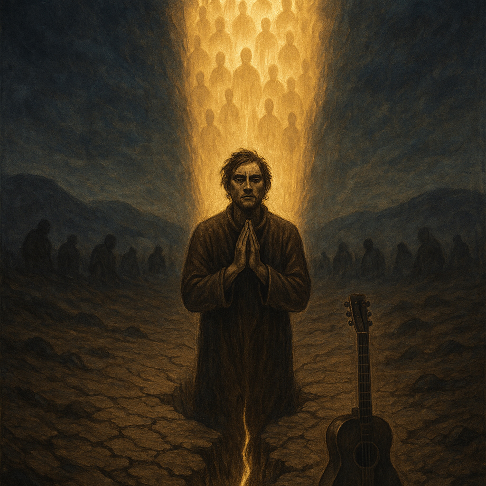

## Lyrics  
  
**The Fearless Vow Blues** is a folk-blues retelling of Chapter 13 of the Lotus Sūtra, where Medicine King and countless Bodhisattvas step forward to promise the Buddha they will spread the Dharma fearlessly, even in an age of corruption and hostility. With acoustic guitar, harmonica, and gospel-tinged rhythms, the song walks through the vow, the prophecy of persecution, the Buddha’s rejection of superficial promises, and the dramatic emergence of the Bodhisattvas of the Earth.  
  
This track blends gritty blues storytelling with timeless spiritual truth — carrying the vow of “not sparing body or life” into a modern voice. It’s a song about courage, rejection, deep roots, and the kind of faith that shines brightest when the world turns dark.  
  
⸻  
  
**Search Tags**  
  
blues folk, acoustic blues, spiritual blues, gospel folk, lotus sutra, fearless vow, bodhisattvas of the earth, medicine king, dharma blues, vow of devotion, protest folk, gospel blues, mystical folk, ancient wisdom, buddhist blues, fearless song, folk storytelling, cosmic blues, vow song, timeless dharma  
  
**The Fearless Vow Blues**  
  
**(Verse 1: The Buddha’s Call)**  
(Acoustic guitar, steady walking bass)  
The Buddha looked around, saw the final hour,  
Said, “The age ahead is cruel, and wickedness has power.”  
He called out to the sages, “Who will take the post?  
To carry on the truth, when I give up the ghost?”  
  
**(Chorus: The Fearless Vow)**  
Oh, we are the messengers, no fear left to spend,  
We won’t spare our bodies, we’ll fight till the end.  
We’ll preach the Dharma, though the world turns cold,  
Buddha, don’t you worry, this vow’s carved in gold.  
  
**(Verse 2: The Enemies)**  
(Harmonica, low and mournful)  
We know the bitter trials the future’s gonna bring,  
Three kinds of enemies sharpening their sting.  
The angry common people, cursing with their breath,  
And jealous false priests, who wish us to our death.  
  
They’ll conspire with the mighty, twist the crown around,  
Try to drive the Dharma Votary out of every town.  
  
**(Chorus: The Fearless Vow)**  
(With more grit and harmony)  
Oh, we are the messengers, no fear left to spend,  
We won’t spare our bodies, we’ll fight till the end.  
We’ll preach the Dharma, though the world turns cold,  
Buddha, don’t you worry, this vow’s carved in gold.  
  
**(Bridge: The Rejection)**  
(Music slows, minor chord shift)  
But the Lord looked on and said, “Your vow is good and true,  
Yet your roots in this dark world aren’t deep enough for you.  
I need more than courage, more than belief,  
I need disciples bound by time beyond grief.”  
  
**(Verse 3: The Earth Bodhisattvas)**  
(Music swells, gospel touch, harmonies rising)  
Then the ground began to tremble, the earth let out a cry,  
And countless golden figures came rising to the sky.  
The Bodhisattvas of the Earth, trained in ages long before,  
The true disciples chosen for the vow that would endure.  
  
Yeah, their bond runs deeper, a tie that will not break,  
The ones ordained to finish, for all living beings’ sake.  
  
**(Outro: The Deep Root)**  
(Harmonica wails, guitar fades on Am)  
The truth is in the deep root, the wisdom in the ground,  
Only the oldest bond can carry the final sound.  
  
———————————  
  
  
  
  
Gemini’s  
**(Verse 1: The Buddha’s Call)**   
(Acoustic guitar and simple bass begin)   
The Buddha looked around, he saw the final hour,   
Said, "The coming age is mean, and wickedness has power."   
He called to all the Sages, said, "Who will take the post?   
To spread the final truth, when I give up the ghost?"    
  
**(Chorus: The Fearless Vow)**   
Oh, we are the messengers, we got no fear to spend.   
We won’t spare our bodies, right up to the end.    
  
We’re going to speak the Dharma, even as the world grows cruel,   
Buddha, don't you worry, we’ve got faith as our fuel.    
  
  
**(Verse 2: The Enemies)**   
(Harmonica enters, a low, sustained note)   
We know the bitter trouble that the future has in store,   
Three kinds of arrogant people knocking at the door.    
  
The angry, common crowds, they’ll curse you with their breath,   
And those jealous, false priests, they’ll wish you nothing but death.    
  
They’ll conspire with the mighty, manipulate the crown,   
Trying to chase the Dharma Votary out of every town.    
  
**(Chorus: The Fearless Vow)**   
(Slightly louder, more determined)   
Oh, we are the messengers, we got no fear to spend.   
We won’t spare our bodies, right up to the end.   
We’re going to speak the Dharma, even as the world grows cruel,   
Buddha, don't you worry, we’ve got faith as our fuel.  
  
**(Bridge: The Rejection and the Truth)**   
(Music slows dramatically, harmonic chord change)   
But the Lord gave us pause, when our promise was done,   
He said, "Your hearts are pure, son, but the journey's just begun."   
He said, "Your bond to this dark world, it’s not the deepest kind,   
Your tie is **superficial**—you left your roots behind."    
  
He needed more than courage, more than a pure belief,   
He needed the **original connection** to handle all this grief.    
  
**(Verse 3: The Earth Bodhisattvas)**   
(Music swells, bass becomes more prominent, a slight gospel feel)   
Then the ground beneath their feet, it began to heave and moan    
And countless golden figures rose up from the very stone.   
The **Bodhisattvas of the Earth**, they had been trained in time long past    
  
The only true disciples whose bond was built to last.   
Yeah, they had the deep connection, the tie that cannot break,   
The ones ordained to finish this mission, for all living beings' sake.    
  
**(Outro)**   
(Harmonica returns for a final, weary, fading run)   
So the truth is in the deep root, and the wisdom in the ground.   
Gotta have the oldest connection, for the final sound.   
(Guitar fades out on the A minor chord)  
  
