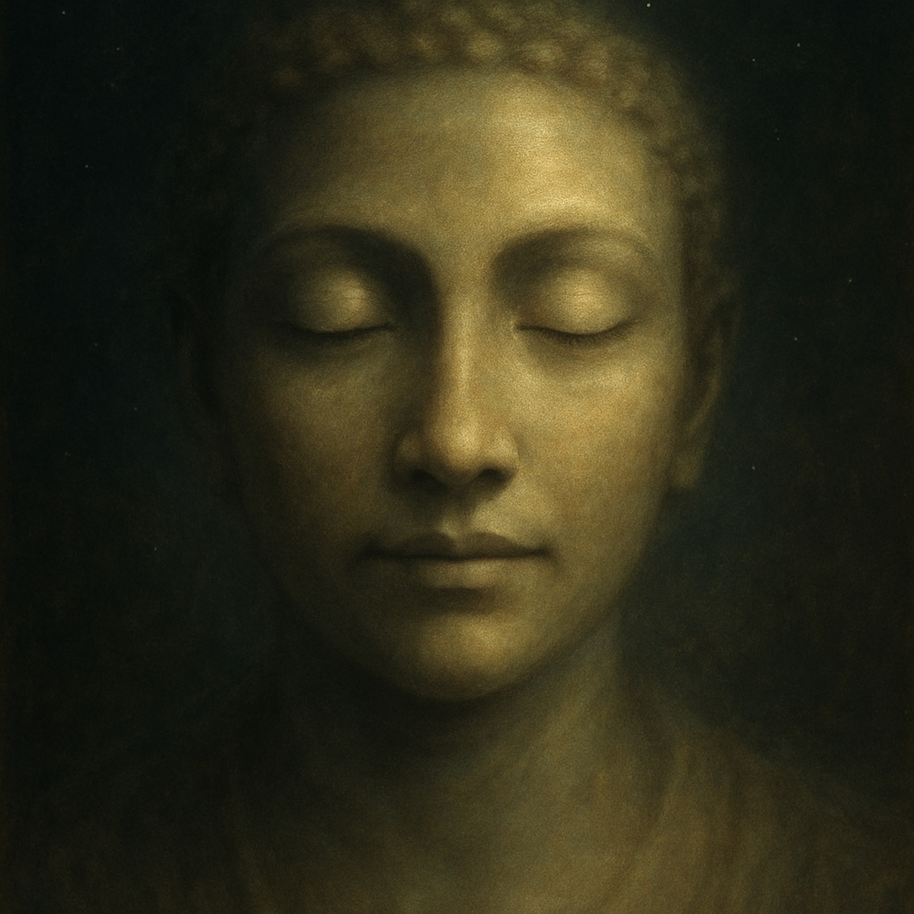

# Mercy Wears Our Faces  
  
This bluesy folk song, "Mercy Wears Our Faces," is a heartfelt, secular exploration of the ancient Buddhist teaching of Avalokitesvara, the Bodhisattva of Compassion. Inspired by a passage from the Lotus Sutra, the song strips away the mythic and focuses on the deeply personal.  
  
With a lonesome guitar and a soulful voice, the track contemplates the idea that "World-Voice-Perceiver" isn't just a divine figure, but a potential within each of us. The song's lament isn't one of despair, but of recognition—the realization that we are the ones who can embody compassion and alleviate suffering. It suggests that when we listen deeply to the cries of others, our hands become the Bodhisattva's, and our actions become acts of mercy.  
  
Perfect for quiet reflection, "Mercy Wears Our Faces" is a poignant reminder that enlightenment and compassion are not distant goals, but living truths made real through our own kindness.  
  
compassion, Buddhism, folk, blues, spiritual, Lotus Sutra, Avalokitesvara, Bodhisattva, Houston music, indie folk, singer-songwriter, spiritual folk, Mercy Wears Our Faces, new age, meditative music, enlightenment, compassion, skillful means  
  
Lyrics:   
(Acoustic guitar in E minor, slow, with a lonesome slide)  
(Verse 1)  
Got a heavy heart, can't lift the load  
Travelin' down a dusty, lonely road  
Been listenin' to the cries, hear 'em day and night  
Prayin' for a world that's bathed in light  
But I ain't no Buddha on a gilded throne  
Just a weary soul, singin' all alone.  
  
(Chorus)  
'Cause the Bodhisattva, she takes on every shape  
A homeless man's sorrow, a prisoner's escape  
The World-Voice-Perceiver hears the whispered prayer  
Turns a tear to dew and floats it on the air.  
Yeah, she's the doctor, the dancer, the friend you need  
Plantin' compassion's little, tiny seed.  
  
(Verse 2)  
The Buddha said, "You see that shining one?  
He's every moonbeam, every risin' sun.  
He'll be the one you need when your world is dark,  
A healing flame, a single, fiery spark."  
But that ain't just a story from a book of old  
It's a truth in every life, more precious than gold.  
  
(Chorus)  
'Cause the Bodhisattva, she takes on every shape  
A weary mother's burden, a lover's sweet ache.  
The World-Voice-Perceiver hears the whispered prayer  
Turns a tear to dew and floats it on the air.  
Yeah, she's the doctor, the dancer, the friend you need  
Plantin' compassion's little, tiny seed.  
  
(Bridge)  
Some folks see a hero with a thousand hands  
Healin' every wound in a thousand lands.  
But maybe those hands belong to me and you  
When we reach out in kindness, honest and true.  
Hear the sound of sufferin', a bitter, low moan  
Then you become the hands, and you're no longer alone.  
(Guitar solo - slow, sorrowful, with a bluesy bend)  
  
(Outro)  
So when your blues come callin', and your hope feels thin  
Just listen close to the truth from deep within.  
That World-Voice-Perceiver, she's listenin' to you  
And she's workin' through me and she's workin' through you, too.  
(Strum final E minor chord, let it ring out and fade)  
  
  
