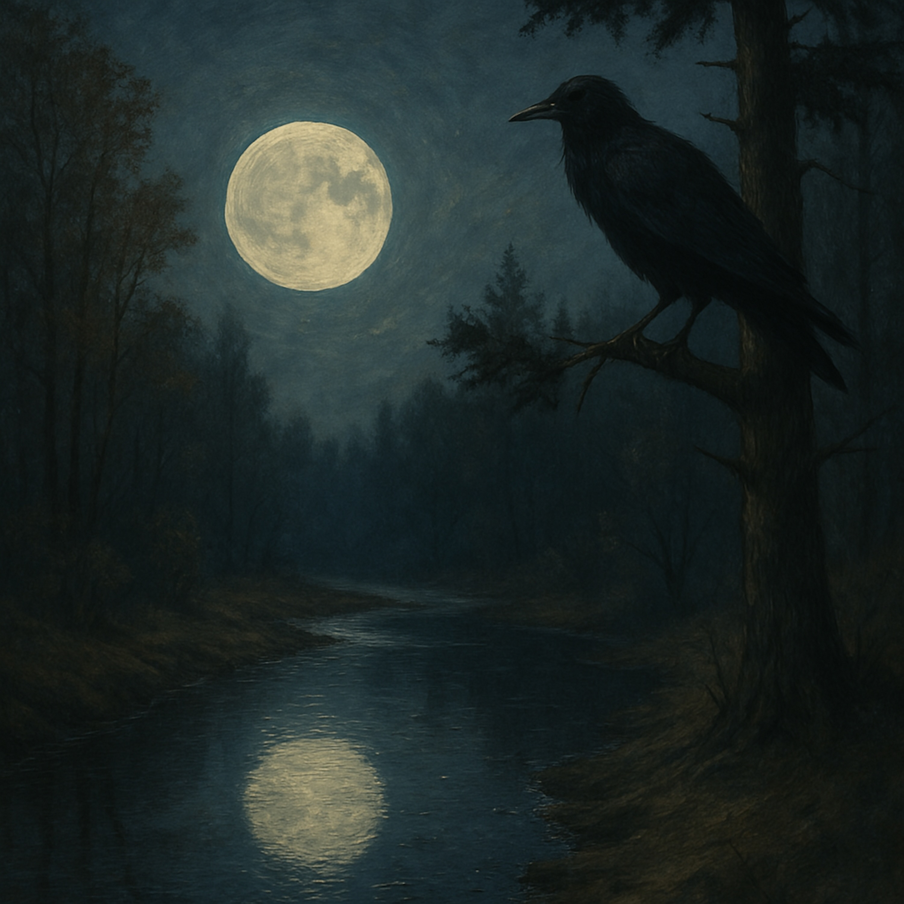

# Muddy Waters, Silent Mind  
  
**“Muddy Waters, Silent Mind”** is a reflective blues folk song that draws inspiration from Nichiren’s *Shishin Gohon-Shō*, where he speaks of muddy water catching the moon’s reflection and trees receiving rain without deliberation. With soulful male vocals and a melodic, earthy arrangement, this song explores the quiet wisdom found in nature’s flow—no striving, no resistance, just being.  
  
Blending acoustic blues and folk tones, the track invites listeners into a space of calm awareness and spiritual presence. It’s a meditation on stillness, acceptance, and the beauty of letting life unfold without control.  
  
Let the muddy waters clear, and hear the moonlight sing.  
  
**blues folk, reflective blues, acoustic blues, meditative music, spiritual folk, Nichiren Buddhism, Shishin Gohon-Shō, muddy water metaphor, moon reflection, nature wisdom, mindfulness, soulful male vocals, poetic lyrics, serene music, silent mind, acceptance, letting go, Buddhist inspiration, folk storytelling, acoustic guitar, peaceful songs, contemplative blues, nature-inspired song**  
  
[Verse 1]  
Muddy water  
Clear as the night  
Caught the moon’s face  
Holding it tight  
No thought it carried  
No plan to speak  
Yet it shone so bright in the shallow creek  
  
[Chorus]  
No mind to wander  
No part to play  
Nature’s rhythm finds its way  
Reflection dances  
Soft and true  
Muddy water holding the hue  
  
[Verse 2]  
The rain comes down  
A gentle sigh  
Trees gather drops from the heavy sky  
They reach and they open like humble hands  
No master plan  
But they understand  
  
[Chorus]  
No mind to wander  
No part to play  
Nature’s rhythm finds its way  
The world flows on  
No questions asked  
Muddy waters  
Holding the task  
  
[Bridge]  
Is it choice or fate that fills the stream?  
The glow of the moon or a fleeting dream?  
Plants won’t argue  
Trees won’t fight  
They stretch and they grow under the pale light  
  
[Verse 3]  
Oh  
The raven calls on the withered pine  
It doesn’t wonder  
It doesn’t pine  
Nature hums low  
No voice to refine  
Muddy water flows  
And the moon aligns  
  
  
