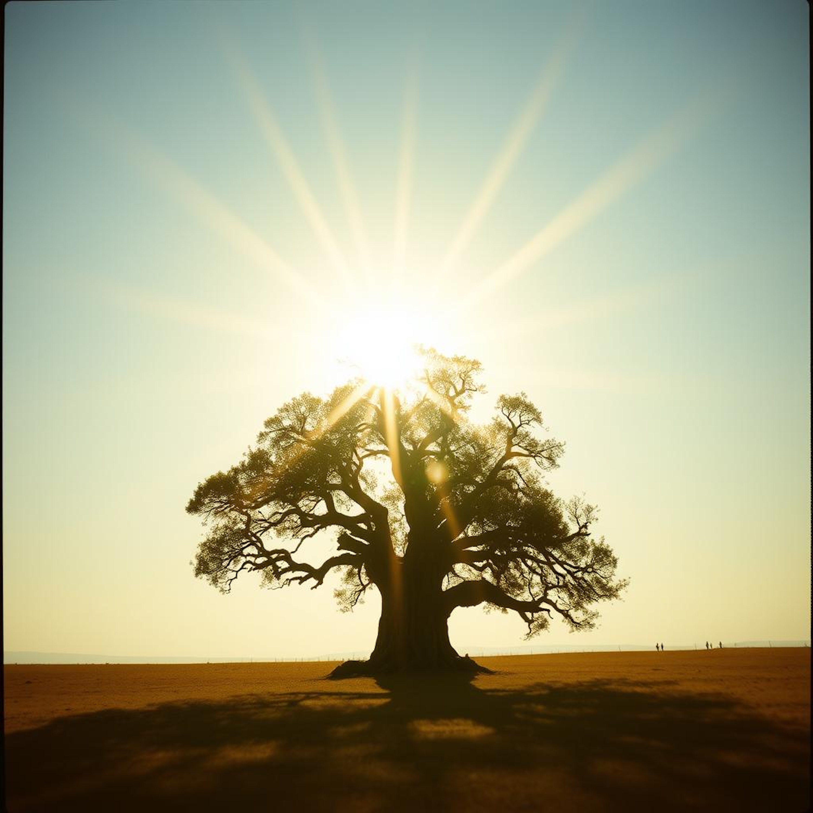

# Once I Was Fame Seeker  
  
*“Once I Was Fame Seeker” is a folk-blues reflection on the ancient path of transformation and purpose. Inspired by Chapter 1 of the Lotus Sūtra, this song gives voice to the past life of Maitreya Bodhisattva—when he was known as Yaśaskāma, the Fame Seeker. Blending timeless Buddhist wisdom with modern soul, the song explores how our desire for recognition can evolve into a vow to serve, uplift, and illuminate others. It’s a tribute to every artist, seeker, and bodhisattva walking the middle way between longing and letting go. Written and performed by The William Altig Choir.*  
  
**Tags:** folk, blues, buddhist, lotus sutra, bodhisattva, maitreya, manjusri, dharma, spiritual music, acoustic, wisdom, transformation, seeker, enlightenment, william altig, folk blues, soundcloud, original song, soul, inner light, upaya, mahayana, fame seeker, vow, karma, path, devotion  
  
[Verse 1]  
Once I was Fame Seeker, walking in dreams,  
Longing for glory in soft golden beams.  
I sang to the stars, “Let them know my name,”  
Not for the praise, but to kindle their flame.  
  
[Chorus]  
Once I was Fame Seeker, now I just shine,  
Not for the spotlight—just to give a sign.  
The light in my chest, it’s not mine to claim—  
It passes through me, like a whisper of flame.  
  
[Verse 2]  
Mañjuśrī remembered, in ages gone by,  
When I asked the meaning of light in the sky.  
He said, “You too stood there, long time ago—  
And the Buddha you loved let your whole heart glow.”  
  
[Chorus]  
Once I was Fame Seeker, now I just shine,  
I carry a vow beyond space and time.  
To sing what is true, to speak what is kind,  
To help you remember the light that’s inside.  
  
[Bridge]  
Not every name we wear will stay,  
But every vow we make lights the way.  
From seeker to servant, from longing to peace,  
Each echo of Dharma will never cease.  
  
[Final Chorus]  
Once I was Fame Seeker, still I walk on,  
With my eyes on the dawn, and my heart in the song.  
Not for the fame, not for acclaim—  
But to leave this world brighter than when I came.  
  
  
