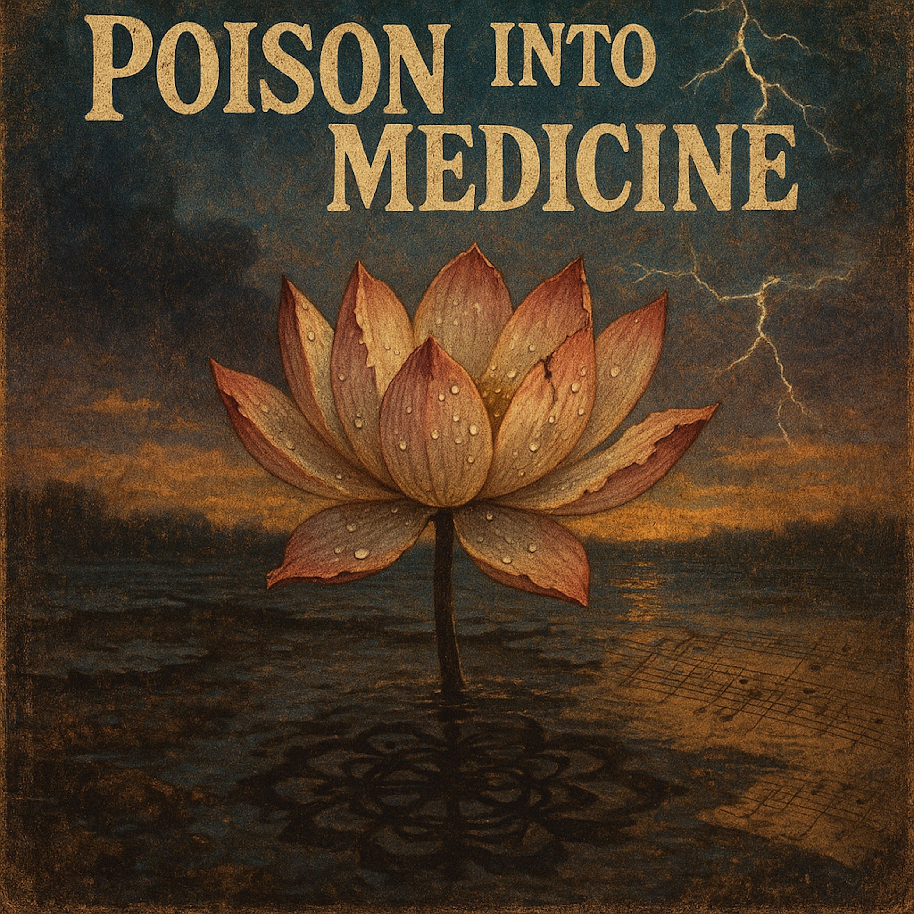

# Poison Into Medicine   
  
"Poison Into Medicine" is a bluesy folk anthem about finding strength in struggle and transforming life's hardships into wisdom. Inspired by the Buddhist teacher Nichiren's teachings, this song weaves ancient philosophy with raw, soulful blues to remind us that our greatest challenges can become our greatest teachers.  
  
Like the lotus that blooms from muddy water, this song celebrates the beauty that emerges from difficulty. With gritty vocals and heartfelt lyrics, it speaks to anyone who's ever faced adversity and chosen to grow through it rather than be broken by it.  
  
Perfect for fans of spiritual blues, conscious folk music, and anyone seeking songs about resilience, transformation, and finding joy in the journey—even when the road is rough.  
  
**Key themes:** Turning obstacles into opportunities • Buddhist wisdom meets American blues • Resilience and personal growth • Finding delight in the struggle • The lotus blooming in mud  
  
## SEO Tags  
Buddhist blues, folk music, spiritual songs, Nichiren Buddhism, resilience songs, inspirational music, lotus flower symbolism, turning poison into medicine, conscious folk, blues folk fusion, transformation songs, struggle and growth, mindfulness music, meditation music, acoustic blues, Nam myoho renge kyo, Buddhist chanting, spiritual awakening, overcoming adversity, personal growth music, wisdom songs, American folk, roots music, soulful blues, existential folk, philosophical music, healing music, empowerment songs, indie folk, conscious lyrics, authentic blues, vintage folk sound, muddy water lotus, embracing difficulty, life lessons music, contemplative songs, strength through struggle  
  
## Short Version (for character-limited platforms)  
Bluesy folk anthem transforming struggle into strength. Nichiren Buddhist wisdom meets raw American blues. For anyone who's ever grown through hardship. 🪷  
##   
## Hashtag Version  
#BuddhistBlues #FolkMusic #SpiritualMusic #NichirenBuddhism #ResilienceSongs #LotusFlower #PoisonIntoMedicine #ConsciousFolk #BluesFolk #TransformationMusic #MindfulnessMusic #OvercomingAdversity #Indiefolk #AuthenticBlues #WisdomSongs  
  
## Poison Into Medicine   
**Verse 1:**   
Well, I woke up this morning, trouble at my door Same old heavy burden that I've been carrying before But the teacher said to me, "Don't you turn and run— The lotus blooms in muddy water, rising to the sun"  
  
**Chorus:**   
Gonna turn this poison into medicine Let the struggle make me strong again Every trial is a teacher, every tear's a friend Gonna turn this poison into medicine  
  
**Verse 2:**   
Lightning in the darkness shows you where to go Can't appreciate the mountain if you never climb the road The fire that tests you is the fire that makes you shine Your earthly troubles are the path to the divine  
  
**Chorus:**   
Gonna turn this poison into medicine Let the struggle make me strong again Every trial is a teacher, every tear's a friend Gonna turn this poison into medicine  
  
**Bridge:**   
Nam-myoho-renge-kyo, that's the ancient song Finding joy right in the middle when everything goes wrong The seed breaks open in the dark beneath the ground Before the flower shows its face, it's got to be broken down  
  
**Verse 3:**   
So bring your storms and bring your rain, bring your heaviest load I'll be chanting through the pain, walking down this road 'Cause suffering ain't the enemy I used to know It's the gateway to the wisdom that will help me grow  
  
**Final Chorus:**   
I'm turning poison into medicine Let the struggle make me strong again Every trial is a teacher, every tear's a friend I'm turning poison into medicine Oh, I'm turning poison into medicine  
  
**Outro:**   
(Slow and resolute)   
Delight is in the struggle, friend Delight is in the struggle, friend The lotus rises, and will rise again  
  
