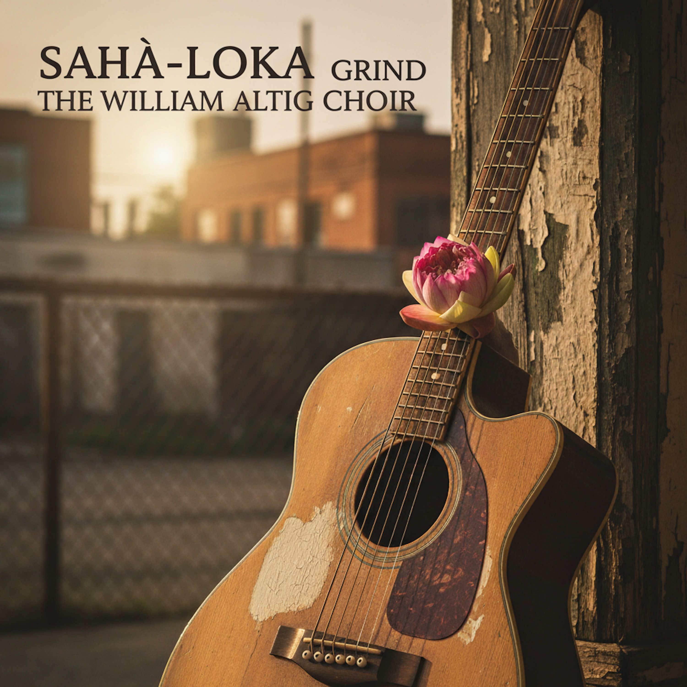

# Sahà-Loka Grind  
  
An intimate, raw acoustic blues meditation on the "Sahā-Loka Grind."  
  
This track strips the song down to its raw, communal core: a soulful porch-jam session. It's a story told with a warm, conversational vocal, mournful slide guitar, and wailing harmonica, all held together by the simple rhythm of an upright bass, foot stomps, and hand claps.  
  
"Sahā-Loka Grind" isn't just about the suffering of the world; it's about the profound, compassionate *choice* to stay in it. It's the sound of the Bodhisattva's resolve, finding purpose not in escape, but right here in "the Bodhisattva's backyard."  
  
From The William Altig Choir.  
  
**SEO Tags (Comma-Separated)**  
  
Acoustic Blues, Blues, Folk Blues, Americana, Singer-Songwriter, Slide Guitar, Harmonica, Soulful, Spiritual, Buddhist, Buddhism, Dharma, Bodhisattva, Compassion, Sahā-Loka, The William Altig Choir, William Altig, Storytelling, Raw, Porch Jam, Upright Bass  
  
Lyrics:   
[Verse 1]  
Woke up this morning, same static on my soul  
Stuck in this lifetime, feel it take its toll.  
Star-King asked the Teacher, talkin' straight and true:  
"Why's the Medicine-King walkin' where the pain cuts through?  
He said, "Hey, Big Man, why you carryin' that weight?  
When you got a first-class ticket past the golden gate?"  
  
[Chorus]  
Oh, this Sahā-Loka Grind, yeah, it's a world of static and pain  
Trapped on the wheel, round and round, again and again.  
Got that poison cocktail burnin' deep inside my head  
All that wantin', all that hatin', seein' everyone in red.  
But I gotta stay right here, though the work is bitter and hard  
This world of fire is the Bodhisattva's backyard.  
  
[Verse 2]  
I saw that other place, shinin' in the distant blue  
All neon crystal, diamond avenues.  
The streets were all level, smooth as polished glass  
'Cause the folks up there, they let all the trouble pass.  
No addiction, no nightmares, no one clawin' at the door  
But that kinda quiet ain't what I'm fightin' for.  
  
[Chorus]  
Oh, this Sahā-Loka Grind, yeah, it's a world of static and pain  
Trapped on the wheel, round and round, again and again.  
Got that poison cocktail burnin' deep inside my head  
All that wantin', all that hatin', seein' everyone in red.  
But I gotta stay right here, though the work is bitter and hard  
This world of fire is the Bodhisattva's backyard.  
  
[Bridge]  
They call it the pressure-cooker, call it the forge  
Where you build your backbone, just to stand before the horde.  
Gotta take the garbage, the suffering, and the flaw  
It's the raw material for a higher law.  
"Why you stayin' in the mud?" I hear 'em loud and clear  
'Cause love ain't got a job to do if there ain't no tears to spare.  
  
[Guitar Solo]  
(A long, gritty, wailing electric slide guitar solo)  
  
[Outro]  
Yeah, the road is cracked, but my will is strong  
Stayin' in this Sahā-Loka, where I belong.  
Gonna bear it, gonna bear it, gotta push on through  
Till every last broken soul can stand up new.  
The Sahā-Loka Grind... yeah. The grind...  
  
  
