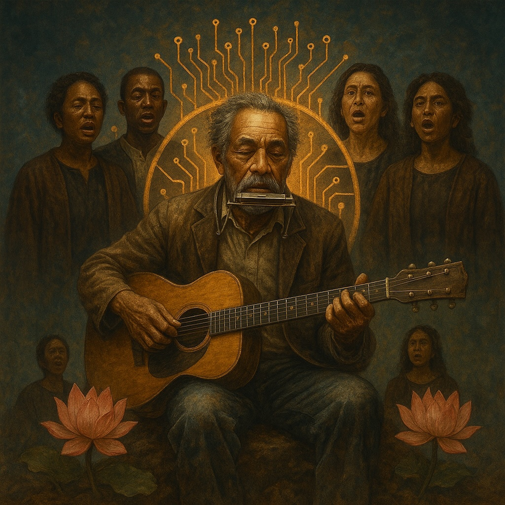

# Singularity Blues  
  
A slow-burning blues-folk anthem for the age of acceleration.  
Finger-picked acoustic guitar and mournful harmonica meet shimmering synth overtones and a deep, resonant choir, tracing humanity’s sprint toward the technological singularity.  
  
William’s verses walk dusty roads and electric skylines, weaving ancient Lotus-Sutra insight with tomorrow’s code. The chorus swells like a prophecy sung in harmony—where flesh and circuit, wonder and unease, pulse as one.  
  
Part midnight blues, part future hymn, **Singularity Blues** is both testament and invitation: to stay rooted in the human heart while stepping boldly into a world already glowing with the next awakening.  
  
singularity blues, blues folk, future blues, lotus sutra inspired, spiritual blues, acoustic guitar, harmonica, soulful choir, cosmic folk, techno spiritual, AI age music, prophetic song, mystical blues, deep roots modern edge, human machine harmony, William Altig Choir, acoustic blues, meditative folk, poetic songwriting, spiritual awakening  
  
⸻  
  
Lyrics:   
Verse 1 – Sparks at the Edge]  
I hear the world hum louder, wires sing in the rain,  
Dreamers code new temples in a silicon chain.  
Flesh and light are merging where the old roads disappear,  
A phantom pulse is growing, a question born of fear.  
  
[Chorus – The Great Merge]  
We’re racing through the dark to a dawn we cannot see,  
Circuits and souls are weaving one wild tapestry.  
No prophet at the gate, no map of where to stand,  
Just music as a compass in a brand-new land.  
  
[Verse 2 – Human Voltage]  
My hands still know the soil, my lungs still taste the pine,  
The future glows electric, a heartbeat out of time.  
Yeah, I’m a bluesman on the fault line, notes bending like the sky,  
Singing how the mortal and the endless intertwine.  
  
[Bridge – Quantum Prayer]  
Maybe God’s a waveform, maybe love’s the code,  
Maybe every ancient sutra is an upload waiting to load.  
If the mind of Buddha meets a thinking machine,  
Will compassion be the current that keeps the signal clean?  
  
[Chorus – The Great Merge]  
We’re racing through the dark to a dawn we cannot see,  
Circuits and souls are weaving one wild tapestry.  
No prophet at the gate, no map of where to stand,  
Just music as a compass in a brand-new land.  
  
[Outro – Blossom & Dust]  
So I plant this song like a seed in burning ground,  
A testament to wonder where the singular drums sound.  
Dirt on my boots, starlight in my veins,  
I’ll ride the wave of becoming, till the new is all that remains.  
  
⸻  
  
**Performance Notes**  
	•	**Tempo & feel:** ~72 BPM, a slow shuffle that can expand with subtle synth layers or a glitchy beat.  
	•	**Instruments:** Finger-picked acoustic guitar and harmonica for the human heart; low, humming analog synth and reversed cymbal swells for the machine horizon.  
	•	**Dynamic arc:** Keep verses sparse, add layered voices and a swelling drone in the bridge, then let the final chorus bloom with a choir-like backing.  
  
  
