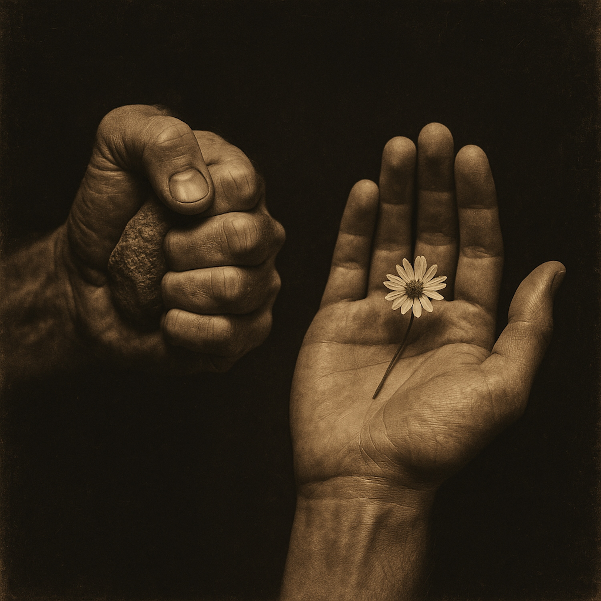

# The Ballad of Elias Stone  
  
"The Ballad of Elias Stone" is a bluesy folk tale that explores two paths to the same truth.  
  
It tells the story of Elias, a legendary musician who achieves greatness through twenty years of grueling sacrifice, embodying the belief that enlightenment is earned only through immense struggle. His path is challenged when the conservatory's Founder makes a radical promise: that the same ultimate prize can be won through a single, fleeting moment of joy.    
  
This song is a modern parable inspired by a core teaching in the ancient Buddhist text, the *Lotus Sutra*. It's a story about the power of sincere faith, the different "skillful means" we use to find our way , and the idea that the seed of greatness, or "Buddha-Nature," already exists within all of us, waiting for a moment of joy to awaken it.    
  
Set to a sparse, soulful arrangement of acoustic guitar, harmonica, and a steady foot stomp, this is a story-song for anyone who has ever wondered about the true nature of sacrifice, faith, and the simple, transformative power of joy.  
  
**Search Tags**  
  
Americana, Folk, Blues, Singer-Songwriter, Acoustic, Story Song, Parable, Spiritual, Buddhism, Lotus Sutra, Philosophy, Elias Stone, Folk Rock, Harmonica, Storytelling, Melancholic, Hopeful, Faith, Joy, Enlightenment, Zen  
Sources and related content  
  
**(Song Lyrics)**  
**(Acoustic guitar intro, simple and melancholic)**  
  
(Verse 1)  
At the Grand Conservatory, up on Harmony Hill  
The only road to glory was an iron-clad will  
They'd tell you 'bout Elias, a man of grit and bone  
Practiced twenty years, son, and slept on cold, hard stone  
He played until his fingers bled a symphony of pain   
Just to earn the Maestro's title, again and again.  
  
(Chorus)  
But the Founder came a-callin', with a whisper soft and low  
"Just one moment of joy, son, is all you need to know.  
Hear a single sweet phrase from my 'Unfolding Heart'  
And I'll guarantee your soul, right from the very start."  
  
(Verse 2)  
The students and the masters, they gathered in the hall  
Elias stood among 'em, the man who'd gave his all  
The Founder looked right at him, the man who'd paid the cost  
And spoke about a new path, for all the tired and lost  
The crowd began to grumble, "What about the price we paid?"  
Was twenty years of sufferin' a foolish choice he made?  
  
(Chorus)  
'Cause the Founder came a-callin', with a whisper soft and low  
"Just one moment of joy, son, is all you need to know.  
Hear a single sweet phrase from my 'Unfolding Heart'  
And I'll guarantee your soul, right from the very start."  
  
**(Instrumental Break - Harmonica takes a short, soulful solo over the acoustic guitar)**  
  
(Bridge)  
She said, "Your house is burnin', but you're too lost in your games   
So I call you out with promises, I whisper all your names  
The struggle was a toy cart, boys, to get you to the door  
But the prize was always bigger than what you were fightin' for  
'Cause the music ain't somethin' you build with sweat and tears  
It's a seed inside your own heart, been sleepin' there for years."   
  
(Verse 3)  
And Elias, he stood listenin', the legend carved from strife  
Heard about the music that was waitin' all his life  
And a slow smile spread across his face, a crack in weathered ground  
He finally understood the truth in that sweet and simple sound  
The climb ain't the reason, it's always been the view  
And the path of joy was standin' there, shiny, fresh, and new.  
  
(Chorus)  
Yeah, the Founder came a-callin', with a whisper soft and low  
"Just one moment of joy, son, is all you need to know.  
Hear a single sweet phrase from my 'Unfolding Heart'  
And I'll guarantee your soul, right from the very start."  
  
(Outro)  
Yeah, guarantee your soul...  
Just one moment...  
(Acoustic guitar fingerpicks a final, resolving chord, and a single, long harmonica note fades to silence.)  
  
  
**Production Notes:**  
* **Genre:** Americana / Bluesy Folk  
* **Tempo:** Slow, walking tempo (~80 bpm)  
* **Instrumentation:**  
    * **Acoustic Guitar:** A well-worn dreadnought (like a Martin D-28), fingerpicked with a steady, slightly melancholic Travis-picking pattern. The foundation of the track.  
    * **Vocals:** A single male vocalist with a raw, honest, storyteller's voice. Think somewhere between Townes Van Zandt and Jason Isbell. The delivery should be conversational in the verses and rise with a touch of gospel-like conviction in the chorus.  
    * **Harmonica:** A blues harp, providing mournful but hopeful fills between vocal lines. It should wail softly after the choruses and during the instrumental break.  
    * **Upright Bass:** A simple, resonant bassline, providing a warm, woody heartbeat to the song.  
    * **Percussion (Sparse):** A single foot stomp on beats 2 and 4, or a simple kick drum. The feel should be organic and sparse, just enough to keep time.  
* **Mood & Arrangement:** The song begins with a somber, respectful tone, describing Elias's struggle. It builds in tension when the Founder speaks, then finds a moment of quiet revelation in the bridge. The final chorus and outro should feel like a gentle, liberating exhale. The recording should have a warm, analog feel, as if recorded live in a single room.  
  
  
