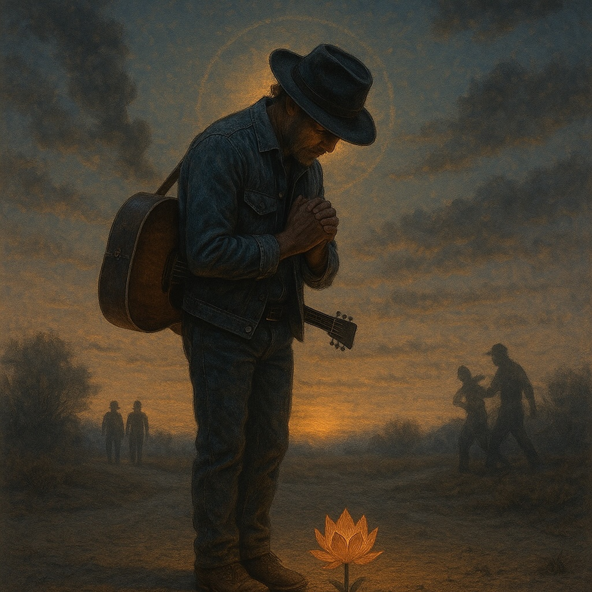

# The Bow That Sees (Blues Folk Version)  
#   
*The Bow That Sees* is a bluesy folk anthem inspired by the Lotus Sūtra’s teaching of non-contempt. With gritty guitar, mournful harmonica, and gospel warmth, it tells the story of bowing in reverence—even when the world throws stones. This song carries the spirit of Bodhisattva Never Disrespectful: humility in the face of pride, compassion in the midst of quarrels, and unshakable faith that every being holds the seed of enlightenment. It’s a song of dignity, resilience, and hope—a reminder that no soul is ever abandoned, and we all walk the long road home together.  
  
The Bow That Sees, blues folk, folk blues, acoustic blues, gospel folk, Bodhisattva Never Disrespectful, Lotus Sutra song, non-contempt, spiritual folk music, mindful blues, American roots, meditation music, dharma blues, spiritual awakening, acoustic storytelling, reverence, compassion, soulful folk, enlightenment songs, folk gospel fusion  
  
Lyrics:   
**(Verse 1)**  
I bow to the stranger, ragged and worn,  
To the weary heart, to the soul forlorn.  
In the mud of sorrow, the lotus will rise,  
Every broken spirit still holds the skies.  
  
**(Chorus)**  
Oh, I won’t call you lazy, I won’t call you lost,  
The road is long, but we all must cross.  
The One Great Vehicle carries us home,  
No soul abandoned, no one alone.  
  
**(Verse 2)**  
My pride’s like dust, let the wind take it down,  
No need to lift myself by pushin’ you around.  
Your light’s still hidden, but it shines in kind,  
Every soul’s a Buddha, in body and mind.  
  
**(Chorus)**  
Oh, I won’t call you lazy, I won’t call you lost,  
The road is long, but we all must cross.  
The One Great Vehicle carries us home,  
No soul abandoned, no one alone.  
  
**(Bridge – spoken or sung, with harmonica fills)**  
Even when the stones are thrown at me,  
I bow, I bow, sayin’ what I see:  
“You will be a Buddha, just wait and see.”  
  
**(Chorus – repeat, with fuller harmony)**  
Oh, I won’t call you lazy, I won’t call you lost,  
The road is long, but we all must cross.  
The One Great Vehicle carries us home,  
No soul abandoned, no one alone.  
  
  
