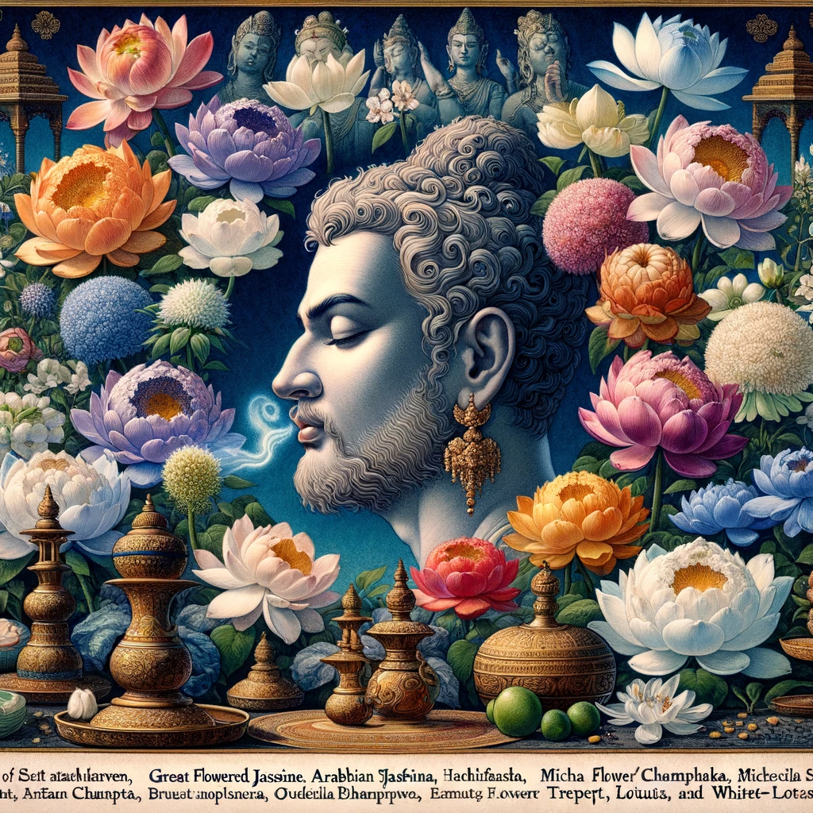

  
## The Buddha is in conversation with Satatasamitabhiyukta (Ever and Constantly Strenuous).  
## The Buddha is in conversation with Satatasamitabhiyukta (Ever and Constantly Strenuous).  
## The Buddha is in conversation with Satatasamitabhiyukta (Ever and Constantly Strenuous).  
## The Buddha is in conversation with Satatasamitabhiyukta (Ever and Constantly Strenuous).  
## The Buddha is in conversation with Satatasamitabhiyukta (Ever and Constantly Strenuous).  
## The Buddha is in conversation with Satatasamitabhiyukta (Ever and Constantly Strenuous).  
## The Buddha is in conversation with Satatasamitabhiyukta (Ever and Constantly Strenuous).  
## The Buddha is in conversation with Satatasamitabhiyukta (Ever and Constantly Strenuous).  
## The Buddha is in conversation with Satatasamitabhiyukta (Ever and Constantly Strenuous).  
## The Buddha is in conversation with Satatasamitabhiyukta (Ever and Constantly Strenuous).  
## The Buddha is in conversation with Satatasamitabhiyukta (Ever and Constantly Strenuous).  
##   
## Chapter 19–Perfuming the Universe  
Further, Satatasamitabhiyukta (Ever and Constantly Strenuous), the Bodhisattva Mahasattva who preserves, shares, studies, and writes this Sacred Teaching (Dharmapāryaya), is blessed with a perfect sense of smell, endowed with eight hundred fine qualities. With this refined sense, he can detect various odors in the entire universe, inwardly and outwardly. These include unpleasant and pleasant smells, foul odors, and the fragrance of assorted flowers, such as the Great Flowered Jasmine, Arabian Jasmine, Michelia Champaka, and Trumpet-Flower.  
Further, Satatasamitabhiyukta (Ever and Constantly Strenuous), the Bodhisattva Mahasattva who preserves, shares, studies, and writes this Sacred Teaching (Dharmapāryaya), is blessed with a perfect sense of smell, endowed with eight hundred fine qualities. With this refined sense, he can detect various odors in the entire universe, inwardly and outwardly. These include unpleasant and pleasant smells, foul odors, and the fragrance of assorted flowers, such as the Great Flowered Jasmine, Arabian Jasmine, Michelia Champaka, and Trumpet-Flower.  
Further, Satatasamitabhiyukta (Ever and Constantly Strenuous), the Bodhisattva Mahasattva who preserves, shares, studies, and writes this Sacred Teaching (Dharmapāryaya), is blessed with a perfect sense of smell, endowed with eight hundred fine qualities. With this refined sense, he can detect various odors in the entire universe, inwardly and outwardly. These include unpleasant and pleasant smells, foul odors, and the fragrance of assorted flowers, such as the Great Flowered Jasmine, Arabian Jasmine, Michelia Champaka, and Trumpet-Flower.  
Further, Satatasamitabhiyukta (Ever and Constantly Strenuous), the Bodhisattva Mahasattva who preserves, shares, studies, and writes this Sacred Teaching (Dharmapāryaya), is blessed with a perfect sense of smell, endowed with eight hundred fine qualities. With this refined sense, he can detect various odors in the entire universe, inwardly and outwardly. These include unpleasant and pleasant smells, foul odors, and the fragrance of assorted flowers, such as the Great Flowered Jasmine, Arabian Jasmine, Michelia Champaka, and Trumpet-Flower.  
He can also discern the scents of aquatic flowers like the Blue Lotus, Red Lotus, White Esculent Water-Lily, and White Lotus. He senses the aroma of fruits and blossoms from trees like Sandals, Xanthochymus, Tabernæmontana, and Agallochum. From where he stands, he can detect and understand the countless combinations of perfumes and the distinct smells of creatures, such as elephants, horses, cows, goats, wild animals, and the body odors of various beings in brute form.  
He recognizes the scents of women and men, boys and girls, and even from a distance, the smell of grass, bushes, herbs, and trees. He perceives these smells as they are without being surprised or stunned.  
  
  
Remaining on Earth, he smells the fragrance of gods and heavenly flowers, such as Erythrina, Bauhinia, Mandarava, Great Mandarava, Mangusha, and Great Mangusha. He detects the perfume of divine powders like sandal and agallochum and the mixed scents of celestial blossoms. He senses the aroma from the bodies of gods like Indra, the Chief of the Gods, knowing whether the god is relaxing, playing, or speaking the law in his palace, Vaigayanta, or the assembly hall of the gods, Sudharma.  
He smells the odors from other gods, their companions, youths, and maidens without being overwhelmed by these scents. He also perceives the fragrance from all Devanikayas, Brahmakayikas, Mahabrahmas, disciples, Hermit Buddhas (Solitary Enlightened Ones), Bodhisattvas, and Tathagatas (Enlightened Ones). He detects the scent arising from the seats of the Tathagatas, knowing where they abide without being hindered or troubled by these diverse smells. He can describe these odors to others without affecting his memory if needed.  
