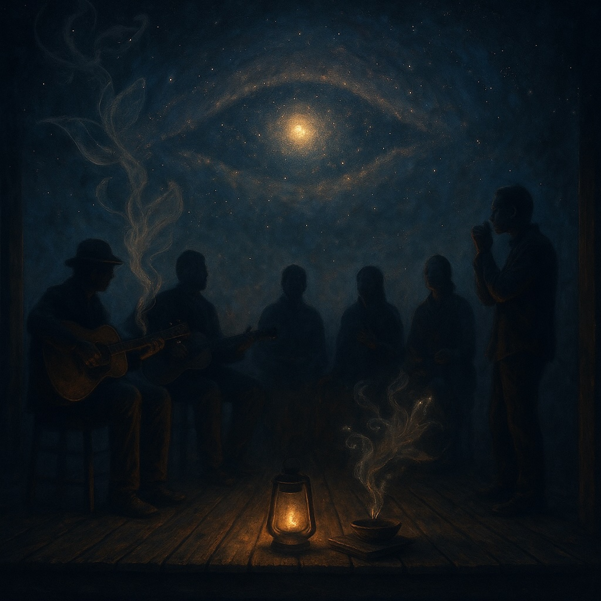

# The Buddha’s Eyes Blues  
  
*Buddha’s Eyes Blues* is a slow-rolling, rootsy folk-blues meditation on the heart of Chapter Ten of the *Lotus Sūtra*.  
  
With warm finger-picked guitar, mournful slide, and harmonica sighs, it honors the sutra’s call to **make offerings of devotion and daily action**.  
  
Each verse carries the listener down a dusty road of incense smoke and open palms, where giving is not about barter but about **opening the Buddha’s eyes within**—seeing the oneness of all life and the beautiful differences that make every being unique.  
  
This song is both an homage and an invitation: to treat every kitchen and street corner as a sacred hall, to offer kindness as the highest gift, and to walk the wide world with awakened eyes.  
  
⸻  
  
**Comma-Separated Search Tags**  
  
blues folk, acoustic blues, spiritual folk, lotus sutra, buddhist blues, mindful music, devotional blues, fingerpicked guitar, slide guitar, harmonica, roots music, soulful meditation, dharma songs, awakening, offerings, equality and difference, buddha nature, slow blues, americana, spiritual awakening  
  
**Verse 1 – The Offering Road**  
G  
I laid my flowers down, incense smoke in the rain,  
C  
Every coin of my heart, every ounce of my pain.  
G  
Not to buy a heaven, not to pay some dues,  
D7  
But to open these eyes that the Buddha can use.  
  
**Chorus – Seeing True**  
G  
Oh the world’s all equal, and every face unique,  
C  
Joy and sorrow mingle, every soul has speech.  
G  
The same wide sky, a million different hues—  
D7                       G  
That’s the view when you walk in the Buddha’s shoes.  
  
**Verse 2 – Keeper of the Word**  
G  
I met a dusty pilgrim with a sutra in his hands,  
C  
Said “I’m just a singer in these broken lands.  
G  
But the words I carry are the living flame,  
D7  
Hold one line with love, and you’ll never be the same.”  
  
**(Chorus)**  
  
**Bridge – Equality & Difference**  
C  
The mountain and the river, the beggar and the king,  
G  
All rise and fall inside the self-same ring.  
C  
Yet each breath is a fingerprint, each cry its own tune—  
D7  
One Dharma rain, but a thousand blooms.  
  
**Verse 3 – Everyday Temple**  
G  
So I make my offering in the work I do,  
C  
In the kindness I plant, in the songs I sing for you.  
G  
Every street and kitchen is a sacred hall,  
D7  
Where the Buddha’s eyes are seeing it all.  
  
**Outro / Tag**  
G  
I laid my flowers down, incense smoke in the rain,  
C  
Opened these eyes and I’ll never be the same.  
G  
Buddha’s eyes blues, running through my veins,  
D7                   G  
One world, many colors, one endless flame.  
  
⸻  
  
**Performance Notes**  
	•	**Feel**: Slow-rolling 12-bar groove, think Mississippi John Hurt meets modern folk.  
	•	**Guitar**: Finger-picked bass-line alternating with treble fills; add a resonant slide on the bridge to suggest the “Buddha eye” shimmer.  
	•	**Vocals**: Warm and unhurried, with a slight gravel to carry the “offering road” weight.  
	•	**Harmonica**: A wailing response between lines of the chorus, like a wind through temple bells.  
  
