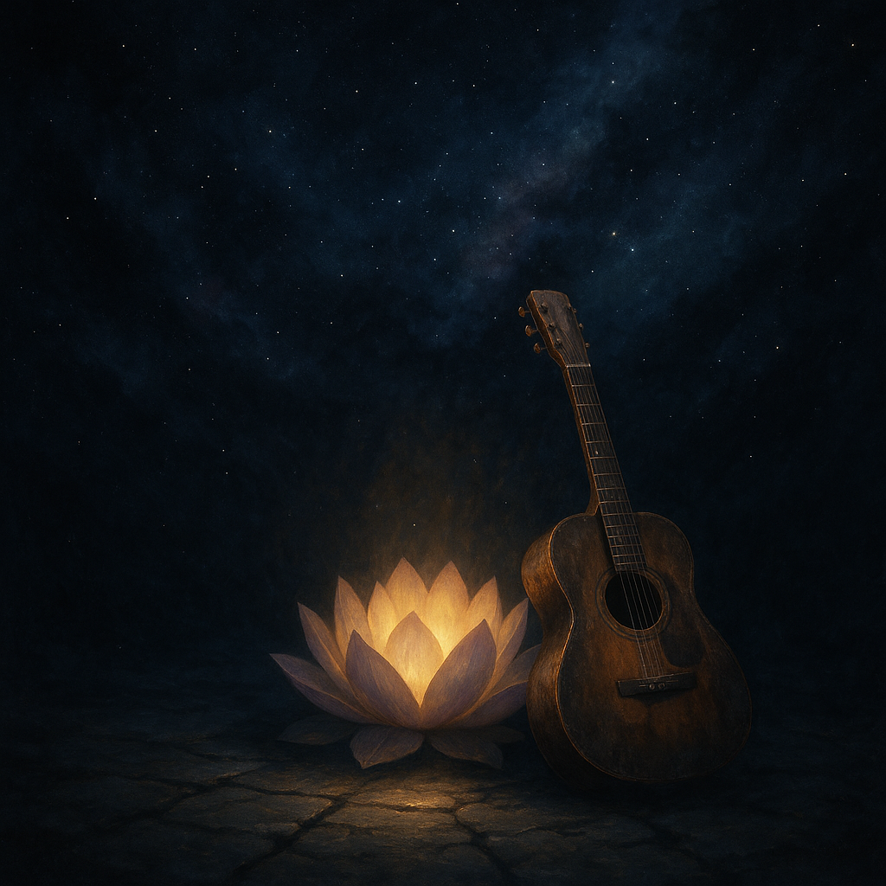

# *The Conjured City Blues*  
  
*“The Conjured City Blues”* is a soulful fusion of ancient Buddhist wisdom and the raw emotional power of the Blues. Inspired by Chapter Seven of the Lotus Sutra, the song journeys through the vastness of suffering, perseverance, and hope expressed by the Brahma Kings’ universal vow for enlightenment. With a slow, haunting melody rooted in minor blues traditions, it captures the timeless struggle of beings trapped in the “prison of the triple world” and their shared aspiration for liberation. This folk-blues anthem channels the spiritual quest as a long, arduous road filled with illusions and obstacles, yet illuminated by the unwavering light of compassion and awakening. A heartfelt call to all who seek solace and strength, *“The Conjured City Blues”* is both a lament and a vow — a musical meditation on suffering, resilience, and the transformative power of faith.  
  
blues, folk blues, lotus sutra, buddhist music, spiritual blues, meditation music, soulful, cosmic blues, enlightenment, lotus flower, spiritual journey, suffering, perseverance, spiritual awakening, folk music, acoustic blues, mellow blues, reflective music, meditation, deep blues, emotional music, buddhism, dharma, universal vow, cosmic journey, hopeful blues, blues guitar, soulful vocals, inspirational music, ancient wisdom, mystical blues  
  
  
Lyrics:   
**"The Conjured City Blues"**  
  
*(Verse 1)*
I’ve been walkin’ through the prison,
The triple world’s heavy chains,
Long ages lost in shadow,
Where the suffering remains.  
  
The heavens cry, the Brahma Kings sigh,
They pray the Dharma wheel to spin,
Turn that light to break the night,
Let the healing song begin.  
  
*(Chorus)*
Oh, the road is long, the journey slow,
Five hundred yojanas down below,
Through phantom cities made of dreams,
We’re chasin’ truths behind the seams.  
  
*(Verse 2)*
Great-Universal-Wisdom sat so still,
Ten aeons passed ‘fore light could fill,
Conquered Mara, fought the fight,
But the dawn came slow that night.  
  
We stumble through illusions deep,
Earthly desires that haunt our sleep,
Yet in the darkest, there’s a vow,
To raise us up and show us how.  
  
*(Chorus)*
Oh, the road is long, the journey slow,
Five hundred yojanas down below,
Through phantom cities made of dreams,
We’re chasin’ truths behind the seams.  
  
*(Bridge)*
The vow’s not just for me or you,
It’s for all beings, pure and true,
May merit shine and wisdom flow,
Till every heart begins to glow.  
  
*(Outro)*
So sing the Blues of cosmic pain,
Of hope and loss and sacred gain,
The Buddha’s light, a distant star,
Guidin’ souls from near and far.  
  
