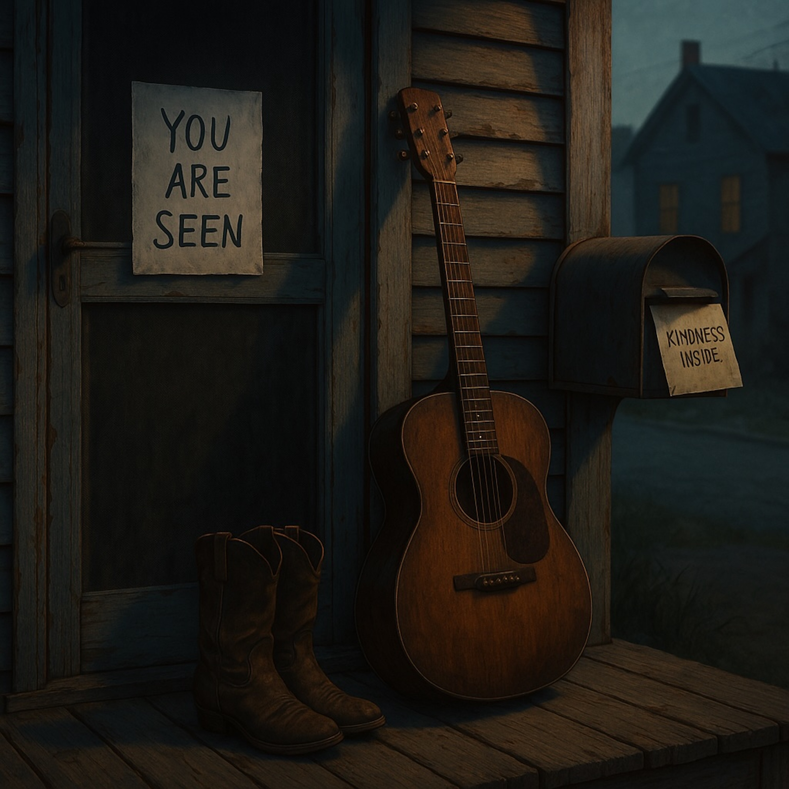

# The Debt of Peace  
  
*“The Debt of Peace”* is a raw, slow-burning Delta blues song that captures the emotional weight of everyday suffering and the quiet hope for human connection. With trembling finger-picked guitar, a sparse upright bass, and a weeping harmonica, this track tells the truth gently but unflinchingly. The lyrics explore the burden we all carry—the debt of peace we owe ourselves and each other—and how small acts of kindness might offer a way through. This is blues as sermon, storytelling as balm.  
  
  
**Tags:**  
delta blues,folk blues,slow blues,acoustic blues,blues storytelling,emotional blues,social blues,kindness,peace,folk songwriting,singer-songwriter,william altig,americana,deep south blues,first noble truth,mindful music,empathy,acoustic guitar,harmonica,spoken truth,music with meaning  
  
**Lyrics:
[Verse 1]**  
We’re all sufferin’, Maria,  
That’s the First Noble Truth.  
Ain’t just me and you now—  
It’s the old and the youth.  
  
Some wear it like wrinkles,  
Some wear it like flame.  
But it’s all the same aching,  
Just a different name.  
  
**[Chorus]**  
We carry it like debt,  
Owe peace we can’t pay.  
Hearts overdrawn  
By the price of each day.  
We smile like we’re whole,  
But the cracks run deep.  
We’re rich in our silence,  
But too poor to sleep.  
  
**[Verse 2]**  
The collectors come softly,  
In a whisper or sigh—  
A past we can’t bury,  
A future gone dry.  
  
We fake it at fences,  
Say, “Fine,” with a grin.  
But we’re prayin’ someone  
Might just ask us again.  
  
**[Chorus]**  
We carry it like debt,  
Owe peace we can’t pay.  
Hearts overdrawn  
By the price of each day.  
A kindness could save us,  
But who takes that leap?  
We’re rich in our pride,  
And too poor to weep.  
  
**[Bridge]**  
But what if the first step  
Ain’t money or time—  
Just seein’ each other  
And callin’ it kind?  
  
**[Verse 3]**  
So I leave a note,  
On your door, not your screen:  
“You are seen, you are valued—  
You ain’t lost, you ain’t mean.”  
  
**[Final Chorus]**  
We carry it like debt,  
Owe peace we can’t pay.  
But a neighbor’s soft kindness  
Might show us the way.  
We’re rich in our stories,  
In each pain and release—  
Too poor to be kind,  
Till we share the same peace.  
  
  
