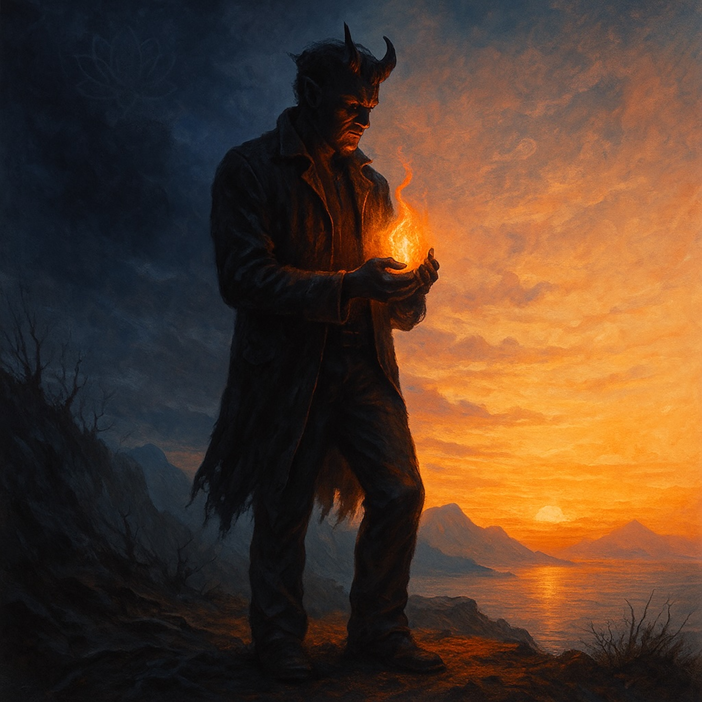

# The Demon’s Vow  
  
**The Demon’s Vow** is a gritty, blues-folk redemption tale that moves from shadow to flame.  
Driven by raw guitar and a dark, swampy groove, the song tells of a former predator who meets a fearless sage and hears a *new song*—a call to give rather than take.  
  
Each verse walks through the transformation:  
from hunger and havoc,  
to the spark of Dharma’s light,  
to the pledge to guard those who carry wisdom forward.  
The chorus lands like a mantra: *“The deepest change you’ll ever find ain’t in what you take, but in what you give away.”*  
  
With its smoky harmonica, deep slide guitar, and cinematic bridge, **The Demon’s Vow** is both confession and promise—a blues of redemption, a folk hymn to inner awakening, and a fierce pledge to protect the flame of truth.  
  
blues folk, redemption song, spiritual awakening, vow of transformation, dark to light, inner change, demon to guardian, protective vow, dharma inspiration, blues storytelling, soulful guitar, harmonica blues, mystical blues, transformation anthem, powerful bridge, redemption ballad, spiritual blues folk  
  
Verse 1  
I was born in the shadows, hunger in my bones,  
Rulin’ like a phantom on a cracked and crooked throne.  
Took what I wanted, hearts left torn and bruised,  
Just a wild-eyed demon with nothing to lose.  
  
Chorus  
Then I heard a new song—soft, steady, kind,  
“The deepest change you’ll ever find  
Ain’t in what you steal, but in what you give away.”  
That’s the vow I made on that fateful day.  
  
Verse 2  
Met a wanderin’ sage with a lantern in his gaze,  
Stood through my thunder, never looked away.  
He spoke of the Dharma, the wondrous law,  
How the whole wide universe has no fatal flaw.  
Said, “The same fire in me can rise in you too.”  
And my black-ice heart felt a spark break through.  
  
Chorus  
Yeah, I heard a new song—soft, steady, kind,  
“The deepest change you’ll ever find  
Ain’t in what you steal, but in what you give away.”  
That’s the vow I made on that fateful day.  
  
Bridge  
Now my fangs are blunt and my claws turned slow,  
Found a sweeter power in the guard I show.  
For the keepers of the teaching, the carriers of the flame  
I’ll stand like a fortress when the darkness makes its claim.  
That old dark kingdom ain’t my home no more—  
I’m a sentinel now on a brighter shore.  
  
I heard a new song—soft, steady, kind,  
“The deepest change you’ll ever find  
Ain’t in what you steal, but in what you give away.”  
That’s the vow I made on that fateful day.  
  
Outro  
Oh, the vow… yeah, the vow…  
To hold the light, day and night.  
From the pit to the dawn I stay—  
That’s the promise I keep, come what may.  
  
		  
  
