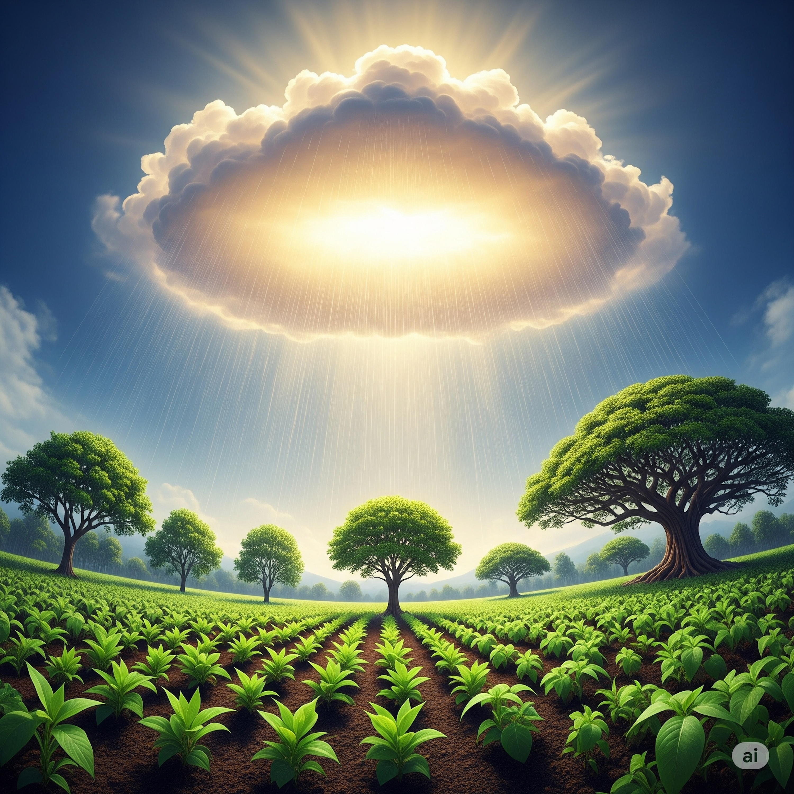

# The Dharma Rain  
  
From **omnipresent Clouds**, a sky so vast,   
The **Dharma's single flavor,** meant to last.   
No partiality, no love, no hate,   
Just **universal truth**, for every state.  
  
Beneath, the earth, a garden rich and wide,   
Where **varied herbs and mighty trees** abide.   
From small, frail shoots to canopies so grand,   
Each takes the moisture, flourishing in its land.   
**The Buddha knows their nature, deep and true**,   
But **they themselves know not**, nor do we, too.  
  
For **judgment holds no place** on this pure Way,   
No superior, middle, or inferior stay.   
The **ultimate nirvana**, one for all,   
Though diverse paths may answer wisdom's call.  
  
A **Bodhisattva, stirred by Bodhicitta's fire**,   
Through **Six Perfections**, rises ever higher.   
With **generosity** and **patient grace**,   
And **wisdom's light** illuminating space.   
Through **kindly speech** and **beneficial deed**,   
They plant the **seeds of oneness** to succeed.  
  
For **all possess the Buddha-nature bright**,   
**Earthly desires, transformed to pure enlightenment**.   
**Suffering's deep well, a fount of sweet release**,   
In **interbeing's bond**, we find our peace.  
  
So let the rain descend, impartial, free,   
A **pure land blooms in universal unity**.   
No need to weigh or measure, praise or blame,   
Just **compassion's path**, igniting every flame.   
We tend our gardens, helping all to thrive,   
**In mutual respect, our spirits come alive**.  
  
