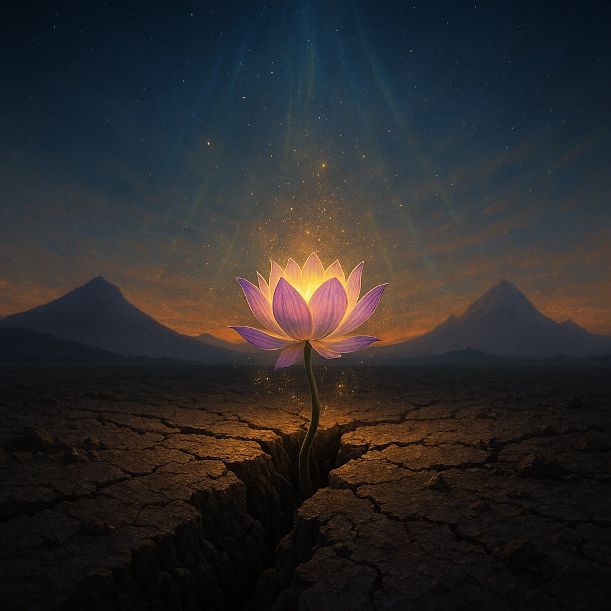

# The Dirt and the Eternal Blossom  
  
A slow-burning, 12-bar blues with a cosmic heart.  
*The Dirt and the Eternal Blossom* sets the parable of Maitreya’s doubt and the Buddha’s eternal presence to a gritty, acoustic groove with mournful harmonica and a chorus that feels like Olympus and Gridhrakuta singing together.  
  
The lyrics follow a seeker who dares to question:  
  
“The truth ain’t floating up in the air—it’s buried waiting here.”  
  
From cracked soil and trembling earth, the Bodhisattvas of the Earth rise in radiant light, revealing that enlightenment is **immanent, not distant**.  
The bridge draws on the Parable of the Skilled Physician—birth and death as compassionate strategy—while the outro turns doubt itself into the “good root” of awakening.  
  
This is blues-folk testimony for anyone who suspects that **faith is forged by inquiry**, and that the eternal Buddha is present in the everyday dirt of our lives.  
  
⸻  
  
**Suggested tags**  
lotus sutra, blues folk, 12 bar blues, spiritual blues, acoustic blues, harmonica, buddhist music, cosmic folk, mystical blues, bodhisattvas of the earth, eternal buddha, philosophical song, roots music, american folk blues  
  
(Style: Slow, 12-bar blues progression, acoustic guitar with a mournful harmonica interlude. Grounded in common experience.)  
  
(Verse 1 – The Paradox of Time)  
I stood upon that high, holy hill, watched the big assembly wait.  
Saw the teacher, Shakyamuni, standing at the gate.  
He looked like a handsome man, black hair and twenty-five.  
But he claimed these hundred-year-old souls had kept his dream alive.  
Oh, that’s a strange family tree, a paradox too hard to bear.  
How can a young father claim sons with silver in their hair?.  
  
(Chorus – The Emergence)  
So I let the doubt rise up, let the question be sincere.  
‘Cause the truth ain't floating up in the air, it's buried waiting here.  
Then the *Saha world* trembled, and the ground began to break.  
And the Bodhisattvas of the Earth rose up for goodness' sake.  
They had golden-hued bodies, bathed in limitless light.  
Proving that our potential is immanent, hidden out of sight.  
  
(Verse 2 – The Hidden Potential)  
The Buddha declined the visitors who offered to take the task.  
Said, "I got my own home-grown disciples, I don't need the help you ask".  
They came from beneath the surface, from the space belonging to this world.  
They showed us that Buddha-nature ain't a banner to be unfurled.  
It's the seed that breaks the earth of defilements, bound to emerge and safeguard the Dharma.  
It means the path ain't a flight, friend, but a transformation of the karma.  
  
(Chorus – The Emergence)  
So I let the doubt rise up, let the question be sincere.  
‘Cause the truth ain't floating up in the air, it's buried waiting here.  
Then the *Saha world* trembled, and the ground began to break.  
And the Bodhisattvas of the Earth rose up for goodness' sake.  
You got the power you need, beneath the surface of the clay.  
This dirty old world is the only place to make your Buddha's mind your own today.  
  
(Bridge – The Skilled Physician’s Ruse)  
Then the Master started preaching, shattered the linear line.  
Said, "I've been teaching for eons, that birth and death was just a sign".  
It was an expedient means (*Hōben*), a trick of profoundest love.  
Like the Parable of the Physician, sending word from above.  
He left the medicine for the sons whose minds were deranged and lost.  
He feigned extinction so they'd finally count the cost.  
They had to thirst for the teaching, they had to yearn with grief and fear.  
To take the Dharma, the medicine, and finally be cleared.  
  
(Outro/Harmonica Solo)  
Oh, my sincere question, wasn't a flaw but a good root.  
If you got that doubt in your belly, you gotta go find the fruit.  
It’s not about blind faith, it's about the search, the crucible of the mind.  
The eternal Buddha's always here, he's not hard to find.  
He’s been working for eons, transforming poison into medicine.  
Just emerge from the earth, child, where your true self has been.  
  
  
