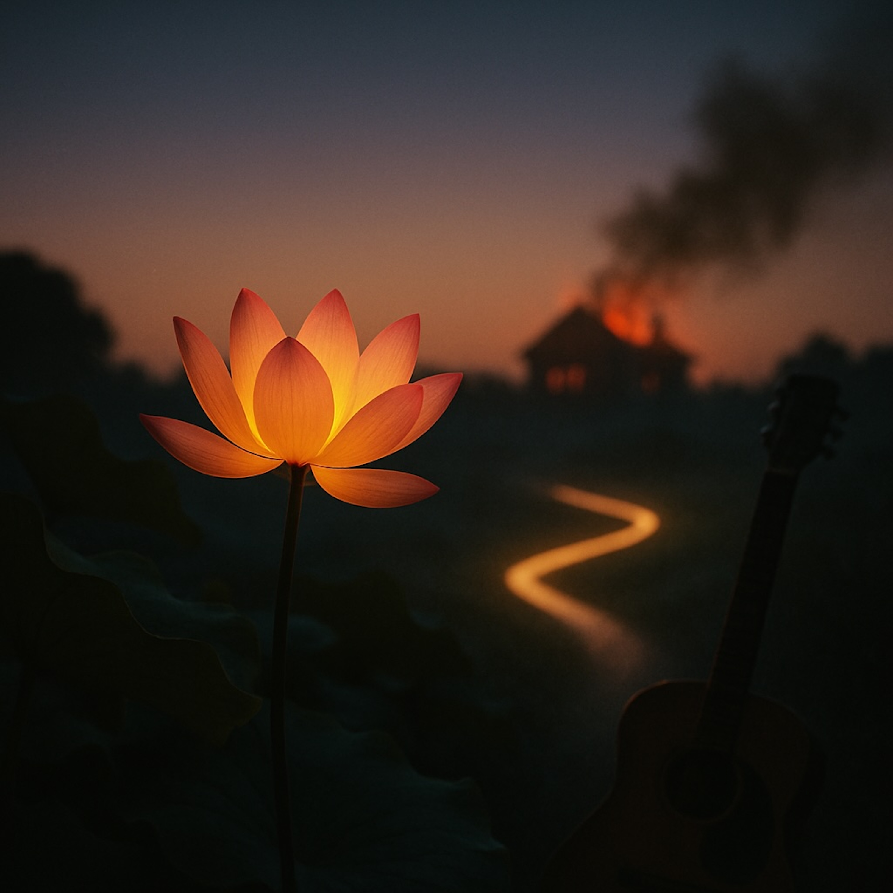

# The Eternal Road in This Burning House  
  
This song is a long, luminous walk through fire and stillness. With a slow, earthy guitar groove and a blues-folk pulse, it weaves ancient parable into present-day grit. The verses trace a pilgrim’s hard miles—years of searching for a distant light—only to discover that awakening is already here, in the everyday and the ordinary.  
  
Drawing on the Lotus Sutra’s Burning House story, the lyrics paint vivid images of smoke-filled rooms and a loving father’s skillful call, then shift to the intimate work of “peaceful practices”: quieting the tongue, laying down anger, and seeing the world reflected in one’s own heart. The chorus rings like a timeless refrain: the Buddha is not a figure of the past but the sound in the silence now, guiding the One Vehicle that carries every soul home.  
  
Part gospel of daily life, part road-house blues, *The Eternal Road in This Burning House* invites listeners to walk the single shining path where the sacred and the ordinary are one, vowing compassion for every living being.  
  
eternal road, burning house, blues folk, secular blues, acoustic guitar, minor key, lotus sutra inspired, one vehicle, spiritual awakening, inner truth, bodhisattva vow, mindful practice, compassionate living, modern dharma song, soulful storytelling, acoustic blues, reflective folk, deep lyrics, spiritual journey, awakening in daily life  
  
**(Style: Secular Folk/Blues, minor key, steady acoustic guitar rhythm)**  
  
**(Verse 1)**   
I spent too many years on the road lookin’ for a **far-off, distant light**.   
Thought my destiny was low, that I was bound for the dark of the night.   
They told me there were two small paths, maybe three paths I could choose.   
Said my soul wasn’t strong enough, didn’t have a thing to lose.   
But the oldest truth, the one that’s real, cuts clean right through the bone,   
It says every single soul out there **can walk on the one road home**.   
Seems the differences between us, ain't permanent or set.  
  
**(Chorus)**   
Oh, the **Buddha didn’t start way back then**, he’s been here all along.   
He’s the sound in the silence, the tune that drives this song.   
It ain't about gettin' to heaven, it’s about **the truth you already hold**.   
That **unsurpassed state of life** is richer than pure gold.   
The **ultimate reality** is not high, it’s in the mundane here.   
Right now, in this moment, let the One Vehicle steer.  
  
**(Verse 2)**   
They showed me a **house on fire**, smoky walls and a dangerous floor.   
We were playing on the inside, oblivious right to the core.   
The Father knew we wouldn’t run, just yelling wouldn’t do the trick.   
So he promised us three different wagons, that **skillful means**—a loving trick.   
He gave us the word, provisional teachings, just to get us out the door.   
Now we’re standing in the sunlight, and there’s **one great white cart** and nothing more.   
He pretends to leave the world, like a **physician feigning death**,   
Just to make us crave the medicine, [draw in a desperate breath.]  
  
**(Verse 3)**   
Gotta practice those **peaceful practices**, if you want to be unbound.   
You gotta quiet that judging tongue, let that gossiping mouth slow down.   
**Discard the anger and the envy**, turn your mind to what is true .   
Avoid the low temptations, and **see the world reflecting back in you**.   
This body is a bright mirror, where the mountains and the seas appear.   
The **sacred ain't in the heavens**, but right in the challenges here.   
You hear the **deep cries of the world**, you collect all the tears they weep.   
'Cause your sadness ain't just your own burden, the sorrow is wide and deep.  
  
**(Chorus)**   
Oh, the **Buddha didn’t start way back then**, he’s been here all along.   
He’s the sound in the silence, the tune that drives this song.   
It ain't about gettin' to heaven, it’s about **the truth you already hold**.   
That **unsurpassed state of life** is richer than pure gold.   
The **ultimate reality** is not high, it’s in the mundane here.   
Right now, in this moment, let the One Vehicle steer.  
  
**(Outro)**   
The core essence is the same, no need to look away.   
My **highest happiness is tied** to the path you walk today.   
We ain't separate, we're **interdependent**, a web of give and take.   
So I make the **Bodhisattva Vow**, for every single living sake.   
  
***(Fade out on sustained acoustic guitar chord)***  
  
