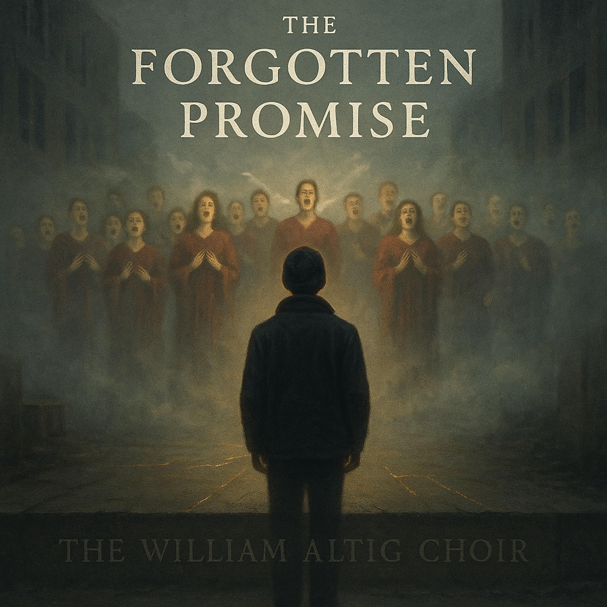

# The Forgotten Promise | *By The William Altig Choir*  
  
We all carry something ancient within us—a promise made before memory, a purpose that calls to us through the noise of daily life. "The Secret Vow" is a heavy blues meditation on the profound loss we feel when we've forgotten why we're here.  
  
Drawing from the Buddhist teaching of the Bodhisattva vow—the commitment to return to this world of conflict to benefit all beings—this song explores what happens when life's preoccupations bury that sacred purpose so deep it becomes a secret even to ourselves. The weight we carry isn't a burden to escape, but a key waiting to unlock our deepest calling.  
Through haunting fingerpicked guitar, wailing slide, and raw vocal testimony, the song journeys from confusion and heaviness toward the breakthrough moment of remembering. It's about waking up to the realization that we didn't come here by accident—we came on purpose, with purpose.  
  
For anyone who's ever felt simultaneously lost and called, burdened by a mission they can't quite name, preoccupied by a thousand distractions while something sacred whispers from beneath it all—this song is for you.  
  
The secret vow was never hidden. It was sleeping in your heart. And today's the day you start.  
  
**SEO Search Tags**  
blues, folk blues, spiritual music, bodhisattva, buddhist music, americana, roots music, slide guitar, heavy blues, introspective folk, gospel blues, conscious music, sacred music, spiritual awakening, purpose, mindfulness music, meditation music, contemplative music, soul searching, existential blues, harmonica blues, acoustic blues, storytelling folk, delta blues, musical activism, compassionate action, awakening, remembering, vow, promise, service music, benefit all beings, world music fusion, choir, choral arrangement, The William Altig Choir, contemporary folk, modern blues, philosophical music, meaningful lyrics, deep blues, emotional blues, transformative music, healing music, community music, collective awakening, ancient wisdom, modern spirituality, conscious lyrics, intentional living, life purpose music  
  
  
Lyrics  
Verse 1  
[Fingerpicked acoustic guitar, sparse and haunting]  
I wake before the dawn breaks, with weight upon my chest  
Something whispers in the silence, won’t let my spirit rest  
There’s a promise in my bones, carved deeper than my name  
But the preoccupations of this life have smothered out the flame  
I walk these streets like shadows, familiar but alone  
Each face I pass, a question mark, each moment overthrown  
By bills and fears and anger, by the grinding of the day  
While something sacred calls to me from ages far away  
Chorus  
[Full band enters: slide guitar, upright bass, brushed drums]  
I made a vow, I made a vow  
Before I can’t remember when  
To walk into the fire, to come back here again  
But the secret’s grown so heavy  
That I’ve buried it from me  
I made a vow to all of you  
But I’ve forgotten how to see  
Verse 2  
[Guitar builds intensity, adding distortion on the edges]  
Some nights I dream of battlefields where suffering runs deep  
Of reaching out my hands to hold the ones who cannot sleep  
Of stepping through the doorway into conflict and to pain  
Not running from, but running toward, to help them break the chain  
But morning comes with coffee, with the traffic and the news  
With a thousand small distractions and a thousand small refusals  
To remember why I’m here at all, what mission brought me through  
The veil between the worlds I’ve known to stand here next to you  
Chorus  
[Heavier, with harmonica wailing between lines]  
I made a vow, I made a vow  
Before this flesh and bone  
To benefit all beings, not to walk this path alone  
But the secret’s grown so heavy  
I’m a stranger to myself  
I made a vow that mattered once  
Now it’s gathering dust on shelves  
Bridge  
[Music strips down to just voice and acoustic guitar, building gradually]  
Wait—  
There’s a crack in the concrete  
There’s a light beneath the door  
There’s a reason I keep stumbling  
Like I’ve been here once before  
Maybe—  
[Drums return, soft but insistent]  
All this weight I’m carrying  
Isn’t burden, it’s a key  
To unlock the ancient promise  
That’s been waiting inside of me  
[Full band swells]  
I came into this world of conflict  
Not to add more to the pain  
But to hold the hand of suffering  
And walk with it again  
Final Chorus  
[Triumphant, cathartic, full-throated]  
I made a vow, I MADE A VOW  
And now I’m starting to recall  
To come back here in service  
To answer when you call  
The secret wasn’t hidden  
It was sleeping in my heart  
I made a vow to benefit all beings  
And today’s the day I start  
I made a vow to benefit all beings  
And today’s the day I start  
Outro  
[Extended instrumental fade with slide guitar and harmonica trading phrases, like a conversation between the old forgotten self and the newly awakened one. Ends on a single, sustained note of resolution]  
  
Musical Notes  
Instrumentation:  
	•	Lead vocal (raw, emotional delivery)  
	•	Acoustic guitar (fingerpicked verses, strummed chorus)  
	•	Electric guitar with slide (for emotional punctuation)  
	•	Upright bass (walking blues lines)  
	•	Brushed drums (building to full kit on final chorus)  
	•	Harmonica (crying out the pain and recognition)  
	•	Optional: Hammond organ (subtle, for spiritual depth)  
Vocal Delivery:  
	•	Verses: Contemplative, almost spoken-word quality at times  
	•	Chorus: Building from questioning to declaration  
	•	Bridge: Breakthrough moment—voice cracks with realization  
	•	Final Chorus: Full-throated, redemptive, celebratory  
Dynamic Arc:  
The song should feel like a journey from confusion and heaviness toward clarity and purpose, with the bridge serving as the pivotal moment of remembering.​​​​​​​​​​​​​​​​  
  
  
