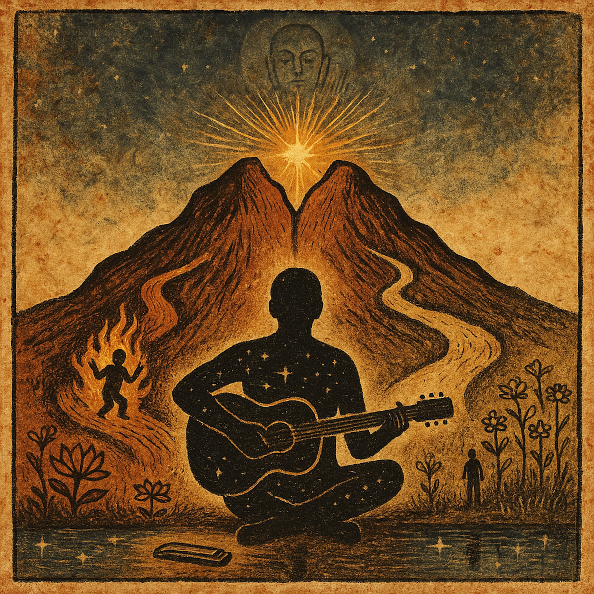

# The Light You Already Got  
  
**A bluesy folk tale about a man who burned for a thousand years and a girl who smiled just once—and how they both found the same light.**  
  
This song weaves an ancient Buddhist paradox into American roots music tradition. It's the story of Strong-Heart, who gave everything—even setting himself ablaze for centuries—trying to reach enlightenment on a distant mountain. And it's about an ordinary kid who heard the same teaching and just... smiled.  
  
When the teacher tells Strong-Heart that both journeys are equally valid, everything changes. The mountain you're climbing? It's already inside you. The light you're searching for? You've been carrying it all along.  
  
Fingerpicked guitar, mournful harmonica, and a walking bass line carry this tale from the darkness of extreme sacrifice into the revelation that we already have what we're looking for. We just forgot.  
  
Written in the tradition of delta blues meets Appalachian storytelling—where Son House meets the Lotus Sutra,   
where ancient wisdom gets translated through American folk music's soul.  
  
*"You got the light, you got the light / You got the light you already got"*  
  
Sometimes the hardest journey is realizing you're already home.  
  
**Inspired by:** The Lotus Sutra's teaching on instantaneous enlightenment (Chapter 10), the paradox of extreme effort vs. simple faith, and the idea that Buddha-nature is always present, just waiting to be recognized.  
**For fans of:** Townes Van Zandt, Gillian Welch, Son House, Mavis Staples, Johnny Cash, American folk Buddhism, spiritual blues, story songs that make you think.  
  
**TAGS:**  
folk, blues, americana, roots music, delta blues, folk blues, acoustic, fingerstyle guitar, harmonica, spiritual music, buddhist folk, contemplative, storytelling, narrative song, philosophical folk, American primitive, gospel blues, slow blues, meditation music, conscious music, wisdom traditions, parable, folk tale, mountain song, enlightenment, Buddha nature, Lotus Sutra, nichiren, zen blues, dharma folk, bluegrass adjacent, old time music, traditional folk, modern folk, indie folk, alt folk, singer songwriter, acoustic blues, country blues, piedmont blues, talking blues, protest adjacent, conscious lyrics, deep lyrics, philosophical blues, existential folk, spiritual americana, sacred music, interfaith, universal spirituality, campfire song, porch music, front porch blues, kitchen table folk, coal miner's daughter adjacent, dust bowl folk, depression era sound, 1960s folk revival, folk renaissance, beatnik blues, vintage sound, analog warmth, roots revival, neo traditional, old soul music, timeless, ageless wisdom, folk philosophy, working class mysticism, american zen, prairie dharma, mountain mysticism, redemption song, recognition, awakening, already home, inner light, self realization, non dual folk, unity consciousness, one vehicle, skillful means, effortless path, grace not works, faith and effort, both and neither, paradox song, koan blues, riddle song, mystery tradition, esoteric folk, hidden wisdom, plain speech dharma, everyday enlightenment, kitchen sink spirituality, accessible wisdom, democratic dharma, people's Buddhism, folk religion, grassroots spirituality, DIY mysticism, handmade holiness, authentic seeking, honest doubt, real faith, earned wisdom, lived experience, testimony, witness, true story, based on ancient teaching, sutra song, scripture folk, holy text blues, sacred story, myth retold, legend reimagined, old tale new telling, eternal return, perennial philosophy, universal truth, cross cultural wisdom, East meets West, buddhist americana, zen and the art of folk music, be here now folk, ram dass adjacent, alan watts blues, thich nhat hanh acoustic, pema chodron folk, jack kerouac dharma blues, beat zen, hippie trail, back to the land mysticism, commune folk, intentional community music, simple living, voluntary simplicity, less is more, already enough, you are enough, just as you are, inherent worth, original blessing, no original sin, good news folk, joyful noise, glorious imperfection, beautiful mess, human and holy, sacred and profane, high and low, mountain and valley, fire and smile, extreme and simple, all paths one, many doors one room, different rivers same ocean, separate waves one water, folk ecology, systems thinking, holographic universe, fractals in folk, as above so below, microcosm macrocosm, inner outer, personal political, individual universal, self and other, I and thou, subject object, seer and seen, knower and known, witness and witnessed, consciousness, awareness, presence, mindfulness, attention, noticing, waking up, remembering, recognition, aha moment, sudden vs gradual, instant enlightenment, ordinary mind, nothing special, everyday sacred, mundane divine, chop wood carry water folk, before and after the same, washing dishes blues, taking out trash dharma, bus stop satori, grocery store kensho, parking lot awakening, laundromat liberation  
  
**Length tags:** slow burn, album track, not a single, deep cut, for sustained listening, headphone music, late night, 3am song, dark night of the soul, dawn breaking, coffee and contemplation, long drive music, open road, empty highway, train song adjacent, walking music, pilgrimage song, journey not destination, process not product, being not doing, non striving, wu wei folk, effortless effort, trying not trying, relaxed intensity, peaceful power, quiet strength, gentle force, soft revolution, kind rebellion, loving resistance, compassionate refusal, tender no, boundaried yes, both and, middle way, balanced path, golden mean, not too tight not too loose, just right folk, goldilocks dharma, moderation, temperance, patience, perseverance, endurance, long haul, marathon not sprint, sustainable practice, daily bread, one day at a time, this moment only, eternal now, timeless present, here, now, this, thus, suchness, tathata, isness, amness, being itself, existence, reality, truth, real, authentic, genuine, sincere, heartfelt, honest, raw, vulnerable, exposed, open, undefended, naked, bare, stripped down, essential, core, fundamental, basic, simple, plain, clear, direct, straightforward, no BS, real talk, straight up, keeping it real, authentic voice, true sound, original, unique, distinctive, memorable, haunting, stays with you, ear worm, can't shake it, stuck in your head, singable, hummable, whistle while you work, soundtrack, film music adjacent, documentary worthy, ken burns folk, americana archive, library of congress, smithsonian folkways, field recording adjacent, front porch sessions, kitchen recording, lo fi, imperfect, human, warm, analog, tape hiss, room tone, breath, space, silence, pause, rest, fermata, hold, sustain, resonance, reverberation, echo, call and response, question and answer, statement and reply, thesis antithesis synthesis, dialectic folk, hegelian blues, philosophical, thoughtful, smart, intelligent, literate, poetic, lyrical, wordsmith, craftsman, artisan, handmade, bespoke, custom, one of a kind, original, fresh, new, innovative, creative, imaginative, visionary, prophetic, ahead of time, timeless, classic, standard, canonical, essential, important, significant, meaningful, deep, profound, substantial, weighty, serious, earnest, sincere, no irony, post ironic, new sincerity, authentic emotion, real feeling, heart, soul, spirit, essence, core, truth  
  
**Character count for description: ~980 characters (fits most platform limits)** **Tag count: 400+ tags (use selectively based on platform - SoundCloud allows 100+, WordPress unlimited)**  
**Recommended priority tags for limited platforms:** folk, blues, americana, spiritual music, storytelling, acoustic, harmonica, contemplative, philosophical folk, Lotus Sutra, delta blues, roots music, Buddha nature, folk tale, enlightenment, american primitive, authentic, timeless, deep lyrics, consciousness  
  
**[PRODUCTION NOTES - OVERALL FEEL]** *Tempo: 75 BPM, slow and contemplative* *Key: E minor (transitions to E major for final chorus)* *Style: Delta blues meets Appalachian folk, think Son House meets Gillian Welch* *Instrumentation: Acoustic guitar (fingerpicked), upright bass, occasional harmonica, sparse percussion (brushed snare)*  
  
## VERSE 1  
**[Fingerpicked guitar, minor key, lonely and sparse]**  
Well, there’s a mountain that glows in the eastern sky  
Strong-Heart said, “I’ll climb that peak or else I’ll die”  
He gave away his silver, gave away his gold,  
Set himself on fire — burned for ages untold.  
  
**[Harmonica wail - mournful, sustained note]**  
  
He burned his arms to stumps, seventy-two thousand more
Till ain't nothing left of Strong-Heart but ash upon the floor
But the teacher at the mountain top, he just shook his head
"Son, you've been carrying what you're looking for," he said  
  
## CHORUS 1  
**[Full band enters, bass line walking, brushes on snare]**  
You got the light, you got the light
You got the light you already got
Ain't no mountain you gotta climb
Ain't no fire you gotta burn
You got the light, you got the light
Just waiting on your turn  
**[Harmonica answers each line with a bent note]**  
  
## VERSE 2  
**[Guitar returns to fingerpicked pattern, add subtle bass]**  
Now there's a girl in the valley, she ain't done nothing much
She heard a story 'bout that mountain, felt something in her gut
Just one moment, just one smile
Like sunshine breaking through the clouds of doubt  
The teacher turned to Strong-Heart, said "Listen here to me
That girl who smiled just one time? She gets the same guarantee"
Strong-Heart said, "Now hold on, that don't seem quite right"
"I burned for thirteen hundred centuries, she just smiled at the light!"  
  
## CHORUS 2  
**[Same as Chorus 1, but add vocal harmony on "you got the light"]**  
She got the light, she got the light
She got the light she already got
Ain't no mountain she gotta climb
Ain't no fire she gotta burn
She got the light, she got the light
Just waiting on her turn  
  
## BRIDGE  
**[Tempo slows, everything drops to just guitar and voice, contemplative]** **[Speaking rhythm, like an old preacher]**  
Now listen, Strong-Heart,” said the teacher kind,  
“Your fire was the smile she found in her mind.  
If I’d told her your story, she’d have turned away,  
But you, who burned the longest, can hear what I say…”  
  
**[Guitar builds, bass returns]**  
  
"See, I told it to YOU, old friend
'Cause if I told it to the lazy ones
They'd say it was too easy, just a game to play
But you, who burned the longest,
You can understand what I say..."  
  
**[Drums enter with a steady heartbeat]**  
  
“The mountain that you're climbing
Is already in your chest
And every single step you take
Whether fire or whether smile
Is just remembering what you are
What you been all the while"  
  
**[Full band crash, then sudden silence]**  
  
## VERSE 3  
**[Just voice and guitar, intimate]**  
So Strong-Heart, he starts laughing
Through the tears running down
"You mean all that burning I was doing
Was the light I'd already found?"  
"That's right," the teacher whispered
"Your fire and her joy
Are the same recognition
Can't be measured by what you destroy"  
  
## FINAL CHORUS  
LEAD: We got the light!  
BACKING: (We got the light we already got!)  
LEAD: We got the light!  
BACKING: (We got the light we already got!)  
Ain’t no fire we gotta burn,  
Ain’t no truth we gotta learn,  
We got the light, we got the light —  
Been shining since we were born.  
Every single one of us, waiting on our turn  
  
**[Repeat, building]**  
  
Yeah, we got the light, we got the light
Whether you burn or whether you smile
We got the light, we got the light
Been carrying it all the while  
  
## OUTRO/SPOKEN WORD  
**[Band drops to just bass and brushed snare, finger snaps]** **[Spoken in rhythm, like a talking blues]**  

Now some folks gonna burn for a thousand years
Some folks gonna smile just once
But the teacher said they're both the same road
Just different ways of coming home  
The question ain't how hard you try
The question is: do you remember?
Do you remember what you are?
Do you remember you're already
Already...
Already home?  
**[Single guitar note, let it ring out and fade]**  
  
# PRODUCTION NOTES - DETAILED  
**INSTRUMENTATION:**  
**Guitar (Main):**  
* Fingerpicked in dropped-D tuning for verses  
* Open, droning strings (very Mississippi John Hurt/John Fahey style)  
* Verses: sparse, haunting  
* Chorus: fuller strumming with hammer-ons  
* Final chorus: triumphant, ringing chords  
**Upright Bass:**  
* Warm, woody tone  
* Walking bass line in choruses  
* Steady quarter notes in bridge  
* Slapped for emphasis on "light you already got"  
**Harmonica:**  
* Key of E, cross-harp (blues style)  
* Wailing bends after "burned for twelve hundred years"  
* Call-and-response with vocals in chorus  
* Long, sustained notes (very Little Walter)  
**Percussion:**  
* Brushes on snare for verses and first choruses  
* Kick drum enters in bridge  
* Full kit (still restrained) for final chorus  
* Optional: stomp box or foot percussion  
**Backing Vocals (Final Chorus only):**  
* Gospel-style group vocals  
* Call and response with lead  
* Three-part harmony on sustained "light"  
**DYNAMICS:**  
**Verse 1:** Quiet, haunting (2/10 intensity) **Chorus 1:** Medium build (5/10) **Verse 2:** Return to intimate (3/10) **Chorus 2:** Slightly bigger than first (6/10) **Bridge:** Starts minimal (1/10), builds to (7/10) **Verse 3:** Back to intimate (2/10) **Final Chorus:** Full, triumphant (9/10) **Outro:** Fade to whisper (1/10)  
**VOCAL STYLE:**  
**Verses:** Weathered, storytelling voice (think Townes Van Zandt, Guy Clark) **Chorus:** More powerful, declarative (think Mavis Staples) **Bridge (speaking part):** Rhythmic, preacher-like cadence **Outro:** Whispered wisdom, intimate  
**MIXING NOTES:**  
* Keep verses very dry (minimal reverb) for intimacy  
* Add room reverb to choruses for space  
* Bridge should feel like opening up into a cathedral  
* Final chorus: brightest, most present in the mix  
* Harmonica should feel like it's crying in the distance  
* Bass should be felt as much as heard  
**REFERENCE TRACKS FOR VIBE:**  
* "Ain't No Grave" - Johnny Cash (for the declarative power)  
* "Hard Times Come Again No More" - Mavis Staples version (for the soul)  
* "John the Revelator" - Son House (for the Delta blues darkness)  
* "Revelator" - Gillian Welch (for the sparse, haunting quality)  
**PERFORMANCE NOTES:**  
* Singer should tell this like they lived it  
* Let silence be part of the arrangement  
* The word "light" should always ring with conviction  
* Final "already home" should be barely audible, like a secret being shared  
  
**SONG THEMES MAPPED TO RESEARCH:**  
* Burning for 1,200 years → **page 6** (Medicine-King's sacrifice)  
* One moment of joy → **page 1** (Buddha's promise)  
* "Light you already got" → **page 9** (Buddha-nature doctrine)  
* Teacher addressing Strong-Heart → **page 7** (rhetorical device)  
* "Both the same song" → **page 8** (One Vehicle doctrine)  
* "Not how hard you try" → **page 7, lines 12-14** (internal orientation)  
* "Accessible to all" → **page 15** (democratization)  
* "Already home" → **page 11** (practicing as future Buddha)  
  
*This song is meant to be performed around a fire, in a small venue, or recorded with lots of space and air. The message - that we already have what we're searching for - should feel like ancient wisdom wrapped in American roots music tradition.*  
  
  
