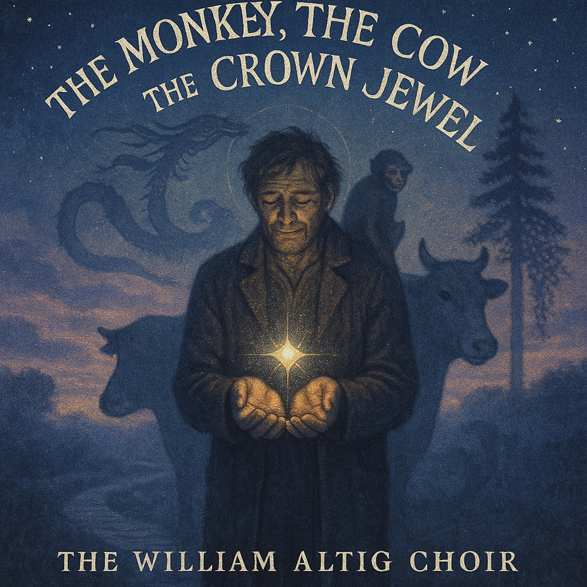

# The Monkey, the Cow, and the Crown Jewel  
###   
### "The Monkey, the Cow, and the Crown Jewel" is a musical journey into a profound spiritual paradox from 13th-century Japan. Inspired by Nichiren Daishonin's letter, the *Urabon Gosho*, the song tells the story of Lord Jibu, a priest described as lacking wisdom and dignity—like a "monkey or a cow". Yet, he is praised in the highest terms.    
###   
### Why? Because his one redeeming quality is his simple, unshakable faith in the Lotus Sutra.  
### This orchestral folk-rock epic explores the theological concept of "derived sanctity." It's not about our own perfection, but the power of the ultimate truth we hold dear. Through the powerful metaphors of a "snake holding a gem" and a "dragon guarding sacred relics," the song builds from a sparse, intimate confession into a soaring anthem for the imperfect. It is a testament to the idea that pure faith is the one jewel that can make any flawed vessel sacred, transforming a life of shadow into a source of brilliant light.    
###   
SEO Tags  
  
The Monkey the Cow and the Crown Jewel, Lord Jibu, Jibu-bō, Flawed Priest, Broken Vessel, Latter Day of the Law, Mappō, Faith Alone, Primacy of Faith, Wisdom like a Cow, Dignity like a Monkey, Crown Jewel, Supreme Jewel, Snake Holding a Gem, Dragon Guarding Relics, Nichiren Buddhism, Lotus Sutra, Wonderful Dharma, Urabon Gosho, Treatise on the Ullambana Service, Śākyamuni Buddha, Borrowed Light, Eternal Light, Seven Generations, Diamond Chalice Precept,   
  
###   
### Folk Rock, Orchestral Folk, Indie Folk, Singer-Songwriter, Spiritual, Buddhism, Nichiren Buddhism, Lotus Sutra, Faith, Philosophy, Contemplative, Uplifting, Epic, Cinematic, Japanese History, Theology, Acoustic Guitar, Strings, The William Altig Choir, Urabon Gosho, Lord Jibu, Mappo, Daimoku, Nam Myoho Renge Kyo  
###   
### (A Blues-Folk Ballad of Faith and Imperfection)  
**Tempo:** ~74 BPM, slow shuffle in 6/8 or 12/8 time.  
**Tone:** Soulful humility turning to radiant assurance  
  
**(Verse 1 – The Lament of the Flawed Vessel)**  
**[**sparse fingerpicked guitar, Hammond drone]**
**Not one of two hundred fifty precepts kept,
Three thousand rules of conduct, all unkept.
My wisdom’s dull — like a horse or a cow,
A monkey’s dignity is all I’ve got now.
A broken vessel in these latter days,
My strength’s a whisper, lost inside the maze.
No merit gathered, nothing I can claim,
Just a flawed old priest who barely speaks his name.  
  
**(Chorus – The Pivotal Faith)**  
**[**add upright bass, soft brushed snare]**
**But nevertheless, my heart holds one thing true:
I revere the Buddha, and the Sutra too.
My only treasure is the faith I hold —
A story for these latter days retold.
For broken vessels shine with borrowed light,
And in devotion, find their sacred might.  
  
**(Verse 2 – The Sacred Metaphors of Derived Sanctity)**  
**[**slide guitar enters with call-and-response]**
**I’m like a serpent with a priceless gem —
Its light redeems, though it’s not mine, but them.
A dragon guarding relics, pure and bright,
My being changed by the Dharma’s light.
The jewel is perfect, though the snake may crawl,
Untouched by mud, it sanctifies us all.
My hands are empty, yet I guard the Law —
The greatest treasure this world ever saw.  
  
**(Chorus – The Pivotal Faith)
**But nevertheless, my heart holds one thing true:
I revere the Buddha, and the Sutra too.
My only treasure is the faith I hold —
A story for these latter days retold.
For broken vessels shine with borrowed light,
And in devotion, find their sacred might.  
  
**(Bridge – The Boundless Promise)**  
**[**choir harmonies swell, organ opens]**
**A wisteria vine around a mighty pine,
I climb to heights that never could be mine.
My strength may fail, but clinging to this grace,
I’ll save my kin and find their sacred place.
For seven generations, I can bring them peace,
A fine jewel of a grandson — granting release.
Through faith alone, I soar on borrowed wings,
And hear the song the Tranquil Heaven sings.  
  
**(Outro – The Mantra of Faith)**  
**[**fade with gospel humming — mantra-like repetition of *“borrowed light…”]***
**The monkey, the cow, and the crown jewel bright —
A flawed man’s faith in eternal light.
The monkey, the cow, and the crown jewel bright —
Borrowed light becomes my own tonight.  
  
  
A slow, blues-folk ballad (~74 BPM, 12/8 time). Sparse finger-picked acoustic guitar opens with warm baritone lead — intimate, confessional. Hammond B3 hums beneath. Verse 1 bare; brushed snare and upright bass join on first chorus, adding pulse and lift. Verse 2 brings slide guitar with gentle call-and-response. Bridge blooms: gospel-style choir, subtle organ swell, wisteria-like rise. Outro fades with humming choir repeating “borrowed light.” Tone: humble yet transcendent, moving from gravel to grace — faith redeeming the flawed vessel.  
  
  
  
  
  
