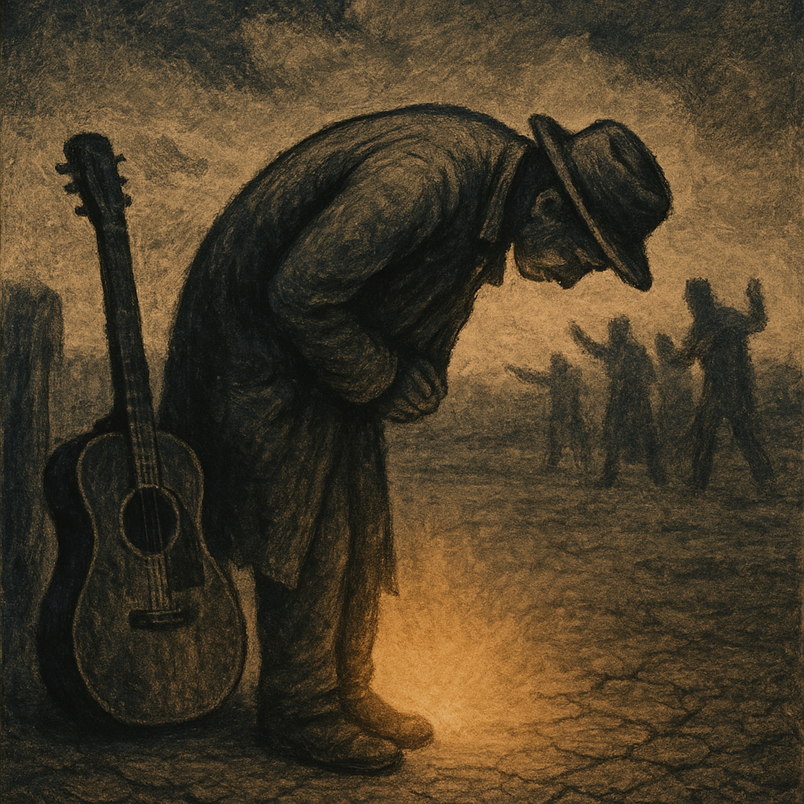

# The Non-Contempt Blues  
  
"The Non-Contempt Blues" is a grounded acoustic folk and blues spiritual that draws its central narrative from the ancient Buddhist text, the *Lotus Sūtra*. Set to a slow, fingerpicked rhythm reminiscent of Delta and Piedmont blues, the song explores the esoteric ethical mandate of the "Third Peaceful Practice"—the uncompromising command to eliminate spiritual arrogance and never condemn another individual's potential for enlightenment, even in the chaotic "Latter Day of the Law." The lyrics champion the figure of Bodhisattva Never Disrespectful, who endured physical abuse and scorn for simply bowing and declaring that all beings possess the inherent potential for Buddhahood. It is a meditation on resilience and humility, arguing that maintaining inner peace and respect for others is the only way to successfully propagate truth without disturbance [Query]. The track is raw, contemplative, and ultimately uplifting, demonstrating that true spiritual power lies not in outward display, but in unwavering, non-judgmental reverence for the inherent dignity of all life.    
  
**Search Tags**  
Blues, Folk, Acoustic, Spiritual, Religious Folk, Buddhism, Lotus Sutra, Bodhisattva, Non-Contempt, Peaceful Practices, Never Disrespectful, Shakyamuni Buddha, Mappō, Doctrine, Endurance, Humility, Fingerstyle Guitar, Resilience, World Music, Wisdom, Dharma  
  
Lyrics:   
  
(Key of Am, Slow Tempo, Fingerpicked Acoustic Guitar)  
  
(Verse 1: Setting the Scene - The Third Practice)  
Said the Buddha to Mañjuśrī, son, the road ahead is rough.  
When the Latter Day comes down heavy, and the world has had enough .  
Don’t look down on the seeker, though his practice seems too slow.     
Don’t call him a sloth, don’t tell him he’s got nowhere to go.  
If you whisper a mean word, a conflict you invite.  
‘Cause every soul’s got that true nature burning bright.     
  
(Chorus)  
Gotta bow down low, gotta keep the peace in your mind .  
Gotta clear out the pride, leave the jealousy behind.     
When the world throws its shadows, your wisdom shines like the sun .  
You preach without disturbance, brother, ‘til the hard work is done.     
  
(Verse 2: The Story of Never Disrespectful)  
Old Sadāparibhūta, he walked that dusty ground.     
Didn’t carry a scripture, didn’t make a boastful sound.     
He’d meet the scornful monk, he’d meet the angry wife.     
He just bowed deep and declared, "You’ll surely reach the highest life!".     
They threw stones at his head, they chased him with a stick.     
He ran down the alley, shouting that truth quick.     
His heart held no resentment, no grudge or angry thought.     
He knew the power of the seed that Bodhisattvas brought.     
  
(Chorus)  
Gotta bow down low, gotta keep the peace in your mind .  
Gotta clear out the pride, leave the jealousy behind.     
When the world throws its shadows, your wisdom shines like the sun.  
You preach without disturbance, brother, ‘til the hard work is done.     
  
(Bridge: The Reward)  
If you purify your heart, the sword won't touch your tongue .  
Heavenly beings gather, keepin’ you safe from dusk ‘til dawn.     
You plant the seeds of justice, you sow the path of reverence.     
And all those you respected, they become your truest friends.  
A great multitude gathers, to receive the Marvelous Law.  
  
(Outro)  
Yeah, they're gonna hear it, and they're gonna keep it too.  
Don't you ever disrespect, don't you ever disrespect...      
Gotta bow down low...  
(Guitar fades out slowly with a single, sustained chord)  
  
  
