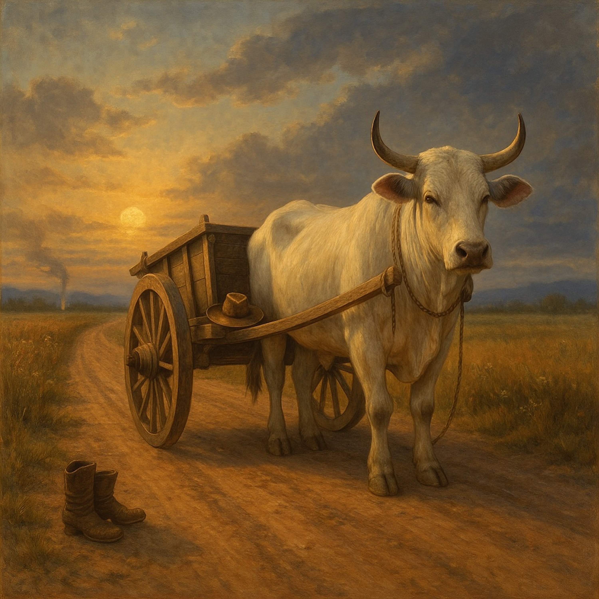

## The One Great White Ox Cart Blues  
  
**The One Great White Ox Cart Blues** is a slow-burning folk-blues meditation on finding the sacred in everyday life.  
  
Driven by a mournful acoustic guitar in A minor and a steady, heartbeat bass, the song draws on the Lotus Sutra’s parable of the Great White Ox Cart to reveal a timeless truth: there is no wall between holy ground and the ground beneath our feet.  
  
Each verse tells of a traveler who chases distant promises only to discover that awakening lives inside ordinary dust and labor.  
  
The chorus sings out like a river current—*“No wall between the holy and the work we do each day… you already ride the great white cart”*—reminding us that Buddhahood is not far away but alive in the present moment.  
  
Images of a burning house, quiet compassion, and the shared strength of all beings give the song both grit and grace.  
  
Part blues lament, part spiritual anthem, **The One Great White Ox Cart Blues** invites listeners to walk the open road of everyday awakening, where purpose and compassion are not lofty ideals but the work of each breath and step.  
  
the one great white ox cart blues, william altig choir, blues folk, spiritual blues, acoustic guitar, slow blues, lotus sutra inspired, one vehicle dharma, awakening song, mindful living, compassionate lyrics, burning house parable, soulful americana, acoustic slide guitar, spiritual journey, everyday enlightenment, folk blues anthem, deep south blues vibe  
  
Lyrics:  
(A bluesy folk song, played with a slow, mournful acoustic guitar riff and a steady, grounding bass line. Key of Am.)  
  
Verse 1  
(Am) I’ve walked a lot of dusty miles, sun on my neck, no shade  
(G) Looked for some far-off kingdom, thought that’s where peace was made  
(C) But every step kept telling me, the sacred’s here, not gone  
(F) Right inside the grit and trouble, that’s where the truth goes on  
(Am) Folks spoke of tiny pathways, too small for most to find  
(E7) But life laid down one open road for all of humankind  
  
Chorus  
(Am) There’s no line between the holy and the work we do each day  
(G) The living light is everywhere, it never moves away  
(C) You already ride the great white cart, not some weaker track  
(F) Your own good heart’s been carrying the strength you thought you lacked  
(Am) We’re part of one wide river, flowing to the sea  
(E7) This whole world moves together in a single destiny  
  
Verse 2  
(Am) I’ve known a house on fire, the smoke can blind your sight  
(G) The lies of fear and anger keep you running through the night  
(C) A wise friend showed a doorway, said, “Come and catch your breath”  
(F) Sometimes a kind illusion saves a soul from early death  
(Am) The guide was never gone for good, just stepped beyond the sound  
(E7) So we’d dig for deeper courage, until the truth is found  
  
Chorus  
(Am) There’s no line between the holy and the work we do each day  
(G) The living light is everywhere, it never moves away  
(C) You already ride the great white cart, not some weaker track  
(F) Your own good heart’s been carrying the strength you thought you lacked  
  
Verse 3  
(Am) Now I try to keep the lesson where I live and work and eat  
(G) Trade old jealous habits for a patience that runs deep  
(C) The world reflects within me, clear as a polished glass  
(F) This very life can hold the light that never needs to pass  
(Am) I listen for the hurting, lend a steady helping hand  
(E7) ‘Cause lifting someone else is where real freedom stands  
  
Chorus  
(Am) There’s no line between the holy and the work we do each day  
(G) The living light is everywhere, it never moves away  
(C) You already ride the great white cart, not some weaker track  
(F) Your own good heart’s been carrying the strength you thought you lacked  
  
Bridge  
(Dm) No one’s left behind here, no soul is marked as small  
(Am) The same strong seed of goodness lives inside us all  
(E7) A single act of kindness can shift the way things go  
(Am) And what we change within ourselves the whole wide world will know  
(G) The ordinary moment is where the healing starts  
(C) Turning everyday reality into a field of open hearts  
  
Outro  
(Am) That quiet truth is timeless; it’s the road beneath your feet  
(E7) Walk it with a steady mercy till the journey feels complete  
(Am) We’re already on that white ox cart—one road, one song, one beat  
  
  
  
  
  
  
  
