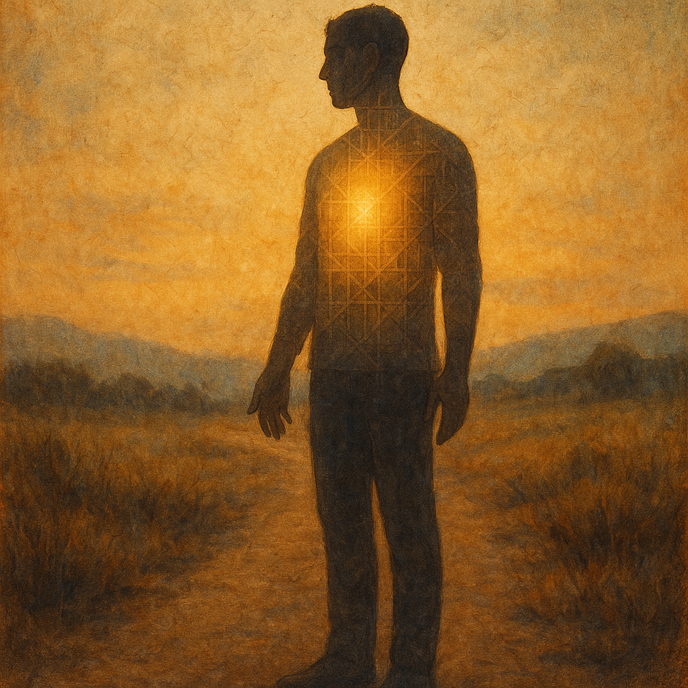

# The One That Stays  
  
"The One That Stays" wrestles with an ancient question: How do ordinary people offer something sacred when the old stories demand the impossible?  
  
Inspired by Buddhist teachings about sacrifice and perseverance, this song explores the tension between spectacular acts of devotion and the quiet heroism of simply continuing—of getting up, showing up, and staying present through hardship. It's about redefining what it means to give your life to something greater: not through dramatic gestures, but through the unglamorous work of enduring for what you believe in.  
  
The song asks: What if the body isn't meant to be destroyed, but to stay? What if the perfect offering isn't burning out, but burning on—day after ordinary day?  
  
For anyone who's ever felt too small, too broken, or too ordinary to matter: this one's for you. The light that changes the world comes from lives that refuse to break.  
  
Bluesy folk pop with soul. A song about resilience, faith, and the sacred ordinary.  
  
**Search Tags:**  
bluesy folk, folk pop, spiritual songs, resilience, perseverance, Buddhist philosophy, endurance, sacred ordinary, contemplative music, Americana, soul folk, faith and doubt, suffering and transformation, daily struggle, ordinary heroism, gospel influenced, philosophical lyrics, religious poetry, human spirit, standing firm, protest song, survival, meaningful life, devotion, staying power, roots music, contemporary folk, social justice, inner strength  
  
  
Lyrics:   
[Verse 1--Intimate, introspective, stripped back]  
They said the old saint lit himself on fire   
Twelve hundred years of light, arms ablaze   
How can I match that pyre   
With my small hands and ordinary days?  
The book says we all can wake right here  
In this skin, this bone, this very life  
But if waking means I disappear—  
Then what's the body even for?  
  
[Chorus--Anthemic but earthy, building intensity without losing intimacy]  
But the fire is what they do to you   
And you keep walking anyway   
The perfect gift ain't the spectacular view   
It's the only body—the one that stays   
Yeah, the only body is the one that stays  
  
[Verse 2--Intimate, introspective, stripped back]  
The teacher said, "You misunderstand the flame"   
The body is the treasure, not the kindling   
It's persecution that will stake your claim   
When you stand for truth while the world is dwindling  
Not just any suffering counts, he said   
Only what you bear for what is true   
Not the lost accounts or the emperor dead   
But the dailiness of rising when they come for you  
  
[Chorus--Anthemic but earthy, building intensity without losing intimacy]  
'Cause the fire is what they do to you   
And you keep walking anyway   
The perfect gift ain't the spectacular view   
It's the only body—the one that stays   
Yeah, the only body is the one that stays  
  
[Bridge--Vulnerable, space opens up, instruments pull back before final chorus surge]  
So I offer up this job, this grief, this bread   
This rising when I'd rather stay in bed   
This helping when I'm barely standing tall   
The mystic law transforms it all—   
Into the flame without the cost   
Of leaving nothing when you're lost  
  
[Verse 3--Intimate, introspective, stripped back]  
The light that saves the world, I've learned   
Comes from a life that will not break   
From hands that give, from bridges burned   
From the heart that makes its stand for giving's sake  
In this ordinary, unspectacular land   
Where enlightenment blooms in mortal clay—  
  
[Final Chorus--Anthemic but earthy, building intensity without losing intimacy]  
Yeah, the fire is what they do to you   
And you keep walking anyway   
The perfect gift ain't the spectacular view   
It's the only body—the one that stays   
The only body—the one that stays   
The only body is the one that stays  
  
  
