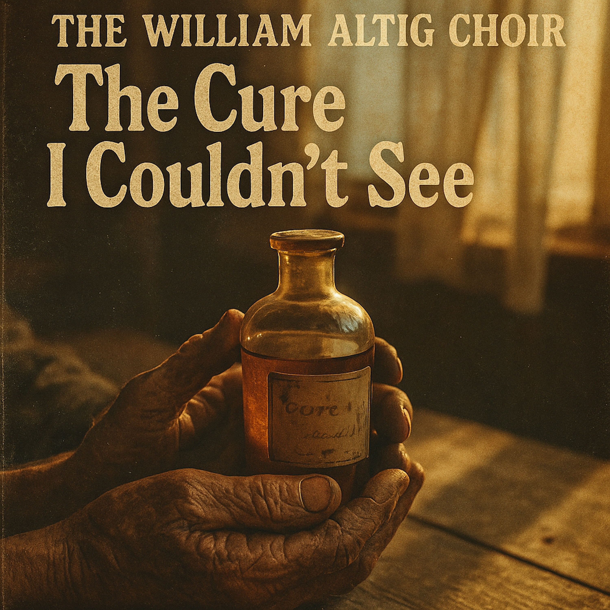

# The Physician's Parable (The Cure I Couldn't See)  
  
**The Cure I Couldn't See** | The William Altig Choir  
  
A blues-folk meditation on the physician's parable from the Lotus Sutra. This song tells the story of a soul searching desperately for healing, only to realize the remedy was offered all along—but pride and delusion kept them from believing.  
  
Inspired by ancient Buddhist wisdom translated through the language of Delta blues and Appalachian folk, "The Cure I Couldn't See" explores themes of suffering, recognition, and the bittersweet moment when we finally accept the truth that's been waiting for us.  
  
Raw acoustic guitar, mournful harmonica, and vocals that carry the weight of the journey from darkness into light.  
  
For those who wander, for those who doubt, for those who finally see.  
  
**SEO Tags**  
blues folk, folk blues, acoustic blues, Buddhist music, spiritual folk, Americana, Delta blues, fingerstyle guitar, harmonica blues, gospel folk, Appalachian folk, contemplative music, meditation music, Lotus Sutra, dharma blues, roots music, traditional folk, singer songwriter, acoustic folk, slow blues, Buddhist folk, spiritual blues, American roots, folk ballad, indie folk, conscious music, devotional music, folk gospel, traditional blues, philosophical folk, Buddhist song  
  
**lyrics: **  
**Verse 1** I've been walking these roads with a poison in my veins Searching every hollow for someone to ease my pain Knocked on a thousand doors, cried out a thousand names But the remedy was sitting right there in my father's hands  
  
**Chorus** Oh, the cure I couldn't see Was waiting there, waiting there for me Too proud, too blind, too lost in my disease To believe in the cure I couldn't see  
  
**Verse 2** He showed me the medicine, said "Son, just take this pill" But I shook my head and wandered off across another hill Thought I knew better, thought his words were just old tales While the poison kept on spreading and my body growing frail  
  
**Chorus** Oh, the cure I couldn't see Was waiting there, waiting there for me Too proud, too blind, too lost in my disease To believe in the cure I couldn't see  
  
**Bridge** Now I'm falling to my knees in the dust Everything I thought I knew just turned to rust And I hear his voice calling through the years: "Child, I never left you, I was always here"  
  
**Verse 3** So I took the medicine, felt it burn and then turn sweet Recognition flooding in like mercy at my feet All that wasted time, all those miles I roamed alone When the doctor was beside me, trying to lead me home  
  
**Final Chorus** Oh, the cure I finally see Was waiting there, always there for me No more running, no more disbelief I've found the cure, and the cure has set me free Yeah, I've found the cure, and the cure has set me free  
  
  
