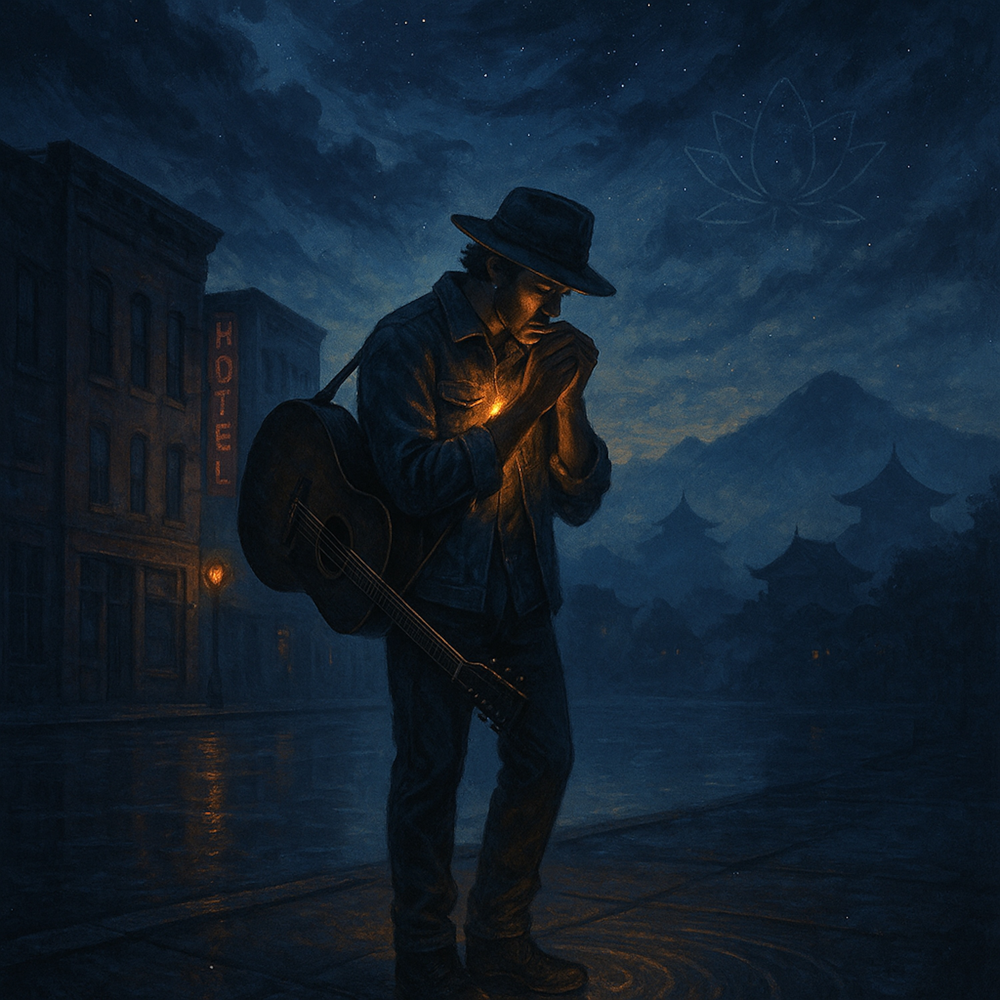

# The Real Wonder  
  
*The Real Wonder* is a slow-burning folk-blues meditation on the power that can’t be staged or faked.  
Over a dusty harmonica and finger-worn guitar, the lyric walks from ancient miracle tales into today’s streets, asking what real magic is.  
  
It finds the answer not in fire in the sky, but in **quiet inner shifts**—  
an unshakable spirit when hard times come,  
a compassionate heart that ripples through families, friends, and strangers,  
small acts of courage that turn shadowed places toward the light.  
  
The music stays earthy and intimate—steady groove, late-night porch mood—while the words open a horizon as wide as the Lotus Sutra’s Chapter 27 inspiration.  
This is blues for the soul’s everyday work:  
choosing kindness, breaking fear, and shining from within until the ordinary world feels miraculous.  
  
Lyrics:   
(Harmonica intro - slow, melancholic bluesy feel, acoustic guitar strumming a simple folk chord progression)  
  
(Verse 1)  
I once heard stories, tales from way back when  
Of mighty wonders, seen by mortal men.  
Walkin' on water, fire in the air.  
Said those old prophets, they could go anywhere.  
My modern mind, it struggles to believe.  
In magic powers, what can they achieve?  
  
(Chorus)  
But the true wonders, ain't no magic show.  
They're the quiet changes, deep down where we grow.  
An unshakable spirit, when the hard times come.  
A compassionate heart, for everyone.  
That's the real power, shining from within.  
That's the only wonder, where we truly begin.  
  
(Verse 2)  
My own mind can get stuck, in old and narrow ways.  
Chasin' desires, through these modern days.  
Life's storms come rollin', try to knock me down.  
Leave me lost and lonely, in this troubled town.  
But I learned to listen, to that quiet voice inside.  
To purify my thinking, with nowhere left to hide.  
  
(Chorus)  
'Cause the true wonders, ain't no magic show.  
They're the quiet changes, deep down where we grow.  
An unshakable spirit, when the hard times come.  
A compassionate heart, for everyone.  
That's the real power, shining from within.  
That's the only wonder, where we truly begin.  
  
(Verse 3)  
To see the dignity, in every single soul.  
To help another, make their spirit whole.  
Not just for myself, but for all I know.  
Planting seeds of kindness, watching goodness grow.  
My actions ripple outward, from me to everyone.  
Turning shadowed places, to where the light is spun.  
  
(Bridge)  
Just a simple word shared, a helping hand you lend.  
That's a transformation, that will never end.  
It's overcoming fear, and standing tall and true.  
Inspiring others to ask, "What makes you, *you*?".  
Building peace together, in this fragile land.  
A quiet revolution, hand in helping hand.  
  
(Chorus)  
'Cause the true wonders, ain't no magic show.  
They're the quiet changes, deep down where we grow.  
An unshakable spirit, when the hard times come.  
A compassionate heart, for everyone.  
That's the real power, shining from within.  
That's the only wonder, where we truly begin.  
  
(Outro)  
Yeah, the real wonders, they ain't far away.  
They're in your choices, every single day.  
A life transformed, a light for all to see.  
That's the wonder, for you and for me.  
(Harmonica and guitar fade out slowly)  
  
blues folk , slow blues , acoustic guitar , harmonica , modern spiritual , inner strength , quiet transformation , compassionate heart , personal growth , life changes , Lotus Sutra inspired , chapter 27 ,deep lyrics , emotional storytelling , soulful songwriting , folk blues ballad , reflective music , meditative blues , spiritual journey  
  
  
