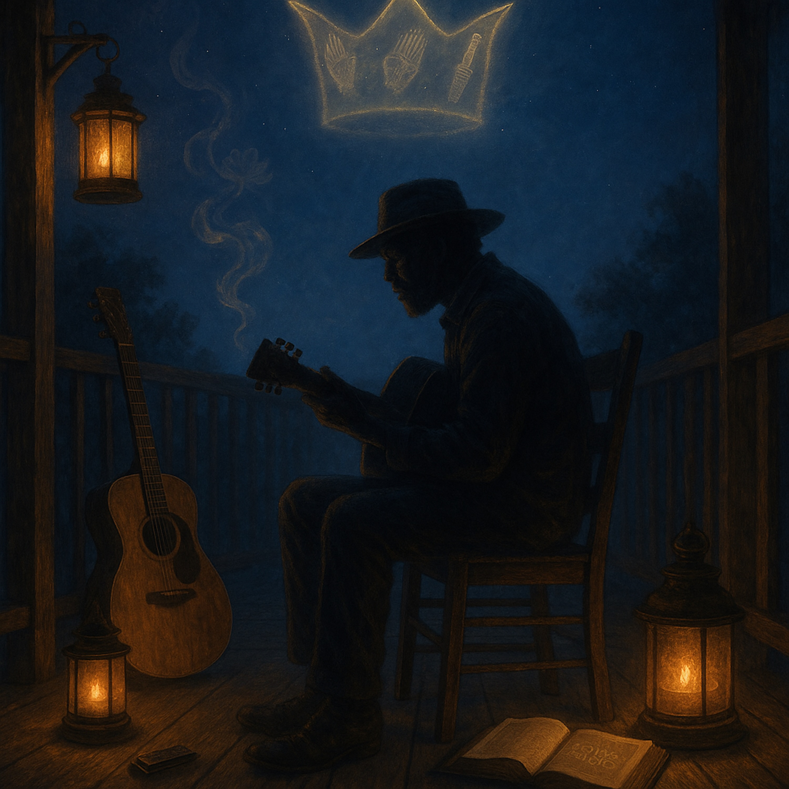

# The Threefold Crown Blues  
  
*The Threefold Crown Blues* is a soulful folk-blues track inspired by Nichiren’s teaching of the Three Virtues — Sovereign, Teacher, and Parent. The song weaves together raw acoustic blues with gospel-style call-and-response, capturing the struggle of human authority and the wholeness found only in the Buddha’s integrated wisdom, compassion, and protective vow. With slide guitar, harmonica, and choir harmonies, this track is both a lament and a hymn of resilience, pointing to the crown of truth that never fails.  
  
⸻  
  
🔑** Search Tags**  
  
folk blues, acoustic blues, gospel blues, spiritual blues, Nichiren, Lotus Sutra, three virtues, sovereign teacher parent, Dharma blues, soulful folk, acoustic storytelling, porch blues, blues choir, wisdom compassion courage, mystical blues, prayerful blues, enlightenment song, bodhisattva path, dharma folk, awakening music  
  
**Lyrics: **  
  
**(Verse 1)**  
Mama’s love is warm as dawn,  
But her skill can’t carry me on.  
Daddy wisdom sharp as flame,  
But without love, it cuts the same.  
  
**(Chorus)**  
Oh, Sovereign, Teacher, Parent true,  
One heart of wisdom, love, and rule.  
Only the Buddha holds that crown,  
He lifts the lost, He won’t let us down.  
  
**(Verse 2)**  
A ruler’s hand, strong and sure,  
But without mercy, power turns cruel.  
Each one shines, but none complete,  
Fragments scattered beneath my feet.  
  
**(Chorus)**  
Oh, Sovereign, Teacher, Parent true,  
One heart of wisdom, love, and rule.  
Only the Buddha wears that crown,  
He walks beside us on this ground.  
  
**(Bridge – Call & Response)**  
*Call:* Who will guide me through the night?  
*Response:* The Buddha’s vow, His endless light.  
*Call:* Who will keep me safe from harm?  
*Response:* Compassion’s hand, wisdom’s arm.  
  
**(Final Chorus – Slow & Rising)**  
Oh, Sovereign, Teacher, Parent true,  
One flame of love, one light that’s new.  
The threefold crown is whole at last,  
The Buddha’s truth will hold us fast.  
  
  
