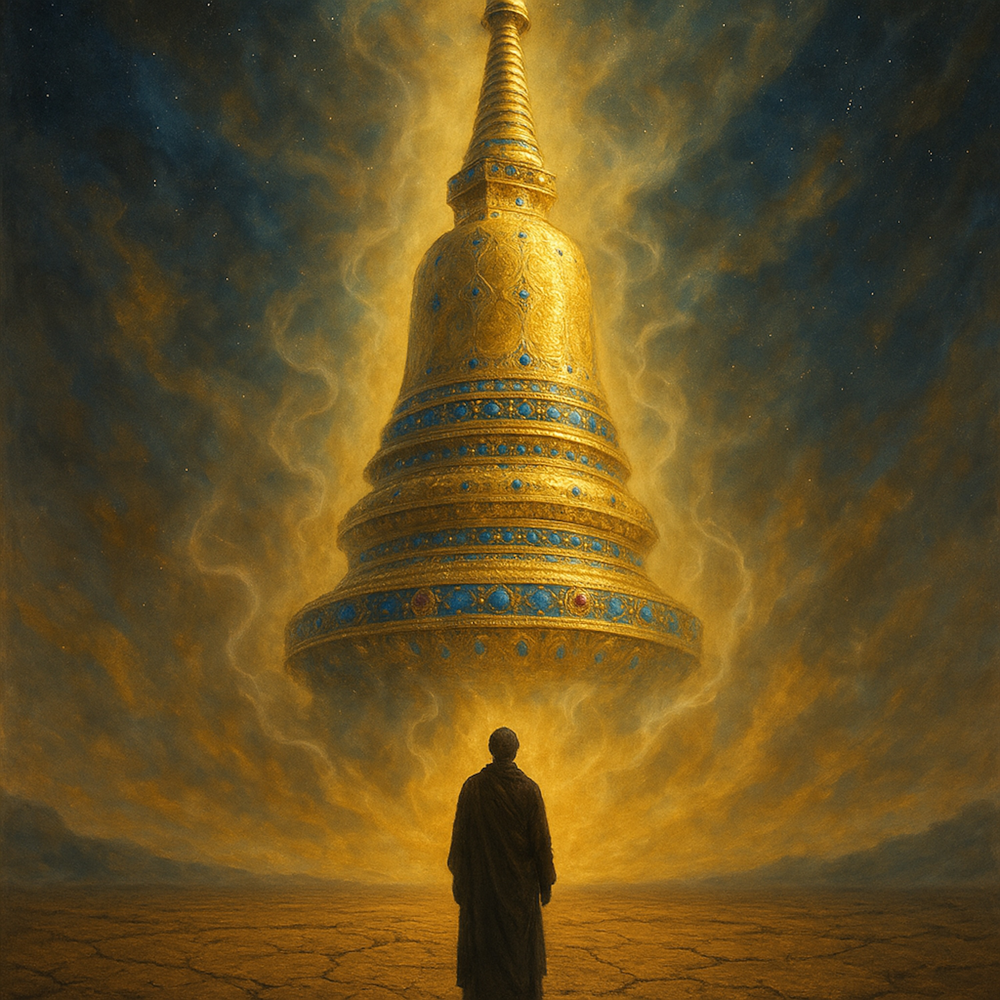

# The Treasure Tower  
  
"The Treasure Tower” is a cinematic folk-rock journey that builds from a single acoustic guitar and vocal into a soaring, full-band spiritual experience.  
  
Drawing inspiration from the epic imagery of the Lotus Sutra, the song tells the story of a profound revelation. It charts the journey from sitting on the "hard earth" as a humble seeker to witnessing the miraculous appearance of the great Stūpa—a tower of gold and lapis lazuli that shakes the ground and fills the air with celestial music.  
But the true miracle isn't just the tower in the sky; it's the discovery of the "priceless gem" within.  
  
Featuring a dynamic arrangement that moves from sparse folk to electric gospel-blues, the song's soaring slide guitar, rich Hammond organ, and thunderous percussion capture the awe of the moment. "The Tower and the Gem" is a song about awakening—about realizing that the divine truth we seek outside is the same truth we've carried inside us all along.  
  
Spiritual Music, Folk Rock, Blues, Gospel Blues, Slide Guitar, Hammond Organ, Singer-Songwriter, Buddhism, Lotus Sutra, Enlightenment, Awakening, Spiritual Awakening, Cinematic Folk, Epic Ballad, The Tower and the Gem, Meditation Music, Conscious Music, Mystical Music  
  
**Lyrics: **  
[Verse 1: The Heavy Ground and the Precursor]  
  
I was sitting on the hard earth, every joint began to ache  
I was seeking simple peace, for the old law’s sake  
  
The Lord went into stillness, meditation deep and vast  
And then the whole wide Buddha-land, it woke up at last  
  
It didn't groan, it humm'd, six ways it shook the ground  
It trembled in its reverence, then it danced and tossed around  
  
Felt that divine energy, so awesome and so real  
I knew a mighty secret was about to be revealed.  
  
[Chorus: The Immediate Sensory Revelation]  
  
Oh, the Stūpa arose, five hundred yojanas high!  
Gold and lapis lazuli piercin' up the sky   
  
That scent of holy incense... filled my lungs   
Then the great, deep voice inside, that celestial tongue  
  
It cried: "Excellent, excellent, Lord Sākyamuni!"   
Now I know the truth is coming for me.  
  
[Verse 2: Sight and Adornment]  
  
I looked upon that Tower, so beautiful and vast  
Made of seven precious substances, built forever-more to last   
  
That silver, pearl, and carnelian, burnin' in the light   
With lapis, gold, and agate, what a heavenly sight   
  
The gods from up in paradise strewed down their floral rain  
White cloth whirled down in thousands, washing away the pain  
  
The banners and the triumphal streamers caught the wind  
Told me this ain't no extinction, this is where the truth begins.  
  
[Chorus: The Immediate Sensory Revelation]  
  
Oh, the Stūpa arose, five hundred yojanas high!  
Gold and lapis lazuli piercin' up the sky   
  
That scent of holy incense... filled my lungs   
Then the great, deep voice inside, that celestial tongue  
  
It cried: "Excellent, excellent, Lord Sākyamuni!"   
Now I know the truth is coming for me.  
  
[Verse 3: Auditory Wonders]  
  
The jeweled chimes and bells were ringing, sweet, tender, and clear   
The melody flowed through the world, takin' all my fear   
I heard celestial music, it pulled me right up near  
  
Then I heard the **Buddhas answer**, like **thunder breakin' truth**   
The Master **called his other forms** to **give the final proof**   
I heard ten-thousand finger-snaps, **echoin' off the roof**  
  
A mighty, joyful thunder, through all of time and space   
Affirming one Great Vehicle... for all the human race .  
  
[Bridge: The Hidden Gem and the New Path]  
  
I thought I was satisfied, just beggin' for my bread  
A pauper on the low road, full of ancient dread  
  
But the Master, knowin' secrets I could never see  
Had tied a priceless jewel right inside of me  
  
That gem of all-knowin' wisdom, I had... but I couldn't see  
I was blind until this Tower... it set me free  
  
Now I wear the robe of patience, and I stand up in the light  
I'm no low-road disciple... I'm a Buddha in my own right.  
  
[Chorus: The Immediate Sensory Revelation]  
  
Oh, the Stūpa arose, five hundred yojanas high!  
Gold and lapis lazuli piercin' up the sky   
  
That scent of holy incense... filled my lungs  
Then the great, deep voice inside, that celestial tongue  
  
It cried: "Excellent, excellent, Lord Sākyamuni!"   
Now I know the truth is coming for me.  
  
[Outro]  
  
  
