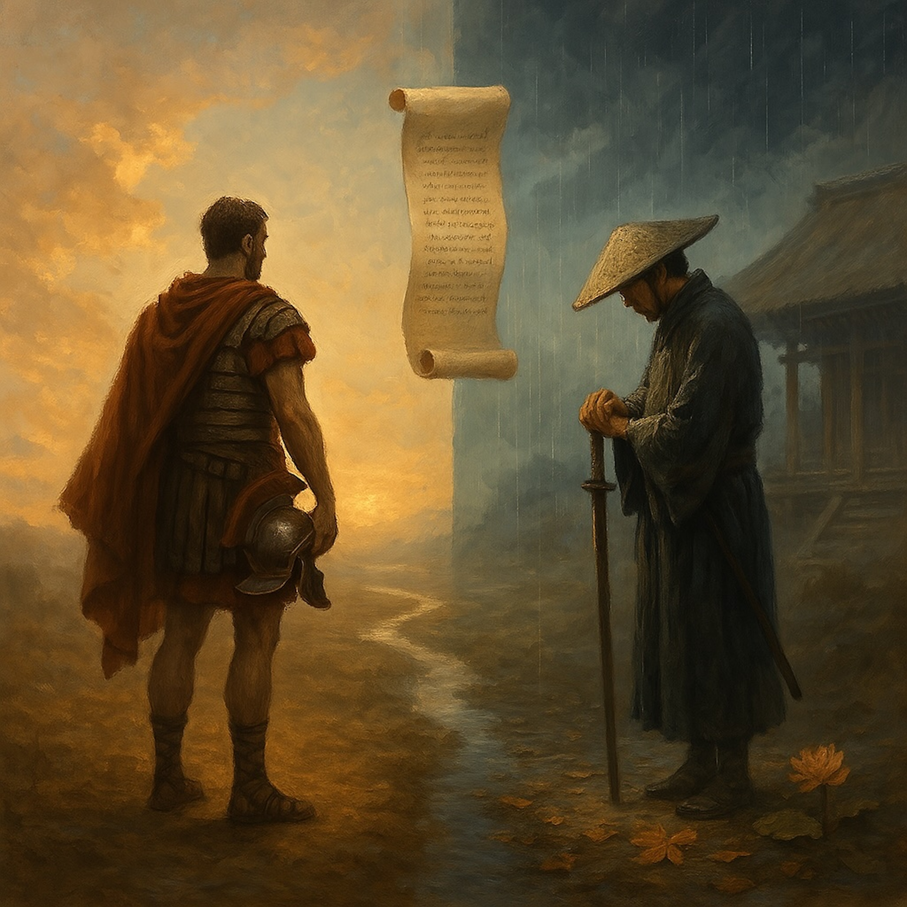

# Two Roads of Faith  
*By William Altig*  
  
**“Two Roads of Faith”** is a folk-blues meditation on devotion, courage, and the cost of truth. Inspired by the contrast between the Roman Centurion of the Gospels and Lord Ueno, a votary of the Lotus Sutra, this track explores two radically different paths of belief—one grounded in trust without proof, the other in unshakable resolve through persecution.  
  
Set to a slow-burning slide guitar, this blues tale weaves gospel echoes with the spirit of the samurai. The song honors those who stand for what’s right even when the world turns away—those who walk the harder road with no turning back.  
  
*“One had status. One had none.*  
*One saw a flash. One faced the sun—*  
*And stayed until his face burned gold.”*  
  
A song for the mad and the free. For the votaries. For those still singing under heavy skies.  
  
**Tags: **folk blues, spiritual blues, Nichiren-inspired, gospel blues, samurai spirit, Lotus Sutra, Buddhist themes, Roman Centurion, Lord Ueno, faith under fire, mystical lyrics, storytelling song, devotional folk, bodhisattva path, courage and belief, historical contrast, soulful male vocals, poetic lyrics, Dharma music, slow-burning blues  
  
**[Verse 1 – The Centurion]**  
A Roman stood by the Teacher’s side,  
Armor gleaming, pride set aside.  
“My servant’s sick,” he bowed his head,  
“Just say the word—he won’t be dead.”  
  
He didn’t ask for proof or sign,  
Didn’t walk the dusty line.  
He saw the power from afar,  
And trusted it like the northern star.  
  
**That was faith—**  
**A quiet yes**  
**Without knowing the rest.**  
**He didn’t see the end—**  
**And that was the test.**  
  
⸻  
  
**[Verse 2 – Lord Ueno]**  
But far away in warlord lands,  
A young man held fate in his hands.  
Not Roman, not cloaked in grace—  
But a samurai with a Buddha’s face.  
  
He saw the truth in Nichiren’s fire,  
Felt the cost climb ever higher.  
They taxed him till his roof caved in,  
But he never gave up, never gave in.  
  
He fed the monks when his kids went cold,  
Sheltered farmers brave and bold.  
He knew the end could be a sword—  
But still, he held the Mystic Word.  
  
**That was faith—**  
**Not in what might be,**  
**But in what must be.**  
**He saw the storm—**  
**And stood like a tree.**  
  
⸻  
  
**[Bridge – The Comparison]**  
The Centurion believed in power unspoken.  
Lord Ueno believed while his world was broken.  
One had status. One had none.  
One saw a flash. One faced the sun—  
And stayed until his face burned gold.  
  
⸻  
  
**[Chorus]**  
*Two roads of faith, both divine,*  
*One trusts the word, the other the line—*  
*Written in sweat, tears, ash, and rain.*  
*Both cried freedom, both bore pain.*  
*But only one walked*  
*With no turning back—*  
*And that’s the road*  
*The Bodhisattvas track.*  
  
⸻  
  
**[Reprise: Verse 2 – Lord Ueno]**  
But far away in warlord lands,  
A young man held fate in his hands.  
Not Roman, not cloaked in grace—  
But a samurai with a Buddha’s face.  
  
He saw the truth in Nichiren’s fire,  
Felt the cost climb ever higher.  
He knew the end could be a sword—  
But still, he held the Mystic Word.  
  
**That was faith—**  
**Not in what might be,**  
**But in what must be.**  
**He saw the storm—**  
**And stood like a tree.**  
  
⸻  
  
**[Bridge – The Comparison]**  
The Centurion believed in power unspoken.  
Lord Ueno believed while his world was broken.  
One had status. One had none.  
One saw a flash. One faced the sun—  
And stayed until his face burned gold.  
  
⸻  
  
**[Chorus]**  
*Two roads of faith, both divine,*  
*One trusts the word, the other the line—*  
*Written in sweat, tears, ash, and rain.*  
*Both cried freedom, both bore pain.*  
*But only one walked*  
*With no turning back—*  
*And that’s the road*  
*The Bodhisattvas track.*  
  
  
